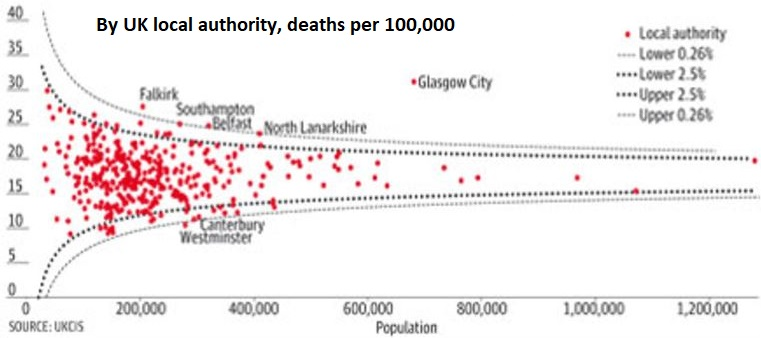

# Funnel Plot from R script to R Visual
This article describes how to build a funnel plot using R script in R visual step by step.

A funnel plot is easy to consume and interpret where the "funnel" is formed by confidence limits and shows the amount of expected variations with outliers represented by dots outside the funnel.

The example in this article is based on an [inspiring story](https://www.theguardian.com/commentisfree/2011/oct/28/bad-science-diy-data-analysis) about how using the wrong visualization tools can lead to the wrong conclusion. The hero of this story is the funnel plot, which is used to compare and analyze institutional performance and medical data.  



In this article we'll create:

- an R-script for RStudio
- an R-visual in Power BI
- a *PNG-based* R-powered Visual in Power BI
- a *HTML-based* R-powered Visual in Power BI

For more information, see [this blog ](https://onlinejournalismblog.com/2011/10/31/power-tools-for-aspiring-data-journalists-funnel-plots-in-r/) to further demonstrate an implementation of a "funnel plot" in R.

## Build an R script with dataset

1. Start with a [minimal R script](./samples/funnel-plot/chapter1_R/script_R_v1_00.r) and an accompanying data table, [dataset.csv](./samples/funnel-plot/chapter1_R/dataset.csv).

1. Alter the script using [this script](./samples/funnel-plot/chapter1_R/script_R_v1_01.r) to implement input error handling and add user parameters to control the appearance of the plot.

## Build a report

Alter the script using [this script](./samples/funnel-plot/chapter2_R/script_R_v2_00.r) to comment out the *read.csv* call and load *dataset.csv* into the Power BI desktop workspace as the **Cancer Mortality** table. This results with the following [PBIX file](./samples/funnel-plot/chapter2_R/funnelPlot_Rvisual.pbix).

> [!NOTE]
> The `dataset` is a hard-coded name for the input `data.frame` of any R-visual. 

## R code packaging in R-powered Visual

We're about to package R code into an R-powered visual. Before you get started, [install the PBIVIZ tools](./custom-visual-develop-tutorial.md#installing-packages).

### Create new R-powered visual

Now use the command line to create a new R-powered visual:

```bash
pbiviz new funnelRvisual -t rvisual
cd funnelRvisual
npm install 
pbiviz package
```

This creates the **funnelRvisual** folder with initial template visual (`-t` stands for _template_). 
The PBIVIZ is in *dist* folder. Try to import it into Power BI and see what it does. The R-code is inside *script.r* file. 

1. Open *script.r* file and replace its contents with your script.

1. Open *capabilities.json* and replace the `Values` string by `dataset` string. It replaces the name of "Role" in template to be like in R-code.

   

1. *(optional)* Open *dependencies.json* and add a section for each R package required by your R script. This tells Power BI to automatically import these packages when the visual is loaded for the first time.

   

1. Re-package the visual using `pbiviz package`. Try to import it into Power BI again and see what it does.

See the above [PBIX](./samples/funnel-plot/chapter3_R/funnelPlot_RCustomVisual.pbix) and entire [Visual Project](https://github.com/Microsoft/PowerBI-visuals/tree/master/RVisualTutorial/TutorialFunnelPlot/chapter3_RCustomVisual/funnelRvisual_v01/) for download.

### R-based visual improvement

The visual is not yet user-friendly, because the user has to know the order of columns in the input table, so let's divide the input field `dataset` into 3 fields (roles): `Population`, `Number` and `Tooltips`


1. Edit *capabilities.json* by replacing `dataset` role by three new roles. You will need to update sections: `dataRoles` and `dataViewMappings`. These sections define names, types, tooltips and maximum columns for each input field, see more information [here](./capabilities.md). See the resulting [Chapter 3 resulting capabilities.json](https://github.com/Microsoft/PowerBI-visuals/tree/master/RVisualTutorial/TutorialFunnelPlot/chapter3_RCustomVisual/funnelRvisual_v02/capabilities.json). 

1. Edit *script.r* to support _Population_, _Number_ and _Tooltips_ as input dataframes instead of _dataset_. See the resulting [Chapter 3 resulting script.r](./samples/funnel-plot/chapter3_R/funnelRvisual_v02/script.r).

   > [!NOTE]
   > To follow the changes in R-script, search for the commented blocks: 
   > 
   > ```r
   > #RVIZ_IN_PBI_GUIDE:BEGIN: Added to enable visual fields
   > ...
   > #RVIZ_IN_PBI_GUIDE:END: Added to enable visual fields
   > 
   > #RVIZ_IN_PBI_GUIDE:BEGIN: Removed to enable visual fields 
   > ...
   > #RVIZ_IN_PBI_GUIDE:BEGIN: Removed to enable visual fields
   > ```

1. Re-package the visual again: `pbiviz package` and try to import it into Power BI again and see what it does.

See the [resulting PBIX](./samples/funnel-plot/chapter3_R/funnelPlot_RCustomVisual.pbix) and [whole Visual Project](https://github.com/Microsoft/PowerBI-visuals/tree/master/RVisualTutorial/TutorialFunnelPlot/chapter3_RCustomVisual/funnelRvisual_v02) for download.

### Adding user parameters

Now we must add user paratmeters to the visual.


The user obviously wants to control colors and sizes of visual elements as well as some internal parameters of algorithm from the UI, so let's add this capability: 

1. Edit *capabilities.json* again, this time the _objects_ section, read more [here](./objects-properties.md). 

This is the place to define names, tooltips and types of each parameter. We also decide on the partition of parameters into groups (three groups in this case). 

The resulting file is:

[Chapter 3 capabilities.json](https://github.com/Microsoft/PowerBI-visuals/tree/master/RVisualTutorial/TutorialFunnelPlot/chapter3_RCustomVisual/funnelRvisual_v03/capabilities.json)

See before vs. after 

1. Edit the *src/settings.ts* file to match [settings.ts](https://github.com/Microsoft/PowerBI-visuals/tree/master/RVisualTutorial/TutorialFunnelPlot/chapter3_RCustomVisual/funnelRvisual_v03/src/settings.ts). This file is written in TypeScript.  Don't worry, it is easy to use this example as a template.  

   To follow the changes in TypeScript, search for the commented blocks: 

   ```typescript
   //RVIZ_IN_PBI_GUIDE:BEGIN:Added to enable user parameters 
    ...
   //RVIZ_IN_PBI_GUIDE:END:Added to enable user parameters 
   ```
 
   You will find two blocks of the code added. 
   1. Declare new interface to hold the property value; 
   1. Define a member property and default values; 

See before vs. after 

1. Edit *script.r* to match [script.r](https://github.com/Microsoft/PowerBI-visuals/tree/master/RVisualTutorial/TutorialFunnelPlot/chapter3_RCustomVisual/funnelRvisual_v03/script.r) and support the parameters in UI, it is quite easy just by adding `if.exists` calls per user-parameter

   To follow the changes in the R script, search for the commented code blocks: 

   ```r
   #RVIZ_IN_PBI_GUIDE:BEGIN:Added to enable user parameters
    ...
   #RVIZ_IN_PBI_GUIDE:END:Added to enable user parameters

   #RVIZ_IN_PBI_GUIDE:BEGIN:Removed to enable user parameters 
    ...
   #RVIZ_IN_PBI_GUIDE:END:Removed to enable user parameters
   ```

See before vs. after 

Note that you may decide not to expose some of the parameters to UI, like we did.  
 
1. Re-package the visual again: `pbiviz package`. Try to import it into Power BI again and see what it does. 

See the [resulting PBIX](https://github.com/Microsoft/PowerBI-visuals/tree/master/RVisualTutorial/TutorialFunnelPlot/chapter3_RCustomVisual/funnelPlot_RCustomVisual.pbix) and [full source code ](https://github.com/Microsoft/PowerBI-visuals/tree/master/RVisualTutorial/TutorialFunnelPlot/chapter3_RCustomVisual/funnelRvisual_v03/) for download.

> [!NOTE]
> In this tutorial we add parameters of several types (boolean, numeric, string, and color) at once. If you find it too complicated to follow, please have a look at [this example](https://github.com/Microsoft/PowerBI-visuals/blob/master/RVisualTutorial/PropertiesPane.md), which shows how to add a single parameter. 

## RHTML-based visual

### Conversion to RHTML visual

Since the resulting visual is PNG-based, it isn't responsive to mouse hover, can't be zoomed in, etc., so we'll show how it can be converted to HTML-based visual.
We will create an empty R-powered HTML-based Visual template and then copy some scripts from the PNG-based visual project.

Use command line:

```bash
pbiviz new funnelRHTMLvisual -t rhtml
cd funnelRHTMLvisual
npm install 
pbiviz package
```

Explore *capabilities.json* and pay attention to `"scriptOutputType": "html"`  line.

Explore *dependencies.json* and pay attention to names of R-packages listed there.

Explore *script.r* and pay attention to its structure. You may open and run it in RStudio. It does not use external input. 
You will find that it creates and saves *out.html* file. The file will have to be self-contained (without external dependencies) and defines graphics inside HTML widget. 

To help `htmlWidgets` users we also provide R-utilities in _"r_files"_ [folder](https://github.com/Microsoft/PowerBI-visuals/tree/master/RVisualTutorial/TutorialFunnelPlot/chapter4_RHTMLCustomVisual/funnelRHTMLvisual_v01/r_files) to help with conversion of `plotly` or `widget` object into self-content HTML. 
Note that this version of R-powered visual supports `source` command (unlike previous types of visuals) and we will use it to make code more readable.   
 
* Replace template *capabilities.json* by *capabilities.json* from the previous step, but obviously keep:

`"scriptOutputType": "html"`  

The resulting file is:
[Chapter 4 funnelRHTMLvisual capabilities.json](https://github.com/Microsoft/PowerBI-visuals/tree/master/RVisualTutorial/TutorialFunnelPlot/chapter4_RHTMLCustomVisual/funnelRHTMLvisual_v01/capabilities.json)

* Merge the latest version of the *sript.r* file from [Chapter 3](#r-code-packaging-in-r-powered-visual) with *script.r* from the template.

What are the changes? We use `plotly` package to convert **ggplot** object to **plotly** object. Next we use `htmlWidgets` package to save it to HTML-file. 

We also move most of the utility functions to [_"r_files/utils.r"_](https://github.com/Microsoft/PowerBI-visuals/tree/master/RVisualTutorial/TutorialFunnelPlot/chapter4_RHTMLCustomVisual/funnelRHTMLvisual_v01/r_files/utils.r) and add `generateNiceTooltips` function for cosmetics of **plotly** object.

The resulting file is
[Сhapter 4  funnelRHTMLvisual v01 script.r](https://github.com/Microsoft/PowerBI-visuals/tree/master/RVisualTutorial/TutorialFunnelPlot/chapter4_RHTMLCustomVisual/funnelRHTMLvisual_v01/script.r)

See before vs. after , 

To follow the changes in R-script, search for the blocks: 

```r
#RVIZ_IN_PBI_GUIDE:BEGIN:Added to create HTML-based 
 ...
#RVIZ_IN_PBI_GUIDE:BEGIN:Added to create HTML-based

#RVIZ_IN_PBI_GUIDE:BEGIN:Removed to create HTML-based  
...
#RVIZ_IN_PBI_GUIDE:BEGIN:Removed to create HTML-based
```

* Merge the latest version of the *dependencies.json* file from [Chapter 3](#r-code-packaging-in-r-powered-visual) with *dependencies.json* from the template to include new R-package dependencies.

The resulting file is 
[Chapter 4 funnelRHTMLvisual_v01 dependencies.json](https://github.com/Microsoft/PowerBI-visuals/tree/master/RVisualTutorial/TutorialFunnelPlot/chapter4_RHTMLCustomVisual/funnelRHTMLvisual_v01/dependencies.json)

1. Change the script *src/settings.ts* in exactly the same way as you did in [Chapter 3.3](#adding-user-parameters)

1. Re-package the visual again: `pbiviz package`. Try to import it into Power BI again and see what it does. 

The resulting PBIX and the whole Visual Project may be found in:  

[Chapter 4 funnelRHTMLvisual_v01](https://github.com/Microsoft/PowerBI-visuals/tree/master/RVisualTutorial/TutorialFunnelPlot/chapter4_RHTMLCustomVisual/funnelRHTMLvisual_v01)

### Further examples

1. Start by creating an empty project: 

   ```bash
   pbiviz new smallRHTML -t rhtml
   cd smallRHTML
   npm install 
   pbiviz package
   ```

1. Take code from this [showcase](http://www.htmlwidgets.org/showcase_networkD3.html) and make the highlighted changes to it:

   

1. Copy it instead of your template *script.r* and run `pbiviz package` again. Now you get this cool visual in your Power BI report!

### HTML widgets gallery
Dozens of visuals from this stunning [gallery](http://gallery.htmlwidgets.org/) of HTML widgets are ready to become your next visual. To make it easier, we created this single visual project: 

[chapter4_RCustomVisual/multipleRHTML](https://github.com/Microsoft/PowerBI-visuals/tree/master/RVisualTutorial/TutorialFunnelPlot/chapter4_RHTMLCustomVisual/multipleRHTML)

It contains __more than 20 interactive HTML visuals !!!__   

Sample of htmlWidgets1:  
  

Sample of htmlWidgets2:  
  

Try it out in [PBIX file](https://github.com/Microsoft/PowerBI-visuals/tree/master/RVisualTutorial/TutorialFunnelPlot/chapter4_RHTMLCustomVisual/multipleRHTML/assets/sample.pbix). To switch between html widgets use **Format** > **Settings** > **Type**. 

If you decide to use it as a starting point for your visual: 
1. Download the entire folder
1. Edit *script.r* and *dependencies.json* to keep only one widget 
1. Edit *capabilities.json* and *settings.ts* to remove `Type` selector
1. Change `const updateHTMLHead: boolean = true;` to `false` in *visual.ts*  (performance) 
1. Change metadata in *pbiviz.json*, particularly `"guid"` field
1. Re-package and continue the development of Visual as explained in the previous chapter. 

> [!NOTE]
> Not all of the widgets in this project are supported in the service yet.

## Tips and Tricks

* We recommend that developers edit	*pbiviz.json* to contain correct metadata (such as _version_, _email_, _name_, _license type_  etc.)

> [!IMPORTANT]
> The `"guid"` field is the unique identifier for a visual. You should create a new project for every different visual, so the GUID will be different for each visual. It will only be the same if you are copying an old project when you create a new visual, which you should not do.

* Edit [*assets/icon.png*](https://github.com/Microsoft/PowerBI-visuals/tree/master/RVisualTutorial/TutorialFunnelPlot/chapter4_RHTMLCustomVisual/funnelRHTMLvisual_v01/assets/icon.png) to create a cool, unique icon for your visual. 

* In order to be able to debug your R-code in RStudio with exactly the same data as you have in Power BI report, add the following code at the beginning of the R-script (edit `fileRda` variable):

```r
#DEBUG in RStudio
fileRda = "C:/Users/yourUserName/Temp/tempData.Rda"
if(file.exists(dirname(fileRda)))
{
  if(Sys.getenv("RSTUDIO")!="")
    load(file= fileRda)
  else
    save(list = ls(all.names = TRUE), file=fileRda)
}
```

This code saves the environment from Power BI report and loads it in RStudio. 

* You don't need to develop R-powered Visuals from scratch with code available in [Github](https://github.com/Microsoft?utf8=%E2%9C%93&q=PowerBI&type=&language=R). Select the visual which is the most similar to the one you want to develop. Again, you should not copy the entire project. If you want to reuse the functionality across visuals, copy the core code across into a new project. For example, you can start from the [spline custom visual](https://github.com/Microsoft/PowerBI-visuals-spline).

* Keep in mind, that each R visual and R Visual applies the `unique` operator to the input table. To avoid the identical rows being removed, consider adding an extra input field with a unique ID and just ignore it in R code.   

* If you have Power BI account, you can use Power BI service to develop your [visual on-the-fly](/PowerBI-visuals/docs/step-by-step-lab/creating-a-custom-visual/#testing-the-custom-visual) instead of re-packaging it with `pbiviz package` command. 

## Next steps

Read tutorials for [PowerBI visuals](./custom-visual-develop-tutorial.md) and [R visuals](/power-bi/visuals/service-r-visuals)

Visit the [R-script showcase](https://community.powerbi.com/t5/R-Script-Showcase/bd-p/RVisuals) and [Office Store (gallery)](https://store.office.com/en-us/appshome.aspx?ui=en-US&rs=en-US&ad=US&clickedfilter=OfficeProductFilter%3aPowerBI&productgroup=PowerBI) and learn how to [develop and submit visuals to the store](https://powerbi.microsoft.com/en-us/documentation/powerbi-developer-office-store/)
