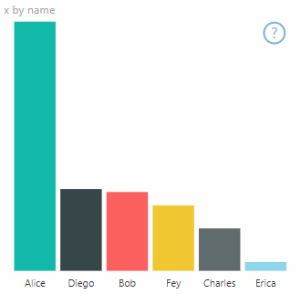

# High-contrast mode support in Power BI visuals

The Windows *high-contrast* setting makes text and apps easier to see by displaying more distinct colors. This article discusses how to add high-contrast mode support to Power BI visuals. For more information, see [high-contrast support in Power BI](../../create-reports/desktop-accessibility-creating-reports.md#high-contrast-color-view).

To view an implementation of high-contrast support, go to the [PowerBI-visuals-sampleBarChart visual repository](https://github.com/Microsoft/PowerBI-visuals-sampleBarChart/commit/61011c82b66ca0d3321868f1d089c65101ca42e6).

To display a visual in high-contrast mode you have to:

* Detect high-contrast mode and colors upon [initialization](#initialization).
* Draw the visual correctly on [implementation](#implementation).

## Initialization

The *colorPalette* member of `options.host` has several properties for high-contrast mode. Use these properties to determine whether high-contrast mode is active and, if it is, what colors to use.

* Detect that Power BI is in high-contrast mode

    If `host.colorPalette.isHighContrast` is `true`, high-contrast mode is active and the visual should draw itself accordingly.

* Get high-contrast colors

    When displaying in high-contrast mode, your visual should limit itself to the following settings:

    * **Foreground** color is used to draw any lines, icons, text, and outline or fill of shapes.
    * **Background** color is used for background, and as the fill color of outlined shapes.
    * **Foreground - selected** color is used to indicate a selected or active element.
    * **Hyperlink** color is used only for hyperlink text.

    > [!NOTE]
    > If a secondary color is needed, foreground color may be used with some opacity (Power BI native visuals use 40% opacity). Use this sparingly to keep the visual details easy to see.

During initialization, you can store the following values in your `constructor` method:

```typescript
private isHighContrast: boolean;

private foregroundColor: string;
private backgroundColor: string;
private foregroundSelectedColor: string;
private hyperlinkColor: string;
//...

constructor(options: VisualConstructorOptions) {
    this.host = options.host;
    let colorPalette: ISandboxExtendedColorPalette = host.colorPalette;
    //...
    this.isHighContrast = colorPalette.isHighContrast;
    if (this.isHighContrast) {
        this.foregroundColor = colorPalette.foreground.value;
        this.backgroundColor = colorPalette.background.value;
        this.foregroundSelectedColor = colorPalette.foregroundSelected.value;
        this.hyperlinkColor = colorPalette.hyperlink.value;
    }
```

Or you can store the `host` object during initialization and access the relevant `colorPalette` properties during update.

## Implementation

The specific implementations of high-contrast support vary from visual to visual and depend on the details of the graphic design. To keep important details easy to distinguish with limited colors, high-contrast mode ordinarily requires a design that's slightly different from the default mode.

Power BI native visuals follow these guidelines:

* All data points use the same color (foreground).
* All text, axes, arrows, lines, and so on, use the foreground color.
* Thick shapes are drawn as outlines, with thick strokes (at least two pixels) and background color fill.
* When data points are relevant, they're distinguished by different marker shapes, and data lines are distinguished by different dashing.
* When a data element is highlighted, all other elements change their opacity to 40%.
* For slicers and active filter elements use foreground-selected color.

In the following sample bar chart, for example, all bars are drawn with two pixels of thick foreground outline and background fill. Compare the way it looks with default colors and with a couple of high-contrast themes:

### [Standard colors](#tab/Standard)



### [High contrast-dark color theme](#tab/Dark)


### [High contrast-white color theme](#tab/White)


---

## Example

The following code shows one place in the `visualTransform` function that was changed to support high-contrast. It's called as part of rendering during the update. For the full implementation of this code see the `barChart.ts` file in the [PowerBI-visuals-sampleBarChart visual repository](https://github.com/Microsoft/PowerBI-visuals-sampleBarChart/commit/61011c82b66ca0d3321868f1d089c65101ca42e6).

### [No high-contrast support](#tab/NoHighContrast)

```typescript
for (let i = 0, len = Math.max(category.values.length, dataValue.values.length); i < len; i++) {
    let defaultColor: Fill = {
        solid: {
            color: colorPalette.getColor(category.values[i] + '').value
        }
    };

    barChartDataPoints.push({
        category: category.values[i] + '',
        value: dataValue.values[i],
        color: getCategoricalObjectValue<Fill>(category, i, 'colorSelector', 'fill', defaultColor).solid.color,
        selectionId: host.createSelectionIdBuilder()
            .withCategory(category, i)
            .createSelectionId()
    });
}
```

### [High-contrast support](#tab/HighContrast)

```typescript
for (let i = 0, len = Math.max(category.values.length, dataValue.values.length); i < len; i++) {
    const color: string = getColumnColorByIndex(category, i, colorPalette);

    const selectionId: ISelectionId = host.createSelectionIdBuilder()
        .withCategory(category, i)
        .createSelectionId();

    barChartDataPoints.push({
        color,
        strokeColor,
        strokeWidth,
        selectionId,
        value: dataValue.values[i],
        category: `${category.values[i]}`,
    });
}

//...

function getColumnColorByIndex(
    category: DataViewCategoryColumn,
    index: number,
    colorPalette: ISandboxExtendedColorPalette,
): string {
    if (colorPalette.isHighContrast) {
        return colorPalette.background.value;
    }

    const defaultColor: Fill = {
        solid: {
            color: colorPalette.getColor(`${category.values[index]}`).value,
        }
    };

    return getCategoricalObjectValue<Fill>(category, index, 'colorSelector', 'fill', defaultColor).solid.color;
}
```

---

## Next steps

>[!div class="nextstepaction"]
>[Design Power BI reports for accessibility](../../create-reports/desktop-accessibility-creating-reports.md)
