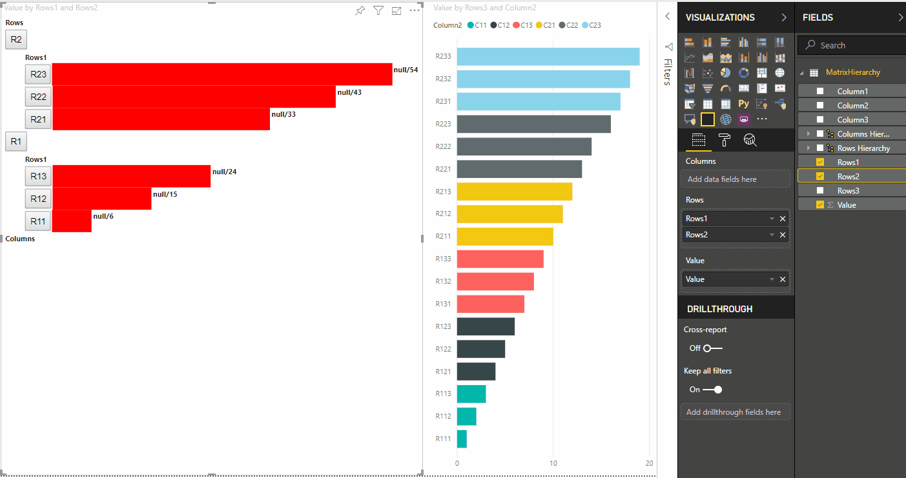

# Highlight data points in Power BI Visuals

By default, whenever an element is selected, the `values` array in the `dataView` [object](objects-properties.md) is filtered to just the selected values. This filtering causes all other visuals on the page to display just the selected data.


If you set the `supportsHighlight` property in your `capabilities.json` to `true`, you'll receive the full unfiltered `values` array along with a `highlights` array. The `highlights` array will be the same length as the values array and any non-selected values will be set to `null`. With this property enabled it's the visual's responsibility to highlight the appropriate data by comparing the `values` array to the `highlights` array.


In the example, you'll notice that one bar is selected, and that is the only value in the highlights array. There can also be multiple selections and partial highlights. The highlighted values will be presented in the data view.

> [!NOTE]
> Table data view mapping doesn't support the highlights feature.

## Highlight data points with categorical data view mapping

The visuals with categorical data view mapping have `capabilities.json` with `"supportsHighlight": true` parameter. For example:

```json
{
    "dataRoles": [
        {
            "displayName": "Category",
            "name": "category",
            "kind": "Grouping"
        },
        {
            "displayName": "Value",
            "name": "value",
            "kind": "Measure"
        }
    ],
    "dataViewMappings": [
        {
            "categorical": {
                "categories": {
                    "for": {
                        "in": "category"
                    }
                },
                "values": {
                    "for": {
                        "in": "value"
                    }
                }
            }
        }
    ],
    "supportsHighlight": true
}
```

The default visual source code after removing unnecessary code will look like this:

```typescript
"use strict";

// ... default imports list

import DataViewCategorical = powerbi.DataViewCategorical;
import DataViewCategoryColumn = powerbi.DataViewCategoryColumn;
import PrimitiveValue = powerbi.PrimitiveValue;
import DataViewValueColumn = powerbi.DataViewValueColumn;

import { VisualSettings } from "./settings";

export class Visual implements IVisual {
    private target: HTMLElement;
    private settings: VisualSettings;

    constructor(options: VisualConstructorOptions) {
        console.log('Visual constructor', options);
        this.target = options.element;
        this.host = options.host;

    }

    public update(options: VisualUpdateOptions) {
        this.settings = Visual.parseSettings(options && options.dataViews && options.dataViews[0]);
        console.log('Visual update', options);

    }

    private static parseSettings(dataView: DataView): VisualSettings {
        return <VisualSettings>VisualSettings.parse(dataView);
    }

    /**
     * This function gets called for each of the objects defined in the capabilities files and allows you to select which of the
     * objects and properties you want to expose to the users in the property pane.
     *
     */
    public enumerateObjectInstances(options: EnumerateVisualObjectInstancesOptions): VisualObjectInstance[] | VisualObjectInstanceEnumerationObject {
        return VisualSettings.enumerateObjectInstances(this.settings || VisualSettings.getDefault(), options);
    }
}
```

Import required interfaces to process data from Power BI:

```typescript
import DataViewCategorical = powerbi.DataViewCategorical;
import DataViewCategoryColumn = powerbi.DataViewCategoryColumn;
import PrimitiveValue = powerbi.PrimitiveValue;
import DataViewValueColumn = powerbi.DataViewValueColumn;
```

Create root `div` element for category values:

```typescript
export class Visual implements IVisual {
    private target: HTMLElement;
    private settings: VisualSettings;

    private div: HTMLDivElement; // new property

    constructor(options: VisualConstructorOptions) {
        console.log('Visual constructor', options);
        this.target = options.element;
        this.host = options.host;

        // create div element
        this.div = document.createElement("div");
        this.div.classList.add("vertical");
        this.target.appendChild(this.div);

    }
    // ...
}
```

Clear content of div elements before rendering new data:

```typescript
// ...
public update(options: VisualUpdateOptions) {
    this.settings = Visual.parseSettings(options && options.dataViews && options.dataViews[0]);
    console.log('Visual update', options);

    while (this.div.firstChild) {
        this.div.removeChild(this.div.firstChild);
    }
    // ...
}
```

Get categories and measure values from `dataView` object:

```typescript
public update(options: VisualUpdateOptions) {
    this.settings = Visual.parseSettings(options && options.dataViews && options.dataViews[0]);
    console.log('Visual update', options);

    while (this.div.firstChild) {
        this.div.removeChild(this.div.firstChild);
    }

    const dataView: DataView = options.dataViews[0];
    const categoricalDataView: DataViewCategorical = dataView.categorical;
    const categories: DataViewCategoryColumn = categoricalDataView.categories[0];
    const categoryValues = categories.values;

    const measures: DataViewValueColumn = categoricalDataView.values[0];
    const measureValues = measures.values;
    const measureHighlights = measures.highlights;
    // ...
}
```

Where `categoryValues` is an array of category values, `measureValues` is an array of measures, and `measureHighlights` is highlighted parts of values.

> [!NOTE]
> Values of `measureHighlights` property can be less that values of `categoryValues` property.
> In means that value was higlighted partially.

Enumerate `categoryValues` array and get corresponding values and highlights:

```typescript
// ...
const measureHighlights = measures.highlights;

categoryValues.forEach((category: PrimitiveValue, index: number) => {
    const measureValue = measureValues[index];
    const measureHighlight = measureHighlights && measureHighlights[index] ? measureHighlights[index] : null;
    console.log(category, measureValue, measureHighlight);

});
```

Create `div` and `p` elements to display and visualize data view values in visual DOM:

```typescript
categoryValues.forEach((category: PrimitiveValue, index: number) => {
    const measureValue = measureValues[index];
    const measureHighlight = measureHighlights && measureHighlights[index] ? measureHighlights[index] : null;
    console.log(category, measureValue, measureHighlight);

    // div element. it contains elements to display values and visualize value as progress bar
    let div = document.createElement("div");
    div.classList.add("horizontal");
    this.div.appendChild(div);

    // div element to visualize value of measure
    let barValue = document.createElement("div");
    barValue.style.width = +measureValue * 10 + "px";
    barValue.style.display = "flex";
    barValue.classList.add("value");

    // element to display category value
    let bp = document.createElement("p");
    bp.innerText = category.toString();

    // div element to visualize highlight of measure
    let barHighlight = document.createElement("div");
    barHighlight.classList.add("highlight")
    barHighlight.style.backgroundColor = "blue";
    barHighlight.style.width = +measureHighlight * 10 + "px";

    // element to display highlighted value of measure
    let p = document.createElement("p");
    p.innerText = `${measureHighlight}/${measureValue}`;
    barHighlight.appendChild(bp);

    div.appendChild(barValue);

    barValue.appendChild(barHighlight);
    div.appendChild(p);
});
```

Apply required styles for elements to use `flexbox` and define colors for div elements:

```css
div.vertical {
    display: flex;
    flex-direction: column;
}

div.horizontal {
    display: flex;
    flex-direction: row;
}

div.highlight {
    background-color: blue
}

div.value {
    background-color: red;
    display: flex;
}
```

In the result, you should have the following view of the visual.


## Highlight data points with matrix data view mapping

The visuals with matrix data view mapping have `capabilities.json` with `"supportsHighlight": true` parameter. For example:

```json
{
    "dataRoles": [
        {
            "displayName": "Columns",
            "name": "columns",
            "kind": "Grouping"
        },
        {
            "displayName": "Rows",
            "name": "rows",
            "kind": "Grouping"
        },
        {
            "displayName": "Value",
            "name": "value",
            "kind": "Measure"
        }
    ],
    "dataViewMappings": [
        {
            "matrix": {
                "columns": {
                    "for": {
                        "in": "columns"
                    }
                },
                "rows": {
                    "for": {
                        "in": "rows"
                    }
                },
                "values": {
                    "for": {
                        "in": "value"
                    }
                }
            }
        }
    ],
    "supportsHighlight": true
}
```

The sample data to create hierarchy for matrix data view mapping:

|   Row1   |   Row2   |   Row3   |   Column1   |   Column2   |   Column3   |   Values   |
|-----|-----|------|-------|-------|-------|-------|
|   R1   |   R11   |   R111   |   C1   |   C11   |   C111   |   1   |
|   R1   |   R11   |   R112   |   C1   |   C11   |   C112   |   2   |
|   R1   |   R11   |   R113   |   C1   |   C11   |   C113   |   3   |
|   R1   |   R12   |   R121   |   C1   |   C12   |   C121   |   4   |
|   R1   |   R12   |   R122   |   C1   |   C12   |   C122   |   5   |
|   R1   |   R12   |   R123   |   C1   |   C12   |   C123   |   6   |
|   R1   |   R13   |   R131   |   C1   |   C13   |   C131   |   7   |
|   R1   |   R13   |   R132   |   C1   |   C13   |   C132   |   8   |
|   R1   |   R13   |   R133   |   C1   |   C13   |   C133   |   9   |
|   R2   |   R21   |   R211   |   C2   |   C21   |   C211   |   10   |
|   R2   |   R21   |   R212   |   C2   |   C21   |   C212   |   11   |
|   R2   |   R21   |   R213   |   C2   |   C21   |   C213   |   12   |
|   R2   |   R22   |   R221   |   C2   |   C22   |   C221   |   13   |
|   R2   |   R22   |   R222   |   C2   |   C22   |   C222   |   14   |
|   R2   |   R22   |   R223   |   C2   |   C22   |   C223   |   16   |
|   R2   |   R23   |   R231   |   C2   |   C23   |   C231   |   17   |
|   R2   |   R23   |   R232   |   C2   |   C23   |   C232   |   18   |
|   R2   |   R23   |   R233   |   C2   |   C23   |   C233   |   19   |

Create the default visual project and apply sample of `capabilities.json`.

Default visual source code after removing unessesray code will look:

```typescript
"use strict";

// ... default imports

import { VisualSettings } from "./settings";

export class Visual implements IVisual {
    private target: HTMLElement;
    private settings: VisualSettings;


    constructor(options: VisualConstructorOptions) {
        console.log('Visual constructor', options);
        this.target = options.element;
        this.host = options.host;
    }

    public update(options: VisualUpdateOptions) {
        this.settings = Visual.parseSettings(options && options.dataViews && options.dataViews[0]);
        console.log('Visual update', options);

    }

    private static parseSettings(dataView: DataView): VisualSettings {
        return <VisualSettings>VisualSettings.parse(dataView);
    }

    /**
     * This function gets called for each of the objects defined in the capabilities files and allows you to select which of the
     * objects and properties you want to expose to the users in the property pane.
     *
     */
    public enumerateObjectInstances(options: EnumerateVisualObjectInstancesOptions): VisualObjectInstance[] | VisualObjectInstanceEnumerationObject {
        return VisualSettings.enumerateObjectInstances(this.settings || VisualSettings.getDefault(), options);
    }
}
```

Import required interfaces to process data from Power BI:

```typescript
import DataViewMatrix = powerbi.DataViewMatrix;
import DataViewMatrixNode = powerbi.DataViewMatrixNode;
import DataViewHierarchyLevel = powerbi.DataViewHierarchyLevel;
```

Create two `div` elements for visual layout:

```typescript
constructor(options: VisualConstructorOptions) {
    // ...
    this.rowsDiv = document.createElement("div");
    this.target.appendChild(this.rowsDiv);

    this.colsDiv = document.createElement("div");
    this.target.appendChild(this.colsDiv);
    this.target.style.overflowY = "auto";
}
```

Check the data in `update` method, to ensure that visual gets data:

```typescript
public update(options: VisualUpdateOptions) {
    this.settings = Visual.parseSettings(options && options.dataViews && options.dataViews[0]);
    console.log('Visual update', options);

    const dataView: DataView = options.dataViews[0];
    const matrixDataView: DataViewMatrix = dataView.matrix;

    if (!matrixDataView ||
        !matrixDataView.columns ||
        !matrixDataView.rows ) {
        return
    }
    // ...
}
```

Clear content of `div` elements before render new data:

```typescript
public update(options: VisualUpdateOptions) {
    // ...

    // remove old elements
    // to better performance use D3js pattern:
    // https://d3js.org/#enter-exit
    while (this.rowsDiv.firstChild) {
        this.rowsDiv.removeChild(this.rowsDiv.firstChild);
    }
    const prow = document.createElement("p");
    prow.innerText = "Rows";
    this.rowsDiv.appendChild(prow);

    while (this.colsDiv.firstChild) {
        this.colsDiv.removeChild(this.colsDiv.firstChild);
    }
    const pcol = document.createElement("p");
    pcol.innerText = "Columns";
    this.colsDiv.appendChild(pcol);
    // ...
}
```

Create `treeWalker` function to traverse matrix data structure:

```typescript
public update(options: VisualUpdateOptions) {
    // ...
    const treeWalker = (matrixNode: DataViewMatrixNode, index: number, levels: DataViewHierarchyLevel[], div: HTMLDivElement)  => {

    }
    // ...
}
```

Where `matrixNode` is the current node, `levels` is metadata columns of this hierarchy level, `div` - parent element for child HTML elements.

The `treeWalker` is recursive function, need to create `div` element and `p` for text as header, and call the function for child elements of node:

```typescript
public update(options: VisualUpdateOptions) {
    // ...
    const treeWalker = (matrixNode: DataViewMatrixNode, index: number, levels: DataViewHierarchyLevel[], div: HTMLDivElement)  => {
        // ...

        if (matrixNode.children) {
            const childDiv = document.createElement("div");
            childDiv.classList.add("vertical");
            div.appendChild(childDiv);

            const p = document.createElement("p");
            const level = levels[matrixNode.level]; // get current level column metadata from current node
            p.innerText = level.sources[level.sources.length - 1].displayName; // get column name from metadata

            childDiv.appendChild(p); // add paragraph element to div element
            matrixNode.children.forEach((node, index) => treeWalker(node, levels, childDiv, ++levelIndex));
        }
    }
    // ...
}
```

Call the function for root elements of column and row of matrix data view structure:

```typescript
public update(options: VisualUpdateOptions) {
    // ...
    const treeWalker = (matrixNode: DataViewMatrixNode, index: number, levels: DataViewHierarchyLevel[], div: HTMLDivElement)  => {
        // ...
    }
    // ...
    // remove old elements
    // ...

    // ...
    const rowRoot: DataViewMatrixNode = matrixDataView.rows.root;
    rowRoot.children.forEach((node) => treeWalker(node, matrixDataView.rows.levels, this.rowsDiv));

    const colRoot = matrixDataView.columns.root;
    colRoot.children.forEach((node) => treeWalker(node, matrixDataView.columns.levels, this.colsDiv));
}
```

Generate selectionID for nodes and Create buttons to display nodes:

```typescript
public update(options: VisualUpdateOptions) {
    // ...
    const treeWalker = (matrixNode: DataViewMatrixNode, index: number, levels: DataViewHierarchyLevel[], div: HTMLDivElement)  => {
        const selectionID: ISelectionID = this.host.createSelectionIdBuilder()
            .withMatrixNode(matrixNode, levels)
            .createSelectionId();

        let nodeBlock = document.createElement("button");
        nodeBlock.innerText = matrixNode.value.toString();

        nodeBlock.addEventListener("click", (event) => {
            // call select method in the selection manager
            this.selectionManager.select(selectionID);
        });

        nodeBlock.addEventListener("contextmenu", (event) => {
            // call showContextMenu method to display context menu on the visual
            this.selectionManager.showContextMenu(selectionID, {
                x: event.clientX,
                y: event.clientY
            });
            event.preventDefault();
        });
        // ...
    }
    // ...
}
```

The main step of using highlighting is to process additional array of values.

If you inspect the object of terminal node, you can see that the values array has two properties - value and highlight:

```javascript
JSON.stringify(options.dataViews[0].matrix.rows.root.children[0].children[0].children[0], null, " ");
```

```json
{
 "level": 2,
 "levelValues": [
  {
   "value": "R233",
   "levelSourceIndex": 0
  }
 ],
 "value": "R233",
 "identity": {
  "identityIndex": 2
 },
 "values": {
  "0": {
   "value": null,
   "highlight": null
  },
  "1": {
   "value": 19,
   "highlight": 19
  }
 }
}
```

Where `value` property represents value of node without applying a selection from other visual, and highlight property indicates which part of data was highlighted.

> [!NOTE]
> Value of `highlight` property can be less that value of `value` property.
> In means that value was higlighted partially.

Add the code to process the `values` array of node if it is presented:

```typescript
public update(options: VisualUpdateOptions) {
    // ...
    const treeWalker = (matrixNode: DataViewMatrixNode, index: number, levels: DataViewHierarchyLevel[], div: HTMLDivElement)  => {
        // ...

        if (matrixNode.values) {
            const sumOfValues = Object.keys(matrixNode.values) // get key property of object (value are 0 to N)
                .map(key => +matrixNode.values[key].value) // convert key property to number
                .reduce((prev, curr) => prev + curr) // sum of values

            let sumOfHighlights = sumOfValues;
            sumOfHighlights = Object.keys(matrixNode.values) // get key property of object (value are 0 to N)
                .map(key => matrixNode.values[key].highlight ? +matrixNode.values[key].highlight : null ) // convert key property to number if it exists
                .reduce((prev, curr) => curr ? prev + curr : null) // convert key property to number

            // create div container for value and highlighted value
            const vals = document.createElement("div");
            vals.classList.add("vertical")
            vals.classList.replace("vertical", "horizontal");
            // create paragraph element for label
            const highlighted = document.createElement("p");
            // Display complete value and highlighted value
            highlighted.innerText = `${sumOfHighlights}/${sumOfValues}`;

            // create div container for value
            const valueDiv = document.createElement("div");
            valueDiv.style.width = sumOfValues * 10 + "px";
            valueDiv.classList.add("value");

            // create div container for highlighted values
            const highlightsDiv = document.createElement("div");
            highlightsDiv.style.width = sumOfHighlights * 10 + "px";
            highlightsDiv.classList.add("highlight");
            valueDiv.appendChild(highlightsDiv);

            // append button and paragraph to div containers to parent div
            vals.appendChild(nodeBlock);
            vals.appendChild(valueDiv);
            vals.appendChild(highlighted);
            div.appendChild(vals);
        } else {
            div.appendChild(nodeBlock);
        }

        if (matrixNode.children) {
            // ...
        }
    }
    // ...
}
```

As the result you'll get the visual with buttons and values `highlighted value/default value`



## Next steps

>[!div class="nextstepaction"]
>[Matrix data view mappings](dataview-mappings.md#matrix-data-mapping)

>[!div class="nextstepaction"]
>[Capabilities of the visual](capabilities.md)
