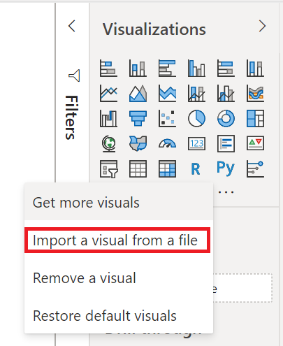
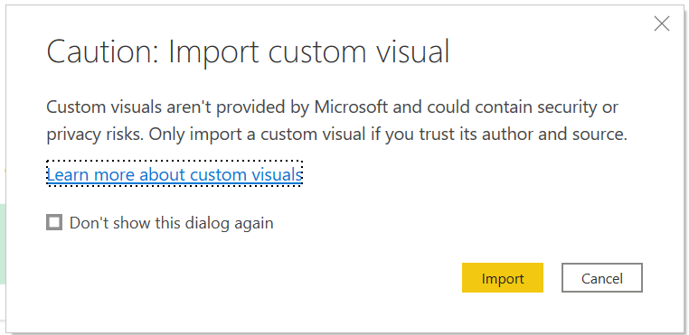
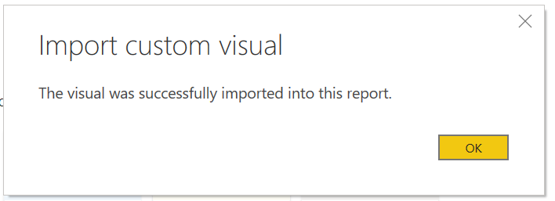
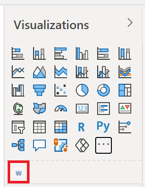

# Import a Power BI visual

Power BI comes with many out-of-the-box visuals that are available in the visualization pane of both [Power BI Desktop](https://powerbi.microsoft.com/desktop/) and [Power BI service](https://app.powerbi.com).

Many more Power BI visuals are available from the Microsoft [AppSource](https://appsource.microsoft.com/marketplace/apps?product=power-bi-visuals) or through Power BI. These visuals are created by Microsoft and Microsoft partners, and are validated by the AppSource validation team.

You can also develop your own Power BI visual, or get one from a trusted friend or coworker.

If you download or receive a Power BI visual, it has to be imported to the visualization pane before it can be used for creating and editing Power BI content.

## Importing a Power BI visual

To import a Power BI visual, follow these steps:

1. Open your report in [Power BI Desktop](https://powerbi.microsoft.com/desktop/) or [Power BI service](https://app.powerbi.com)
2. Select the ellipsis from the visualizations pane

   

3. Select **Import a  visual from a file** from the menu

  

4. If you get a caution about importing custom files select **Import** if you trust the source of the file.

   

5. Navigate to the folder that has the custom visual file (*.pbiviz), then select Open.
6. Select **OK** when the visual is successfully imported.

 

7. The visual will appear as a new icon in the visualizations pane. Select it to create the visual on the report canvas.

  
  
## Next steps

* [Developing a Power BI circle card visual](develop-circle-card.md)

* [Visualizations in Power BI](../../visuals/power-bi-report-visualizations.md)  

* [Visuals in Power BI](power-bi-custom-visuals.md)  

* More questions? [Try asking the Power BI Community](https://community.powerbi.com/)