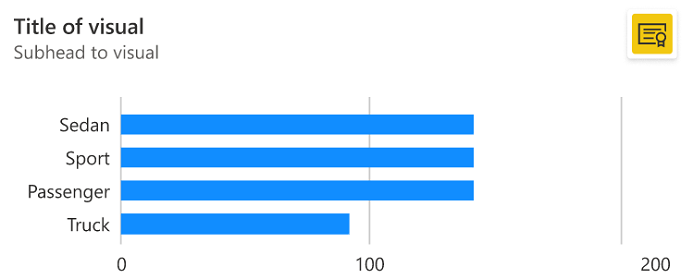
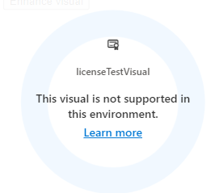

# Licensing and transactability enforcement (Public preview)

When you create Power BI visuals for download on AppSource, you can now manage and enforce their licenses using Microsoft systems. The end-user assigns and manages licenses using familiar tools like [Microsoft 365 admin center](https://admin.microsoft.com/), and the [licensing API](#licensing-api) lets you enforce these licenses and ensure that only licensed users can render the visuals.

## License enforcement process

The following table illustrates the steps involved in managing your visual licenses through Microsoft:

| Step | Details |
|--|--|
| **[Create an offer](/azure/marketplace/marketplace-power-bi-visual) in [Partner Center](https://partner.microsoft.com)** | Choose to transact through the Microsoft commerce system. Enable Microsoft to manage licenses. Set pricing and availability. |
| **Add license enforcement to your Power BI visual package** | Create or reconfigure your package to use the Power BI runtime license, which enforces licensing according to each user’s access. |
| **Customers discover your offer in AppSource and purchase a subscription** | When customers purchase your offer in [AppSource](https://appsource.microsoft.com), they also get licenses for the Power BI Visual. |
| **Customers manage their subscriptions and assign/unassign user license**s | Customers manage subscriptions and assign licenses for these Visuals and offers in the [Microsoft 365 admin center](https://admin.microsoft.com/), just like they do for any of their other subscriptions like Office or Power BI. |
| **Enforce runtime checks** | Give your customers a uniform experience by using our out-of-the-box APIs to enforce runtime license checks. |
| **[View reports](/azure/marketplace/summary-dashboard) to fuel growth** | Gain insight into revenue, payout information, and order and license details. View information about licenses and orders purchased, renewed, and canceled over time and by geography. |

## Licensing API

The **Licensing API** allows Power BI visual developers to enforce Power BI visual licenses. The API supports retrieving the information on Power BI visual licenses that are assigned to the Power BI user. It also enables triggering the licensing related notifications that will appear on the Power BI visual and inform the user that they need to purchase the missing licenses.
The visual shouldn't display its own licensing UX, instead use one of Power BI supported predefined notifications as detailed below.

Learn more about Power BI licensing see [license enforcement](custom-visual-licenses.md).

>[!NOTE]
>The **Licensing API** is available from version 4.7. To find out which version you’re using, check the `apiVersion` in the *pbiviz.json* file.

### Retrieve visual's service plans that are assigned to the active user

To get service plans assigned, add a call to `getAvailableServicePlans` (available via `IVisualLicenseManager`).
From performance perspective, attempt to fetch the licenses once, preferably in the `constructor` or the `init` calls, and save the result.  
Once licenses are retrieved, they'll be cached on Power BI host side during the Power BI session and any further calls to the same will return the cached data.

```typescript
export interface IVisualLicenseManager {
        getAvailableServicePlans(): IPromise<powerbi.extensibility.visual.LicenseInfoResult>;
    }
```

Retrieving the licenses might be a long operation, thus the `getAvailableServicePlans` call is an asynchronous call and should be handled as such in your code.  
As a response to calling the method,  `LicenseInfoResult` object is returned.

```typescript
export interface LicenseInfoResult {
        plans: ServicePlan[] | undefined;
        isLicenseUnsupportedEnv: boolean; 
        isLicenseInfoAvailable: boolean; 
    }
```

* `plans` - an array of Service Plans purchased by the active user for *this* visual. (Licenses purchased for any other visuals aren't included in the response.)  
  A ServicePlan contains the service identifier (spIdentifier) and its state (ServicePlanState).  
  
  * spIdentifier: the string value of the Service ID generated when you configure your offer’s plans in Partner Center (see the following example)
      :::image type="content" source="media/licensing-api/service-id-example.png" alt-text="Screenshot showing an example of a Service ID string.":::

  * state – enum (ServicePlanState) that represents the state of the plans assigned.  
     Supported service plan states:

     | State | Description |
     | - | - |
     | Inactive | Indicates that the license isn't active and shouldn't be used for provisioning benefits. |
     | Active | Indicates that the license is active and can be used for provisioning benefits. |
     | Warning | Indicates that the license is in grace period likely due to payment violation. |
     | Suspended | Indicates that the license is suspended likely due to payment violation. |
     | Unknown | Sentinel value. |

     **Only the *active* and *warning* states represent a usable license. All other states should be treated as not resulting in a usable license.**

* `isLicenseUnsupportedEnv` - indicates that the visual is being rendered in a Power BI environment that doesn't support licenses management or enforcement.
Currently, the following Power BI environments don't support license management or license enforcement:
  * Embedded - Publish To Web, PaaS embed
  * National/Regional clouds (Depends on general support for transactability in national/regional clouds)
  * RS Server (No planned support)
  * Exporting (PDF\PPT) using [REST API](/rest/api/power-bi/reports/export-to-file)

* `isLicenseInfoAvailable` - Indicates whether the licenses info could be retrieved.
Failure in licenses retrieval can occur in case Power BI Desktop user isn't signed in or isn't connected to the internet (offline). For web, licenses retrieval can fail due to a temporary service outage.

Example of calling `getAvailableServicePlans` (using the service ID from the image above):  

```typescript
this.licenseManager.getAvailableServicePlans().then((result: LicenseInfoResult) => {
            this.notificationType = result.isLicenseUnsupportedEnv ?  powerbi.LicenseNotificationType.UnsupportedEnv : powerbi.LicenseNotificationType.General;
            this.hasServicePlans = !!(result.plans && result.plans.length && result.plans[0].spIdentifier == "test_isvconnect1599092224747.powerbivisualtransact.plan1" && 
                ( result.plans[0].state == powerbi.ServicePlanState.Active ||  result.plans[0].state == powerbi.ServicePlanState.Warning));
            
            // display notification if the user doesn't have licenses
            if (!this.hasServicePlans) {
                this.licenseManager.notifyLicenseRequired(this.notificationType).then((value) => {
                    if (value) {
                        this.isIconDisplayed = true;
                    }
                }).catch((err) => {
                    console.log('ERROR', err);
                })
            }
        }).catch((err) => {
            this.hasServicePlans = undefined;
            console.log(err);
        });
```

### Notify the user that the required licenses are missing

Power BI platform provides several out of the box experiences that can be used to notify:

* Licenses should be purchased in order to enjoy full visual's capabilities
* Particular visual's feature is blocked due to missing licenses
* Entire visual is blocked due to missing licenses
* Entire visual is blocked because the Power BI environment in use doesn't support license management\enforcement

```typescript
export interface IVisualLicenseManager {
        notifyLicenseRequired(notificationType: LicenseNotificationType): IPromise<boolean>;
        notifyFeatureBlocked(tooltip: string): IPromise<boolean>;
        clearLicenseNotification(): IPromise<boolean>;
    }
```

#### General icon indicating a required license is missing

Use `notifyLicenseRequired` call with `LicenseNotificationType.General` to display an icon as part of the visual's container.  
Once triggered, the icon will be preserved throughout the visual's lifetime until `clearLicenseNotification` or `notifyLicenseRequired` are called.

> [!NOTE]
> The `LicenseNotificationType.General` notification is only enforced when both applies: supported for licensing environment and Power BI Edit scenarios. Calling this in an unsupported environment or when the report is in Read mode or in dashboard will not apply the icon and will return `false` in the call's response.

Example of the visual display containing the "licenses are required" general icon:

>[!div class="mx-imgBorder"]
>

>[!div class="mx-imgBorder"]
>

#### Overlay the visual's display with a *missing license* notification

Use `notifyLicenseRequired` call with `LicenseNotificationType.VisualIsBlocked` to overlay the visual's display with a notification that visual is blocked since required licenses were found missing.  
Once triggered, this notification will be preserved throughout the visual's lifetime until `clearLicenseNotification` or `notifyLicenseRequired` are called.

Example of the visual display containing the *visual blocked* notification. Power BI Desktop will only display the *Get a license* option:

:::image type="content" source="media/licensing-api/blocked-visual.png" alt-text="Visual display containing the *visual blocked* notification.":::

### Overlay the visual's display with an *unsupported environment* notification

Use `notifyLicenseRequired` call with `LicenseNotificationType.UnsupportedEnv` to overlay the visual's display with a notification that visual is blocked since the Power BI in use doesn't support licenses management\enforcement.  
Once triggered, the icon will be preserved throughout the visual's lifetime until `clearLicenseNotification` or `notifyLicenseRequired` are called.

> [!NOTE]
> The `LicenseNotificationType.UnsupportedEnv` notification is only enforced when called in context of unsupported for licensing environment. Calling this in any other environment will not apply the notification and will return `false` in the call's response.

Example of the visual display containing the "Unsupported Environment" notification:

>[!div class="mx-imgBorder"]
>

#### Display a banner notifying that a specific visual's functionality couldn't be applied

When applying a specific visual's functionality requires licenses that were found missing, you can use the `notifyFeatureBlocked` call that will pop up a banner as part of the visual's container. The banner also supports a custom tooltip that can be set by you and used to provide additional information on the feature that triggered the notification.

> [!NOTE]
> The feature is blocked notification is only enforced when called in the context of supported for licensing environment and in case blocking overlays aren't applied (`LicenseNotificationType.UnsupportedEnv`, `LicenseNotificationType.VisualIsBlocked`). Calling this notification in an unsupported environment will not apply the notification and will return `false` in the call's response.

> [!NOTE]
> To support localized Power BI environment, we recommend maintaining localized versions of the tooltips in use. Please use [Localization API](./localization.md) to retrieve the Power BI locale language.

Once triggered, the banner will be displayed for 10 seconds,
or
until other "feature blocked" banner is triggered,
or
until `clearLicenseNotification` is called (whatever comes first).

Example of the visual display containing the "feature blocked" banner notification:
>[!div class="mx-imgBorder"]
>

## Test a licensed visual

To test a licensed visual end to end before making it publicly available:

* If you're creating a brand new offer, add the visual as a private plan for a test customer account. The offer will only be visible to the this test account for purchasing.
Use this account to validate the offer before making it public.
* If your visual is already available in AppSource and you want to upgrade it to a licensed visual, you *can't make it a private plan* because that will hide the visual from AppSource, and your existing users won't have access to it. There's currently no way to test a published visual end to end. Test it the same way you tested the original visual to AppSource, by mocking the licensing API value to check the different possibilities.

## Considerations and limitations

* Tooltip for feature banner is limited by 500 chars.
* Tooltip for feature banner requires localization.
* License bundling, (i.e. one license that covers multiple offers from the same publisher) is not yet supported.

## Related content

[Publish a Power BI custom visual](office-store.md)

More questions? [Try asking the Power BI Community](https://community.powerbi.com/)
