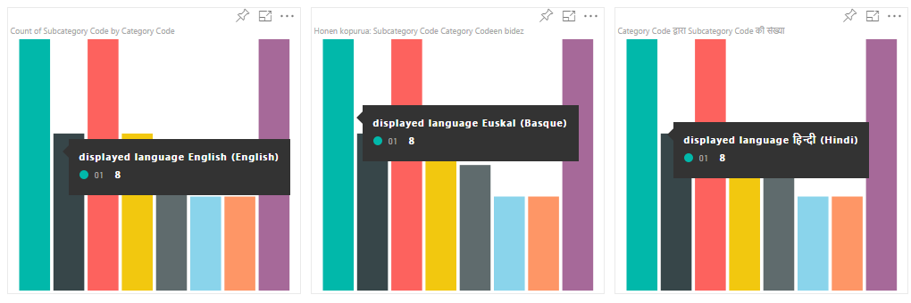
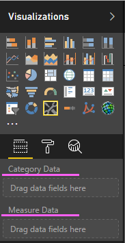
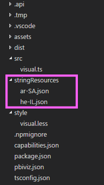
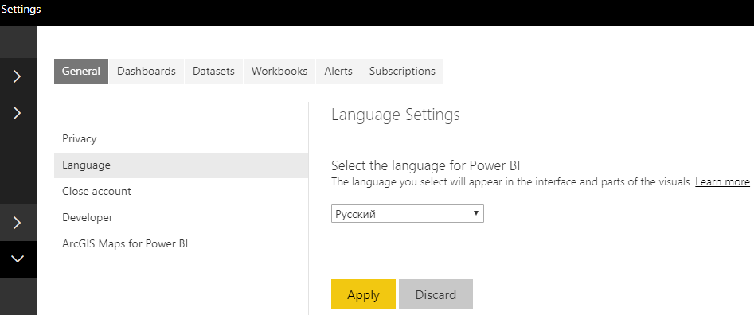
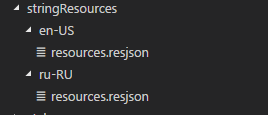

# Add the locale in Power BI for custom visuals

Visuals can retrieve the Power BI locale to localize their content to the relevant language.

Read more about [Supported languages and countries/regions for Power BI](https://docs.microsoft.com/en-us/power-bi/supported-languages-countries-regions)

For example, getting locale in the Sample Bar Chart visual.



Each of these bar charts was created under a different locale (English, Basque, and Hindi), and it is displayed in the tooltip.

> [!NOTE]
> The localization manager in the visual’s code is supported from API 1.10.0 and higher.

# Get the locale

The `locale` is passed as a string during the initialization of the visual. If a locale is changed in Power BI the visual will be generated again with the new locale. You can find the full sample code at SampleBarChart with Locale

The BarChart constructor now has a locale member, which is instantiated in the constructor with the host locale instance.

```typescript
private locale: string;
...
this.locale = options.host.locale;
```

Supported Locales

Locale string | Language
--------------|----------------------
ar-SA | العربية (Arabic)
bg-BG | български (Bulgarian)
ca-ES | català (Catalan)
cs-CZ | čeština (Czech)
da-DK | dansk (Danish)
de-DE | Deutsche (German)
el-GR | ελληνικά (Greek)
en-US | English (English)
es-ES | español service (Spanish)
et-EE | eesti (Estonian)
eU-ES | Euskal (Basque)
fi-FI | suomi (Finnish)
fr-FR | français (French)
gl-ES | galego (Galician)
he-IL | עברית (Hebrew)
hi-IN | हिन्दी (Hindi)
hr-HR | hrvatski (Croatian)
hu-HU | magyar (Hungarian)
id-ID | Bahasa Indonesia (Indonesian)
it-IT | italiano (Italian)
ja-JP | 日本の (Japanese)
kk-KZ | Қазақ (Kazakh)
ko-KR | 한국의 (Korean)
lt-LT | Lietuvos (Lithuanian)
lv-LV | Latvijas (Latvian)
ms-MY | Bahasa Melayu (Malay)
nb-NO | norsk (Norwegian)
nl-NL | Nederlands (Dutch)
pl-PL | polski (Polish)
pt-BR | português (Portuguese)
pt-PT | português (Portuguese)
ro-RO | românesc (Romanian)
ru-RU | русский (Russian)
sk-SK | slovenský (Slovak)
sl-SI | slovenski (Slovenian)
sr-Cyrl-RS | српски (Serbian)
sr-Latn-RS | srpski (Serbian)
sv-SE | svenska (Swedish)
th-TH | ไทย (Thai)
tr-TR | Türk (Turkish)
uk-UA | український (Ukrainian)
vi-VN | tiếng Việt (Vietnamese)
zh-CN | 中国 (Chinese-Simplified)
zh-TW | 中國 (Chinese-Tranditional)

> [!NOTE]
> In the PowerBI Desktop the locale property will contain the language of the PowerBI Desktop installed.

## Localizing the property pane for custom visuals

The fields in the property pane (that are defined in the capabilities) can be localized to provide a more integrated and coherent experience, making your custom visual behave like any other Power BI core visual.

For example, a non-localized custom visual created by using the `pbiviz new` command, will show the following fields in the property pane:



both the Category Data and the Measure Data are defined in the capabilities.json file as `displayName`.

## How to localize capabilities

First add a display name key to every display name you want to localize in your capabilities. In this example:

```json
{
    "dataRoles": [
        {
            "displayName": "Category Data",
            "displayNameKey": "VisualCategoryDataNameKey1",
            "name": "category",
            "kind": "Grouping"
        },
        {
            "displayName": "Measure Data",
            "displayNameKey": "VisualMeasureDataNameKey2",
            "name": "measure",
            "kind": "Measure"
        }
    ]
}
```

Then add a directory called stringResources, this directory will contain all your different string resource files based on the locales you want your visual to support. Under this directory, you’ll need to add a JSON file for every locale you want to support that contains the locale information and the localized strings values for every displayNameKey you want to replace.

In our example, lets say we want to support Arabic and Hebrew. we will need to add two JSON files in the following way:



Every JSON file defines a single locale (this file has to be one of the locales from the supported list above), with the string values for the desired display name keys. In our example the Hebrew string resource file will look as follows:

```json
{
    "locale": "de-DE",
    "values": {
        "VisualCategoryDataNameKey1": "Kategorie Daten",
        "VisualMeasureDataNameKey2": "Messdaten"
    }
}
```

All the required steps to use the localization manager are described below

> [!NOTE]
> Currently, localization  is not supported for debugging the dev visual

## Setup environment

### Desktop

For desktop usage, download the localized version of Power BI desktop from https://powerbi.microsoft.com.

### Web service

If you use the web client (browser) in the service, then change your language in settings:



## Resource file

Add a resources.resjson file to a folder named as the locale you’re going to use inside of the stringResources folder. It is en-US and ru-RU in our example.



After that, add all the localization strings you are going to use into the resources.resjson file you’ve added in the previous step.

```json
{
    ...
    "Role_Legend": "Обозначения",
    "Role_task": "Задача",
    "Role_StartDate": "Дата начала",
    "Role_Duration": "Длительность"
    ...
}
```

This sample is the en-US version of resources.resjson file:

```json
{
    ...
    "Role_Legend": "Legend",
    "Role_task": "Task",
    "Role_StartDate": "Start date",
    "Role_Duration": "Duration"
    ...
}
```

New localizationManager instance
Create an instance of localizationManager in your visual’s code as follows

```typescript
private localizationManager: ILocalizationManager;

constructor(options: VisualConstructorOptions) {
    this.localizationManager = options.host.createLocalizationManager();
}
```

`localizationManager` usage sample
Now you can simply call the getDisplayName function of the localization manager with the string key argument you defined in resources.resjson to get the required string anywhere inside of your code:

```typescript
let legend: string = this.localization.getDisplayName("Role_Legend");
```

It returns "Legend" for en-US and "Обозначения" for ru-RU

## Next Steps

* [Read how to use formatting utils to provide localized formats](utils-formattingutils)
