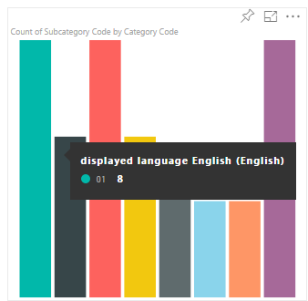
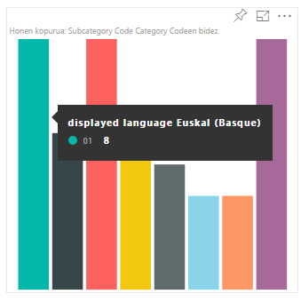
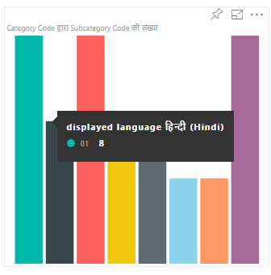
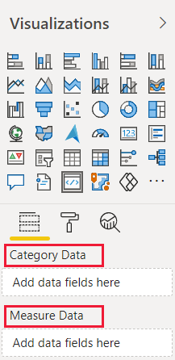
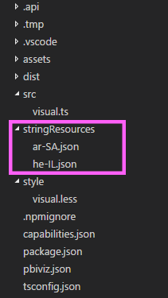
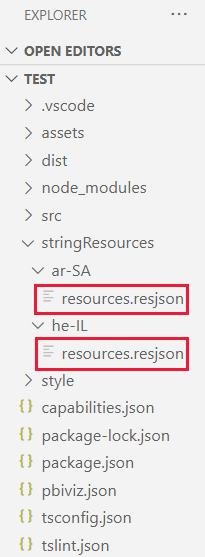

# Add the local language to your Power BI visual

Power BI [supports a range of local languages](./../../fundamentals/supported-languages-countries-regions.md). You can retrieve the Power BI locale language, and use it to display content in your visual.

The following tabs show examples of the same *sample bar chart* visual displaying content in different languages. Each of these bar charts was created using a different locale language (English, Basque, and Hindi) which is displayed in the tooltip.

## [English bar chart](#tab/English)



## [Basque bar chart](#tab/basque)



## [Hindi bar chart](#tab/hindi)



---

> [!NOTE]
>
> * The localization manager in the visual's code is supported from API 1.10.0 and higher.
> * Localization is not supported for debugging the visual while in development.

## How to add the local Power BI language to your visual

To add the local Power BI language to your visual, follow these steps:

1. [Set up your environment to display a language that isn't English](#step-1---set-up-your-environment-to-display-a-language-that-isnt-english).

2. [Get the local Power BI language](#step-2---get-the-locale-power-bi-language).

3. [Set the visual display names](#step-3---set-the-visual-display-names)

4. [Create a language folder](#step-4---create-a-language-folder).

5. [Add a resources file for each language](#step-5---add-a-resources-file-for-each-language).

6. [Create a new localizationManager instance](#step-6---create-a-new-localizationmanager-instance).

7. [Call the getDisplayName function](#step-7---call-the-getdisplayname-function).

### Step 1 - Set up your environment to display a language that isn't English

To test your visual, set Power BI to a language that isn't English. This section shows how to change the settings of Power BI Desktop and Power BI service, so that they use a local language that isn't English.

* **Power BI Desktop** - Download the localized version of Power BI desktop from https://powerbi.microsoft.com

* **Power BI service** - If you're using Power BI service (web portal), change your language in settings:

    1. Sign in to [PowerBI.com](https://powerbi.microsoft.com/).

    2. Navigate to **Settings** > **General**.

          :::image type="content" source="./media/localization/powerbi-settings.png" alt-text="Screenshot of the settings, general, menu option in Power B I service.":::

    3. Select **Select display language** to select the language you want Power BI to use.

          :::image type="content" source="media/localization/webservice-settings.png" alt-text="Screenshot showing the language settings in Fabric.":::>

### Step 2 - Get the locale Power BI language

The local Power BI language is passed as a string called `locale` during the initialization of the visual. If a locale language is changed in Power BI, the visual is generated again in the new language.

```typescript
private locale: string;
...
this.locale = options.host.locale;
```

> [!NOTE]
> In Power BI Desktop, the `locale` property contains the language of the installed Power BI Desktop.

### Step 3 - Set the visual display names

Every visual displays information in the property pane. For example, a nonlocalized custom visual created by using the `pbiviz new` command shows the *Category Data* and *Measure Data* fields in the property pane.

>[!div class="mx-imgBorder"]
>

The property pane display fields are defined in the  **capabilities.json** file. Every display field is defined using a `displayName` property. Add a `displayNameKey` to every display name you want to localize.

```json
{
    "dataRoles": [
        {
            "displayName": "Category Data",
            "displayNameKey": "VisualCategoryDataNameKey1",
            "name": "category",
            "kind": "Grouping"
        },
        {
            "displayName": "Measure Data",
            "displayNameKey": "VisualMeasureDataNameKey2",
            "name": "measure",
            "kind": "Measure"
        }
    ]
}
```

### Step 4 - Create a language folder

To create localized visuals, your project needs to have a language folder. In your project, create a folder called **stringResources**. The folder contains one sub folder for each local language you want your visual to support. For example, to support Arabic and Hebrew, add two folders in the following way:

>[!div class="mx-imgBorder"]
>

### Step 5 - Add a resources file for each language

For each language you want your visual to support, add a **resources.resjson** JSON file in the appropriate **stringResources** sub folder. These files contain the locale language information, and the localized string values for every `displayNameKey` you want to replace.

>[!div class="mx-imgBorder"]
>

Every JSON file defines a single [supported locale language](#supported-languages). Add all the localization strings you're going to use into each **resources.resjson** file.

#### Examples

* **resources.resjson** file with *Russian* strings for each `displayNameKey`.

    ```json
    {
        ...
        "Role_Legend": "Обозначения",
        "Role_task": "Задача",
        "Role_StartDate": "Дата начала",
        "Role_Duration": "Длительность"
        ...
    }
    ```

* **resources.resjson** file with *Hebrew* strings for each `displayNameKey`.

    ```json
    {
        ...
        "Role_Legend": "מקרא",
        "Role_task": "משימה",
        "Role_StartDate": "תאריך התחלה",
        "Role_Duration": "משך זמן"
        ...
    }
    ```

### Step 6 - Create a new localizationManager instance

Create a new `localizationManager` instance in your visual's code.

```typescript
private localizationManager: ILocalizationManager;

constructor(options: VisualConstructorOptions) {
    this.localizationManager = options.host.createLocalizationManager();
}
```

### Step 7 - Call the getDisplayName function

After creating a new `localizationManager` instance, you can call the localization manager's `getDisplayName` function with the string key argument you defined in **resources.resjson**.

For example, the following code returns *Legend* for **en-US**, and *Обозначения* for **ru-RU**.

```typescript
let legend: string = this.localization.getDisplayName("Role_Legend");
```

## Format pane and analytics pane localization

> [!NOTE]
> Relevant to API version 5.1+

To support localization on format pane and analytics pane components, set localized string as follows:

```typescript
displayName: this.localization.getDisplayName("Font_Color_DisplayNameKey");
description: this.localization.getDisplayName("Font_Color_DescriptionKey");
```

For **localize formatting model** see [format pane localization](format-pane.md#localization).  
For **localize formatting model utils** see [formatting model utils - localization](utils-formatting-model.md#localization).

## Supported languages

The following table contains a list of all the languages supported in Power BI, and the string that the `locale` variable returns for each one.

Locale string | Language
--------------|---------------------
ar-SA | العربية (Arabic)
bg-BG | български (Bulgarian)
ca-ES | català (Catalan)
cs-CZ | čeština (Czech)
da-DK | dansk (Danish)
de-DE | Deutsche (German)
el-GR | ελληνικά (Greek)
en-US | English (English)
es-ES | español service (Spanish)
et-EE | eesti (Estonian)
eU-ES | Euskal (Basque)
fi-FI | suomi (Finnish)
fr-FR | français (French)
gl-ES | galego (Galician)
he-IL | עברית (Hebrew)
hi-IN | हिन्दी (Hindi)
hr-HR | hrvatski (Croatian)
hu-HU | magyar (Hungarian)
id-ID | Bahasa Indonesia (Indonesian)
it-IT | italiano (Italian)
ja-JP | 日本の (Japanese)
kk-KZ | Қазақ (Kazakh)
ko-KR | 한국의 (Korean)
lt-LT | Lietuvos (Lithuanian)
lv-LV | Latvijas (Latvian)
ms-MY | Bahasa Melayu (Malay)
nb-NO | norsk (Norwegian)
nl-NL | Nederlands (Dutch)
pl-PL | polski (Polish)
pt-BR | português (Portuguese)
pt-PT | português (Portuguese)
ro-RO | românesc (Romanian)
ru-RU | русский (Russian)
sk-SK | slovenský (Slovak)
sl-SI | slovenski (Slovenian)
sr-Cyrl-RS | српски (Serbian)
sr-Latn-RS | srpski (Serbian)
sv-SE | svenska (Swedish)
th-TH | ไทย (Thai)
tr-TR | Türk (Turkish)
uk-UA | український (Ukrainian)
vi-VN | tiếng Việt (Vietnamese)
zh-CN | 中国 (Chinese-Simplified)
zh-TW | 中國 (Chinese-Tranditional)

## Related content

[Formatting utils](utils-formatting.md)

Questions? Ask the [Power BI community](https://community.powerbi.com/)
