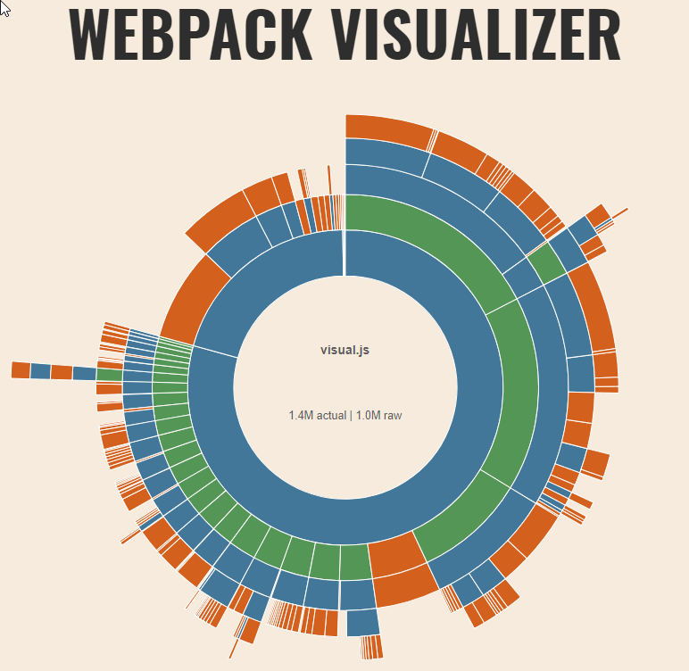

# Migrate to the new powerbi-visuals-tools 3.x.x

Starting from version 3, Power BI Visuals Tools use Webpack to build Custom Visuals.
The new version brings many new opportunities for developers to create visuals:

* TypeScript v3.x.x by default. Starting from TypeScript 1.5 the nomenclature has been changed. [Read more about TypeScript modules](https://www.typescriptlang.org/docs/handbook/modules.html).

* ES6 modules are supported. You don't need to use [externalJS](migrate-to-new-tools.md#fix-loading-external-libraries) anymore, use ES6 imports instead.

* New versions of [D3v5](https://d3js.org/) and other ES6 module-based libraries are supported.

* Reduced package size. Webpack uses [Tree Shaking](https://webpack.js.org/guides/tree-shaking/) to remove unused code. It reduces code of JS and, as a result, you get better performance in visual loading.

* Improved API performance.

* Globalize.js library [is integrated](migrate-to-new-tools.md#remove-globalizejs-library) into formatting-utils.

* Tools uses [webpack-bundle-analyzer](https://github.com/webpack-contrib/webpack-bundle-analyzer) to display the code base of the visual.

All migration steps for the new version of Power BI Visuals Tools are described below.

## Backward compatibility

The new tools save backward compatibility for old visuals code base, but can require some additional changes to load external libraries.

The libs, which support module systems will be imported as Webpack modules. All other libs and visual source code will be wrapped into one module.

Global variables like JQuery and Lodash that were used in the previous pbiviz tools are obsolete now. It means that if the old visual code relay on global variables, the visual can be broken in this case.

The previous version of Power BI Visuals Tools required to define a visual class under `powerbi.extensibility.visual` module.

## How to install powerbi-visuals-tools

The new toolset can be installed by executing the command

```cmd
npm install -g powerbi-visuals-tools
```

The sample of sampleBarChart visual and correspond [changes](https://github.com/Microsoft/PowerBI-visuals-sampleBarChart/blob/sample-next/package.json#L16) in `package.json`:

```json
{
    "name": "visual",
    "version": "1.2.3",
    "scripts": {
        "pbiviz": "pbiviz",
        "start": "pbiviz start",
        "lint": "tslint -r \"node_modules/tslint-microsoft-contrib\"  \"+(src|test)/**/*.ts\"",
        "test": "pbiviz package --resources --no-minify --no-pbiviz"
    },
    "devDependencies": {
      "@types/d3": "5.0.0",
      "d3": "5.5.0",
      "powerbi-visuals-tools": "^3.1.0",
      "tslint": "^4.4.2",
      "tslint-microsoft-contrib": "^4.0.0"
    }
}
```

## How to install Power BI Custom Visuals API

New version of powerbi-visual-tools doesn't include all API versions inside. Instead of that developer should install a specific version of [`powerbi-visuals-api`](https://www.npmjs.com/package/powerbi-visuals-api) package. The version of package matches API version of Power BI Custom Visuals and it provides all type definitions for Power BI Custom Visuals API.

Add `powerbi-visuals-api` into dependencies of project by executing command
`npm install --save-dev powerbi-visuals-api`.
And you should remove the link to old API type definitions. Because types from `powerbi-visuals-api` include automatically by Webpack. Correspond changes are in [this](https://github.com/Microsoft/PowerBI-visuals-sampleBarChart/blob/sample-next/package.json#L14) line of `package.json`.

## Update `tsconfig.json`

To use external modules, you should switch `out` option to `outDir`.
`"outDir": "./.tmp/build/",` instead `"out": "./.tmp/build/visual.js",`.

It's required as TypeScript files will be compiled into JavaScript files independently. It's why you no longer have to specify visual.js file as an output.

And you can also change `target` option to `ES6` if you want to use modern JavaScript as an output. [It's optional](https://github.com/Microsoft/PowerBI-visuals-sampleBarChart/blob/sample-next/tsconfig.json#L6).

## Update Custom Visuals utils

If you use one of [powerbi-visuals-utils](https://www.npmjs.com/search?q=powerbi-visuals-utils) you should update them to the latest version too.

Execute the command `npm install powerbi-visuals-utils-<UTILNAME> --save`. (Ex. `npm install powerbi-visuals-utils-dataviewutils --save` ) to get the new version with external modules of TypeScript.

You can find example in MekkoChart [repository](https://github.com/Microsoft/powerbi-visuals-mekkochart).
This visual uses all utils.

## Remove Globalize.js library

New version of [powerbi-visuals-utils-formattingutils@4.3](https://www.npmjs.com/package/powerbi-visuals-utils-formattingutils) includes globalize.js out of the box.
You don't need to include this library manually to the project.
All required localizations will be added to the final package automatically.

## Fix loading external libraries

Instead include new JS file after libs in `externalJS` array of `pbiviz.json`. Example:

```JSON
"externalJS": [
    ...
    "node_modules/lodash/lodash.min.js",
    "externalJS/init.lodash.js",
    ...
]
```

Import the libs in source. Example for `lodash-es`:

```JS
import * as _ from "lodash-es";
```

where `_` is global variable for `lodash` library.

## Changes in the visuals sources

The main change is converting internal modules to external modules as you can't use external modules within internal modules.

Those changes describe modifications that have been applied to Sample Bar Chart

Detailed descriptions of changes are below:

1. Remove all modules definitions from each file of [source code](https://github.com/Microsoft/PowerBI-visuals-sampleBarChart/blob/sample-next/src/barChart.ts#L153)

    ```typescript
    module powerbi.extensibility.visual {
        ...
    }
    ```

2. [Import Power BI custom visual API definitions](https://github.com/Microsoft/PowerBI-visuals-sampleBarChart/blob/sample-next/src/barChart.ts#L2) .

    ```typescript
    import powerbi from "powerbi-visuals-api";
    ```

3. [Import](https://github.com/Microsoft/PowerBI-visuals-sampleBarChart/blob/sample-next/src/barChart.ts#L12-L23) necessary interfaces or classes from `powerbi` internal module.

    ```typescript
    import PrimitiveValue = powerbi.PrimitiveValue; 
    import VisualUpdateOptions = powerbi.extensibility.visual.VisualUpdateOptions; 
    import VisualConstructorOptions = powerbi.extensibility.visual.VisualConstructorOptions; 
    import IVisualHost = powerbi.extensibility.visual.IVisualHost; 
    import IColorPalette = powerbi.extensibility.IColorPalette; 
    import IVisual = powerbi.extensibility.visual.IVisual; 
    import VisualObjectInstance = powerbi.VisualObjectInstance; 
    import VisualObjectInstanceEnumeration = powerbi.VisualObjectInstanceEnumeration; 
    import EnumerateVisualObjectInstancesOptions = powerbi.EnumerateVisualObjectInstancesOptions; 
    import Fill = powerbi.Fill; 
    import VisualTooltipDataItem = powerbi.extensibility.VisualTooltipDataItem; 
    import ISelectionManager = powerbi.extensibility.ISelectionManager; 
    ```

4. [Import](https://github.com/Microsoft/PowerBI-visuals-sampleBarChart/blob/sample-next/src/barChart.ts#L1) D3.js library

    ```typescript
    import * as d3 from "d3";
    ```

    Or import only required d3 library modules

    ```typescript
    import { max, min } from "d3-array";
    ```

5. [Import](https://github.com/Microsoft/PowerBI-visuals-sampleBarChart/blob/sample-next/src/barChart.ts#L4-L10) utils, classes, interfaces defined in the visual project to the main source file

    ```typescript
    import { getLocalizedString } from "./localization/localizationHelper";
    import { getValue, getCategoricalObjectValue } from "./objectEnumerationUtility";
    import {
        ITooltipServiceWrapper,
        TooltipEventArgs,
        createTooltipServiceWrapper
    } from "./tooltipServiceWrapper";
    ```

### Import CSS Styles

The new version of tools allows developers to import CSS, LESS style directly into the TypeScript code.

So, previously used [styles section](https://github.com/Microsoft/PowerBI-visuals-sampleBarChart/blob/sample-next/pbiviz.json#L22) will be ignored by a compiler.

To use your stylesheet, open main ts file and add the following line:  

```typescript
import "./../style/visual.less";
```  

Your CSS, LESS styles will be compiled automatically.  

### externalJS section in pbiviz.json

The tools [doesn't require](https://github.com/Microsoft/PowerBI-visuals-sampleBarChart/blob/sample-next/pbiviz.json#L20) a list of `externalJS` to load into the visual bundle. Because webpack includes all imported libs.

**The externalJS section in pbivi.json should be empty.**

Call the typical commands `npm run package` to create the visual package or `npm run start` to start dev server.

## Updating D3.js library to version 5

With new tools, you can start using the new version of D3.js library.

Call commands to update D3 in your visual project

`npm install --save d3@5` for install the new D3.js.

`npm install --save-dev @types/d3@5` for install the new type definitions for D3.js.

There are several breaking changes and you should modify your code to use the new D3.js.

1. The interface `d3.Selection<T>` [was changed](https://github.com/Microsoft/PowerBI-visuals-sampleBarChart/commit/af2ff9fb0fc70bd94ea0c604d75a362411d5abeb#diff-433142f7814fee940a0ffc98dc75bfcbR157) to `Selection<GElement extends BaseType, Datum, PElement extends BaseType, PDatum>`

2. You can't apply several attributes by a single call of `attr` method. You [should pass](https://github.com/Microsoft/PowerBI-visuals-sampleBarChart/commit/af2ff9fb0fc70bd94ea0c604d75a362411d5abeb#diff-433142f7814fee940a0ffc98dc75bfcbR278) each attribute in different call of `attr` method. It's [similar](https://github.com/Microsoft/PowerBI-visuals-sampleBarChart/commit/af2ff9fb0fc70bd94ea0c604d75a362411d5abeb#diff-433142f7814fee940a0ffc98dc75bfcbR247) for `style` method too.

3. In D3.js v4, the new merge method is introduced. This method is commonly used to merge enter and update selections after a data-join. [Call merge method](https://github.com/Microsoft/PowerBI-visuals-sampleBarChart/commit/83fe8d52d362dccd0034dd8e32c94080d9376b29#diff-433142f7814fee940a0ffc98dc75bfcbR272) to use d3 properly.

[Read more](https://github.com/d3/d3/blob/master/CHANGES.md) about changes in D3.js library.

## Babel

Starting from version 3.1 the tools use Babel to compile new modern JS code into old ES5 to support wide range of browsers.

This option is enabled by default, but you need to manually import the [`@babel/polyfill`](https://babeljs.io/docs/en/babel-polyfill) package.

Execute command to install the package

`npm install --save @babel/polyfill`

and import the package on the start point of the visual code (usually it's 'src/visual.ts' file):

`import "@babel/polyfill";`

Read more about Babel [in docs](https://babeljs.io/docs/en/).

Finally run [webpack-visualizer](https://github.com/chrisbateman/webpack-visualizer) to display the code base of the visual.  


