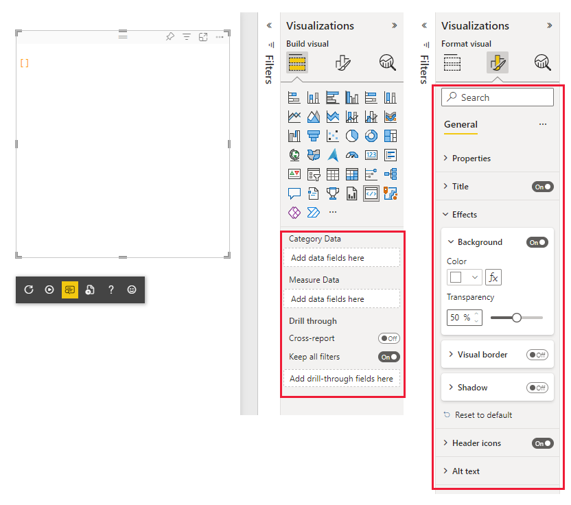

# Visuals that don't require data binding

When you create a visual in a report, the values are defined interactively by adding data fields to the **Values** well on the visualization pane.

:::image type="content" source="media/no-dataroles-support/binding-data.png" alt-text="Adding values to visual.":::

By default, if no values are defined, the format settings are disabled and the visual isn't updated.

The `dataRoles` capabilities model allows you to receive updates from Power BI without binding data.

This means that you can render a visual and use the *update* method to change the format settings even if the data-buckets are empty, or if your visual doesn't use any data roles at all.

The following tabs show two examples of a Power BI visual. One visual requires binding data, and the other uses the *no data roles* feature and doesn't require binding data.

### [Binding data required](#tab/NoDataroles)

>[!div class="mx-imgBorder"]
>

### [Binding data not required](#tab/NoDatarolesSupport)

>[!div class="mx-imgBorder"]
>

---

## How to create a visual that doesn't require data binding

> [!NOTE]
> This feature is available from version 3.6.0 of `powerbi-visuals-api`.

To enable the no data-binding feature, set the following two parameters in the `capabilities.json` file to *true*.

* [Landing page](landing-page.md) allows you to display information on the Power BI card before it's loaded with data

* Empty data view allows Power BI updates when the values field is empty.

```json
    {
        "supportsLandingPage": true,
        "supportsEmptyDataView": true,
    }
```

## Next steps

> [!div class="nextstepaction"]
> [Using capabilities](capabilities.md)

> [!div class="nextstepaction"]
> [Add a landing page](landing-page.md)
