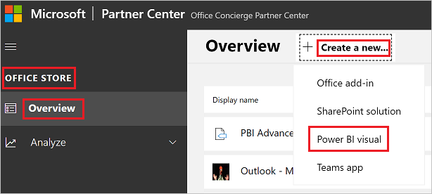

# Publish Power BI visuals to Partner Center

Once you have created your Power BI visual, you may want to publish it to the AppSource for others to discover and use. For more information about creating a Power BI visual, see [Developing a Power BI circle card visual](develop-circle-card.md).

## What is AppSource?

[AppSource](https://appsource.microsoft.com/marketplace/apps?product=power-bi-visuals) is the place to find SaaS apps and add-ins for your Microsoft products and services.

## Preparing to submit your Power BI visual

Before submitting a Power BI visual to AppSource, make sure that the visual complies with the [Power BI visuals guidelines](guidelines-powerbi-visuals.md).

>[!IMPORTANT]
>If you're resubmitting or updating a visual, **do not change its GUID**. Follow these instructions to [test a new version of a visual](submission-testing.md#testing-a-new-version-of-a-published-visual)

When you are ready to submit your Power BI visual, verify that your visual meets all the requirements listed below.

| Item | Required | Description |
| --- | --- | --- |
| Pbiviz package |Yes |Pack your Power BI visual into a Pbiviz package containing all the required metadata. Visual name Display name GUID Version Description Author name and email |
| Sample .pbix report file |Yes |To showcase your visual, you should help users to get familiar with the visual. Highlight the value that the visual brings to the user and give examples of usage and formatting options. You can also add a *"hints"* page at the end with some tips and tricks and things to avoid. The sample .pbix report file must work offline, without any external connections. |
| Icon |Yes |You should include the custom visual logo that will appear in the Marketplace listing. The format can be .png, .jpg, .jpeg or .gif. It must be exactly 300 px (width) x 300 px (height). **Important!** Please review the [AppSource store images guide](/office/dev/store/craft-effective-appsource-store-images) carefully, before submitting the icon. |
| Screenshots |Yes |Provide at least one screenshot. The format can be .png, .jpg, .jpeg or .gif. The dimensions must be exactly 1366 px (width) by 768 px (height). The size of the file can't be larger than 1024 kb. For greater usage, add text bubbles to articulate the value proposition of key features shown in each screenshot. |
| Support download link |Yes |Provide a support URL for your customers. This link is entered as part of your Partner Center listing, and is visible to users when they access your visual's listing on AppSource. The format of your URL should include https:// or https://. |
| Privacy document link |Yes |Provide a link to the visual's privacy policy. This link is entered as part of your Partner Center listing, and is visible to users when they access your visual's listing on AppSource. The format of your link should include https:// or https://. |
| End-user license agreement (EULA) |Yes |You must provide an EULA file for your Power BI visual. You can use the [standard contract](https://go.microsoft.com/fwlink/?linkid=2041178), [Power BI visuals contract](https://visuals.azureedge.net/app-store/Power%20BI%20-%20Default%20Custom%20Visual%20EULA.pdf), or your own EULA. |
| Video link |No |To increase the interest of users for your custom visual, provide a link to a video about your visual. The format of your URL should include https:// or https://. |
| GitHub repository |No |Share a public link to a [GitHub](https://www.github.com) repository with sources of your Power BI visual and sample data. This allows other developers an opportunity to provide feedback and propose improvements to your code. |

## Submitting to AppSource

In order to submit a Power BI visual to AppSource, you need a **pbiviz** package and **pbix** file to upload to Partner Center.

Before you create the **pbiviz** package, make sure you fill the following fields in the **pbiviz.json** file:

* description
* supportUrl
* author
* name
* email

To submit your Power BI visual, you must be registered with Partner Center. If you're not yet registered, [Open a developer account in Partner Center](/office/dev/store/open-a-developer-account).

>[!NOTE]
>**Individual publishers** can use one of these methods to submit a Power BI visual:
>
>* If you have an old Seller Dashboard account, you can continue using this account's credentials to sign into Partner Center.
>* If you don't have an old Seller Dashboard account, and are not registered to Partner Center, you'll need to [Open a developer account in Partner Center](/office/dev/store/open-a-developer-account) using your work email.

Follow the steps below to submit your Power BI visual to Partner Center. For more information about the submission process, see [Submit your Office solution to AppSource via Partner Center](/office/dev/store/add-in-submission-guide).

1. Log into **Partner Center**.

2. On the left pane, select **Commercial Marketplace**.

3. Select **Overview**.

4. Select **New Offer** and from the drop-down menu, select **Power BI visual**.

    

5. In the **Create a new Power BI visual** window, enter a name and Offer ID for your Power BI visual and select **Create**.

    :::image type="content" source="media/office-store/name-visual.png" alt-text="Screenshot of pop up window for PBI visual name.":::

6. Select **Packages** and upload your Power BI **pbiviz** file and the **pbix** file.

7. Select **Properties** and provide the required information.

8. If your product requires additional purchase, select **Offer setup** and check the **Associated service purchase** check box.

9. (Optional) If you want to [certify](power-bi-custom-visuals-certified.md) your visual, select **Product setup** and check the **Power BI certification** check box.
    >[!TIP]
    The Power BI certification process takes time. If you're creating a new Power BI visual, we recommend that you publish your Power BI visual via the Partner Center before you request Power BI certification. This ensures that the publishing of your visual is not delayed.

10. Select **Offer setup** and click **Review and publish**.

## Tracking submission status and usage

You can review the [validation policies](/legal/marketplace/certification-policies#1180-power-bi-visuals).

* After submission, you will be able to view the submission status in the [app dashboard](https://sellerdashboard.microsoft.com/Application/Summary/).

* To understand when your Power BI visual will be available to download from AppSource, review the Power BI visuals [publication timeline](power-bi-custom-visuals-certified.md#publication-timeline).

## Certify your visual

Certified Power BI visuals are visuals in the Marketplace that meet certain specified code [requirements](power-bi-custom-visuals-certified.md#certification-requirements) that the Microsoft Power BI team has tested and approved. To request certification, select the Request Power BI certification check box.
We recommend that you submit and publish your Power BI visual before you request certification, because the certification process can take time. When you request certification, be sure to provide all required certification information in the Notes for certification box on the Review and publish page.
All certified visuals must passes all the [required tests](submission-testing.md).

## Next steps

>[!div class="nextstepaction"]
>[Guidelines for publishing Power BI visuals](guidelines-powerbi-visuals.md)

>[!div class="nextstepaction"]
>[Test your Power BI visual before submitting for certification](submission-testing.md)  

>[!div class="nextstepaction"]
>[Getting a Power BI visual certified](power-bi-custom-visuals-certified.md)

**More questions?** [Try asking the Power BI Community](https://community.powerbi.com/)
