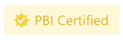

# Certified Power BI visuals

Certified Power BI visuals are Power BI visuals in [AppSource](https://appsource.microsoft.com/marketplace/apps?page=1&product=power-bi-visuals) that meet the Microsoft Power BI team [code requirements](#certification-requirements) and testing. The tests performed are designed to check that the visual doesn't access external services or resources. However, Microsoft isn't the author of third-party custom visuals, and we advise customers to contact the author directly to verify the functionality of these visuals.

Certified Power BI visuals can be used like any other Power BI visual. They offer more features than noncertified visuals. For example, you can [export them to PowerPoint](../../collaborate-share/end-user-powerpoint.md), or display the visual in received emails when a user [subscribes to report pages](../../collaborate-share/end-user-subscribe.md).

The certification process is optional. It's up to the developers to decide if they want their visual certified. Power BI visuals that aren't certified, aren't necessarily unsafe. Some Power BI visuals aren't certified because they don't comply with one or more of the [certification requirements](power-bi-custom-visuals-certified.md#certification-requirements). For example, a map Power BI visual connecting to an external service, or a Power BI visual using commercial libraries can't be certified.

## Removal of certification

Microsoft reserves the right to remove a visual from the certified list, at its discretion.

## Certification requirements

To get your Power BI visual certified, it must meet the requirements listed in this section.

### General requirements

Your Power BI visual has to be approved by Partner Center. Before requesting certification, we recommend that you publish your Power BI visual in [AppSource](https://appsource.microsoft.com/marketplace/apps?page=1&product=power-bi-visuals). To learn how to publish a Power BI visual to AppSource, see [Publish Power BI visuals to Partner Center](office-store.md).

Before submitting your Power BI visual for certification, verify that:

* The visual complies with the [guidelines for Power BI visuals](guidelines-powerbi-visuals.md)
* The visual passes all the [required tests](submission-testing.md)
* The compiled package exactly matches the submitted package

### Code repository requirements

Although you don't have to publicly share your code in GitHub, the code repository has to be available for a review by the Power BI team. The best way to do this is by providing the source code (JavaScript or TypeScript) in GitHub.

The repository must contain:

* Code for only one Power BI visual. It can't contain code for multiple Power BI visuals, or unrelated code.
* A branch named **certification** (lowercase required). The source code in this branch has to match the submitted package. This code can only be updated during the next submission process, if you're resubmitting your Power BI visual.

If your Power BI visual uses private npm packages, or git submodules, you must also provide access to the repositories containing this code.

To understand how a Power BI visual repository looks, review the GitHub repository for the [Power BI visuals sample bar chart](https://github.com/microsoft/PowerBI-visuals-sampleBarChart).

### File requirements

Use the latest version of the API to write the Power BI visual.

The repository must include the following files:

* **.gitignore** - Add `node_modules`, `.tmp` and,  `dist` to this file. The code can't include the *node_modules*, *.tmp*, or *dist* folders.
* **capabilities.json** - If you're submitting a newer version of an existing Power BI visual with changes to the properties in this file, verify that they don't break reports for existing users.
* **pbiviz.json**
* **package.json**. The visual must have the following package installed:
  * ["typescript"](https://www.npmjs.com/package/typescript)
  * ["eslint"](https://www.npmjs.com/package/eslint)
  * ["eslint-plugin-powerbi-visuals"](https://www.npmjs.com/package/eslint-plugin-powerbi-visuals)
  * The file must contain a command for running linter -  `"eslint": "npx eslint . --ext .js,.jsx,.ts,.tsx"`
* **package-lock.json**
* **tsconfig.json**

### Command requirements

Make sure that the following commands don't return any errors.

* `npm install`
* `pbiviz package`
* `npm audit` - Must not return any warnings with high or moderate level.
* `ESlint` with the [required configuration](https://www.npmjs.com/package/eslint-plugin-powerbi-visuals). This command must not return any lint errors.

  >[!NOTE]
  > We're in the process of migrating from TSlint to ESLint. Visuals using TSlint will be accepted for certification until March 2023. After that, ESlint will be required.

### Compiling requirements

Use the latest version of [powerbi-visuals-tools](https://www.npmjs.com/package/powerbi-visuals-tools) to write the Power BI visual.

Compile your Power BI visual with `pbiviz package`. If you're using your own build scripts, provide a `npm run package` custom build command.

### Source code requirements

Make sure you follow the [Power BI visuals additional certification](/legal/marketplace/certification-policies#1200-power-bi-visuals-additional-certification) policy list. If your submission doesn't follow these guidelines, you'll get a rejection email from Partner Center with the policy numbers listed in this link.

Follow the code requirements listed here to make sure that your code is in line with the Power BI certification policies.  

#### Required

* Only use public reviewable OSS components such as public JavaScript or TypeScript libraries.
* The code must support the [Rendering Events API](event-service.md).
* Ensure DOM is manipulated safely. Use sanitization for user input or user data, before adding it to DOM.
* Use the [sample report](https://github.com/PowerBi-Projects/PowerBI-visuals/tree/gh-pages/assets) as a test dataset.

#### Not allowed

* Accessing external services or resources. For example, no HTTP/S or WebSocket requests can go out of Power BI to any services. Therefore, [WebAccess privileges](./capabilities.md#allow-web-access) should be empty, or omitted, in the capabilities settings.
* Using `innerHTML`, or `D3.html(user data or user input)`.
* JavaScript errors or exceptions in the browser console, for any input data.
* Arbitrary or dynamic code such as `eval()`, unsafe use of `settimeout()`, `requestAnimationFrame()`, `setinterval(user input function)`, and user input or user data.
* Minified JavaScript files or projects.

## Submit a Power BI visual for certification

Now you're ready to submit a request to have your Power BI visual certified by the Power BI team.

>[!TIP]
>The Power BI certification process might take time. If you're creating a new Power BI visual, we recommend that you publish your Power BI visual via the Partner Center before you request Power BI certification. This ensures that the publishing of your visual is not delayed.

To request Power BI certification:

1. Sign in to Partner Center.
2. On the **Overview page**, choose your Power BI visual, and go to the **Product** setup page.
3. Select the **Request Power BI certification** check box.
4. On the **Review and publish** page, in the **Notes for certification** text box, provide a link to the source code and the credentials required to access it.

### Private repository submission process

If you're using a private repository such as GitHub to submit your Power BI visual for certification, follow the instructions in this section.

1. Create a new account for the validation team.
2. Configure [two-factor authentication](https://help.github.com/github/authenticating-to-github/securing-your-account-with-two-factor-authentication-2fa) for your account.
3. [Generate a new set of recovery codes](https://help.github.com/github/authenticating-to-github/configuring-two-factor-authentication-recovery-methods#generating-a-new-set-of-recovery-codes).
4. When submitting your Power BI visual, make sure you provide the following details:
    * A link to the repository
    * Sign in credentials (including a password)
    * Recovery codes
    * Read-only permissions to our account ([pbicvsupport](https://github.com/pbicvsupport))

## Certified Power BI visual badges

Once a Power BI visual is certified, it gets a designated badge indicating that it's a certified Power BI visual.

### Certified Power BI visuals in AppSource

* When someone searches online for [Power BI visuals in AppSource](https://appsource.microsoft.com/marketplace/apps?product=power-bi-visuals), a small yellow badge on the visual's card indicates that it's a certified Power BI visual.

    

* When the Power BI visual card is clicked in AppSource, a yellow badge titled *PBI Certified* indicates that this Power BI visual is certified.

    

### Certified Power BI visuals in the Power BI interface

* When a Power BI visual is imported from within Power BI (Desktop or service), a blue badge indicates that the Power BI visual is certified.

    

* You can display only certified Power BI visuals, by selecting the *Power BI Certified* filter option.

## Publication timeline

The process of deploying to AppSource can take time. Your Power BI visual will be available to download from AppSource when this process is complete.

### When will users be able to download my visual?

* If you submitted a new Power BI visual, users will be able to download it a few hours after you receive an email from AppSource.

* If you submitted an update to an existing Power BI visual, users will be able to download it within two weeks of your submission.

    >[!NOTE]
    > The *version* field in AppSource will be updated with the day your Power BI was approved by AppSource, approximately a week after you submitted your visual. Users will be able to download the updated visual but the updated capabilities will not take effect. Your visual's new capabilities will affect the user's reports after about a two weeks.

### When will my Power BI visual display a certification badge?

The certification badge should be visible within three weeks after your submission is approved.

## Related content

* [Frequently asked questions about certified visuals](power-bi-custom-visuals-faq.yml).
* [Guidelines for publishing Power BI visuals](guidelines-powerbi-visuals.md)

More questions? [Try the Power BI Community.](https://community.powerbi.com/)