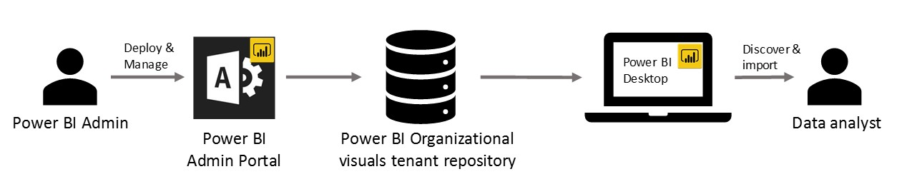

# Organizational visuals in Power BI

You can develop visuals in Power BI to create a unique type of visual that's tailored to you. Usually this is done when the multitude of visuals included in Power BI don't quite meet your needs.

In some organizations, Power BI visuals are even more important – they might be necessary to convey specific data or insights unique to the organization, they may have special data requirements, or they may highlight private business methods. Such organizations can develop their own Power BI visuals, share them throughout their organization, and make sure they're properly maintained.

Organizational visuals are deployed and managed by the Power BI administrator from the Admin portal. Once deployed into the organizational repository, users in the organization can easily discover them, and import the organizational Power BI visuals into their reports directly from Power BI Desktop.

## Administer organizational Power BI visuals

To learn more about how to administer, deploy, and manage organizational Power BI visuals, see [manage Power BI visuals admin settings](../../admin/organizational-visuals.md).

> [!WARNING]
> A Power BI visual installed from a file, can contain code with security or privacy risks. Make sure you trust the author and the source of the Power BI visual file, before deploying it to the organization repository.

## Considerations

This section lists the [admin](#admin-consideration) and [user](#user-considerations) considerations you need to be aware of when using custom built Power BI visuals in your organization.

### Admin consideration

* If a Power BI visual from AppSource or a file is deleted from the repository, any existing reports that use the deleted visual will stop rendering. Deleting from the repository isn't reversible. To temporarily disable a Power BI visual from AppSource or a file, use the **Disable** feature.

* Organizational Power BI visuals are not supported in Power BI report server.

### User considerations

* Organizational Power BI visuals can't be [exported to PowerPoint](../../consumer/end-user-powerpoint.md) or displayed in emails received when a user [subscribes to report pages](../../consumer/end-user-subscribe.md). Only [certified Power BI visuals](power-bi-custom-visuals-certified.md) imported directly from the marketplace support these features.

* Certain visuals don't render if deployed through the organization repository. Use the **Add from AppSource** option in the Admin portal to manage the following visuals:
  * Viso
  * Map box
  * PowerAutomate
  * Charticulator

## Next steps

>[!div class="nextstepaction"]
>[Get a Power BI visual certified](power-bi-custom-visuals-certified.md)

>[!div class="nextstepaction"]
>[Publish Power BI visuals to Partner Center](office-store.md)

>[!div class="nextstepaction"]
>[Frequently asked questions about Power BI visuals](power-bi-custom-visuals-faq.yml#organizational-power-bi-visuals)
