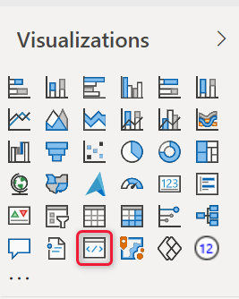

# Troubleshoot your Power BI environment setup

This article explains how to diagnose and fix the following common problems that can occur when setting up your developer environment.

* [Can't start up pbiviz](#cant-start-up-pbiviz)
* [Can't connect to the Power BI service](#cant-connect-to-the-power-bi-service)
* [Can't see the developer icon on the visualization tab](#cant-see-the-developer-icon-on-the-visualizations-tab)
* [Contacting the support team](#contacting-the-support-team)

## Can't start up pbiviz

When your environment isn't set up correctly, you might receive an error such as: *pbiviz command not found*

When you run `pbiviz` in your terminal's command line, you should see the help screen. If you don't, make sure you have [NodeJS](environment-setup.md#install-nodejs) version 4.0 or higher installed.
For help installing [pbiviz](environment-setup.md#install-pbiviz) or [NodeJS](environment-setup.md#install-nodejs) see [Set up your environment for developing a Power BI visual](environment-setup.md).

## Can't connect to the Power BI service

Run the visual server with the command `pbiviz start` in your terminal's command line *from the root of your visual project*.

If the server's not running, your SSL certificates were probably not [installed correctly](environment-setup.md#create-and-install-a-certificate). To install your SSL certificates, see [Create and install a certificate](environment-setup.md#create-and-install-a-certificate).

## Can't see the developer icon on the Visualizations tab

The developer icon looks like a prompt icon within the **Visualizations** tab.

If you don't see it, make sure you have [enabled developer mode in the Power BI settings](environment-setup.md#set-up-power-bi-service-for-developing-a-visual).

> [!NOTE]
> The developer visual is currently only available in the **Power BI service** and not in Power BI Desktop or the mobile app. The packaged visual will work everywhere.

## Contacting the support team

Feel free to contact the Power BI visuals support team (pbicvsupport@microsoft.com) with any questions, comments, or issues you have.

## Next steps

>[!div class="nextstepaction"]
>[Setting up your Power BI environment](environment-setup.md)

>[!div class="nextstepaction"]
>[Frequently asked questions about Power BI visuals](power-bi-custom-visuals-faq.yml#organizational-power-bi-visuals)
