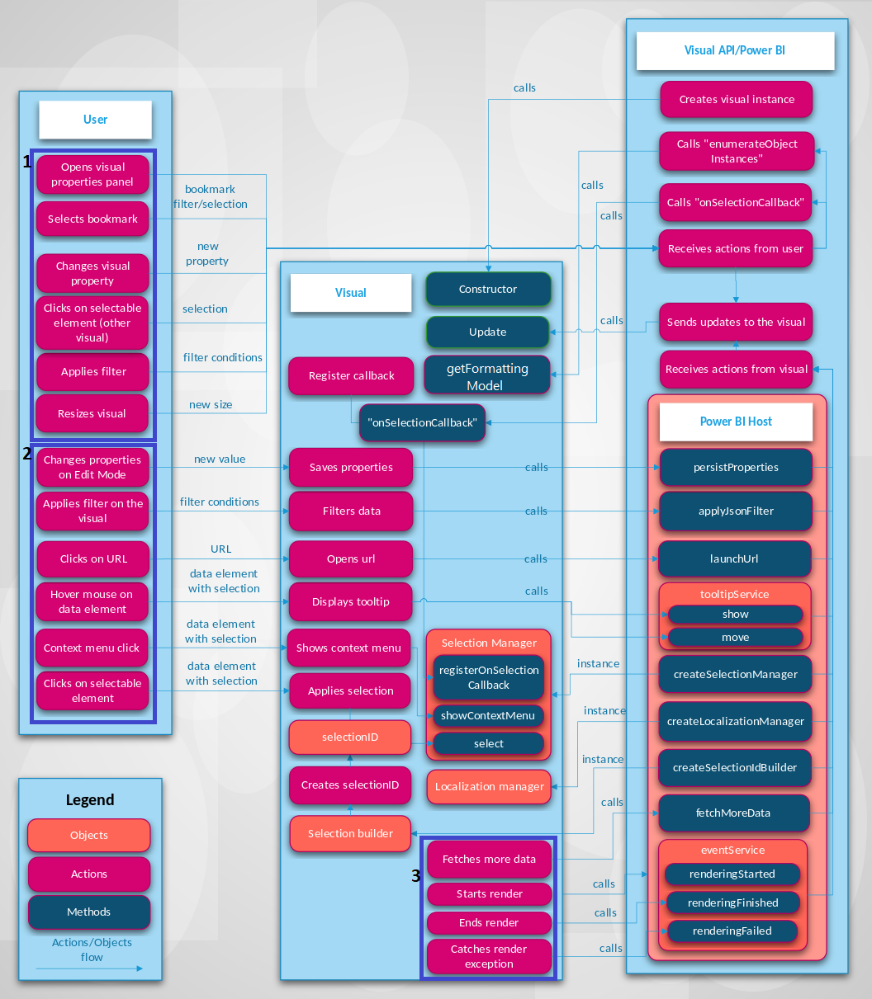

# Power BI visuals system integration

The article describes the [Visual API](./visual-api.md), and how Power BI handles the interactions between you, the visual, and the host.

Actions and subsequent updates in Power BI can be initiated manually or automatically. Update types:

* [Interact with a visual through Power BI](#interact-with-a-visual-through-power-bi).
* [Interact with the visual directly](#interact-with-the-visual-directly).
* [Visual interact with Power BI](#visual-interacts-with-power-bi).

The following figure shows how common visual-based actions, like selecting a bookmark, process in Power BI.

## Interact with a visual through Power BI

You can update a visual with Power BI as follows:

* Open the visual's properties panel.

    When you open the visual's properties panel, Power BI fetches supported objects and properties from the visual's *capabilities.json* file. To receive actual values of properties, Power BI calls the `getFormattingModel` method of the visual (APIs earlier than version 5.0 call `enumerateObjectInstances` instead). The API returns modern format pane model components, properties, and their actual values.

    For more information, see [Capabilities and properties of Power BI visuals](capabilities.md).

* [Customize visualization titles, backgrounds, labels, and legends](../../visuals/power-bi-visualization-customize-title-background-and-legend.md).

    When you change the value of a property in the Format panel, Power BI calls the `update` method. Power BI passes in the new `options` object to the `update` method, and the objects contain the new values.

    For more information, see [Objects and properties of Power BI visuals](objects-properties.md).

* Resize the visual.

    When you change the size of a visual, Power BI calls the `update` method and passes in the new `options` object. The `options` objects have nested `viewport` objects that contain the new width and height of the visual.

* Apply a filter at the report, page, or visual level.

    Power BI filters data based on filter conditions. Power BI calls the `update` method of the visual to update the visual with new data.

    The visual gets a new update of the `options` objects when there's new data in one of the nested objects. How the update occurs depends on the data view mapping configuration of the visual.

    For more information, see [Understand data view mapping in Power BI visuals](dataview-mappings.md).

* Select a data point in another visual in the report.

    When you select a data point in another visual in the report, Power BI filters or highlights the selected data points and calls the visual's `update` method. The visual gets new filtered data, or it gets the same data with an array of highlights.

    For more information, see [Highlight data points in Power BI Visuals](highlight.md).

* Select a bookmark in the **Bookmarks** panel of the report.

  When you select a bookmark in the **Bookmarks** panel, either:

  * Power BI calls a function that's passed and registered by the `registerOnSelectionCallback` method. The callback function gets arrays of selections for the corresponding bookmark.
  * Power BI calls the `update` method with a corresponding `filter` object inside the `options` object.

    In both cases, the visual changes its state according to the received selections or `filter` object.

    For more information about bookmarks and filters, see [Visual Filters API in Power BI visuals](filter-api.md).

## Interact with the visual directly

You can also interact directly with the visual to update it:

* Hover over a data element.

    A visual can display more information about a data point through the Power BI Tooltips API. When you hover over a visual element, the visual can handle the event and display data about the associated tooltip element. The visual can display either a standard tooltip or a report page tooltip.

    For more information, see [Add tooltips to your Power BI visuals](add-tooltips.md).

* Change visual properties (For example, by expanding a tree) and the visual saves the new state in the visual properties.

    A visual can save properties values through the Power BI API. For example, when you interact with the visual and the visual needs to save or update properties values, the visual can call the `persistProperties` method.

* Select a URL.

    By default, a visual can't open a URL directly. To open a URL in a new tab, the visual can call the `launchUrl` method and pass the URL as a parameter.

    For more information, see [Create a launch URL](launch-url.md).

* Apply a filter through the visual.

    A visual can call the `applyJsonFilter` method and pass conditions to filter for data in other visuals. Several types of filters are available, including Basic, Advanced, and Tuple filters.

    For more information, see [Visual Filters API in Power BI visuals](filter-api.md).

* Select elements in the visual.

    For more information about selections in a Power BI visual, see [Add interactivity into visual by Power BI visual selections](selection-api.md).

## Visual interacts with Power BI

Sometimes the visual initiates communication with the Power BI host without any input from you:

* A visual requests more data from Power BI.

    A visual processes data part by part. The `fetchMoreData` API method requests the next fragment of data in the semantic model.

    For more information, see [Fetch more data from Power BI](fetch-more-data.md).

* The event service triggers.

    Power BI can export a report to PDF or send a report by e-mail (applies only to certified visuals). To notify Power BI that rendering is finished and that the visual is ready to be captured as PDF or e-mail, the visual should call the Rendering Events API.

    For more information, see [Export reports from Power BI to PDF](../../collaborate-share/end-user-pdf.md).

    To learn about the event service, see ["Rendering" events in Power BI visuals](event-service.md).

## Related content

Interested in creating visualizations and adding them to Microsoft AppSource? See these articles:

* [Visual API](./visual-api.md)
* [Develop a Power BI circle card visual](./develop-circle-card.md)
* [Publish Power BI visuals to Microsoft commercial marketplace](office-store.md)