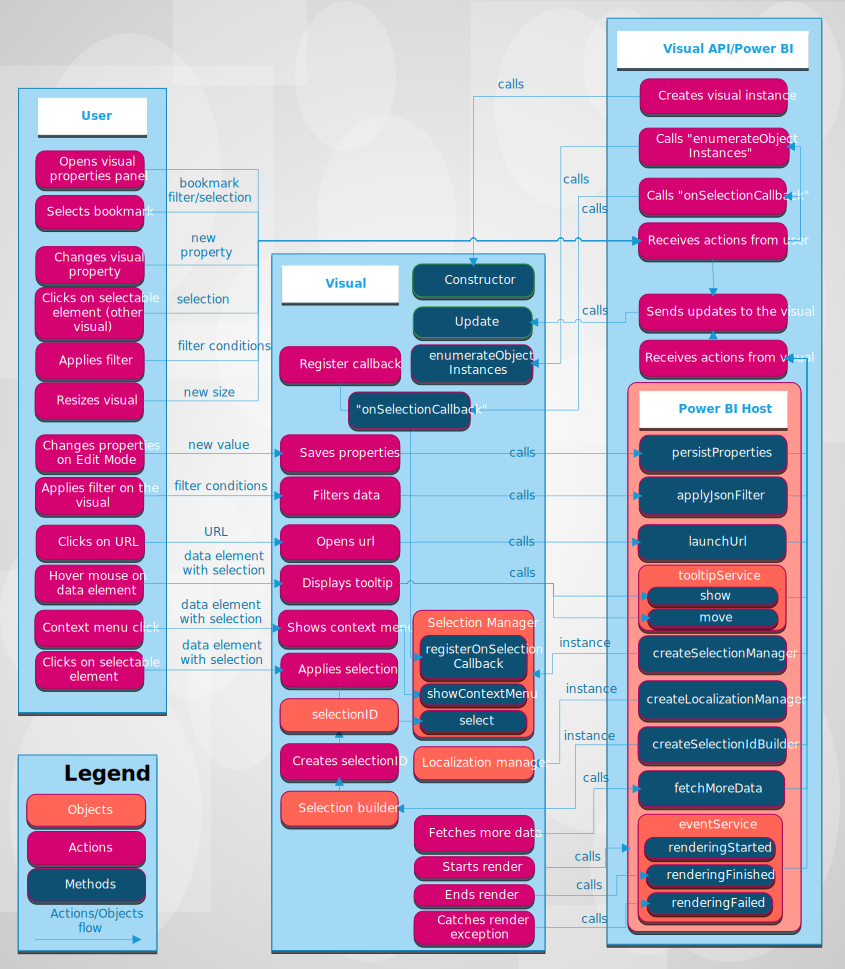

# Power BI visual concept

The article explains how user and visual interact with Power BI. How user interacts with Power BI visual. In the diagram, you see which actions influence directly to the visual or through Power BI (for example, the user selects bookmarks).

## The visual gets update from Power BI

The visual has `update` method and this method usually contains main logic of the visual and responsible for rendering chart or visualizing the data.

More of updates come into call of `update` method.

### User interacts with visual throw Power BI

* User opens visual properties panel.

    Power BI fetches supported objects and properties from the visual `capabilities.json` and for receiving actual values of properties Power BI calls `enumerateObjectInstances` method of the visual.

    The visual has to return actual values of properties.

    For more information, [read about the visual capabilities](capabilities.md).

* [User changes property of the visual](../../visuals/power-bi-visualization-customize-title-background-and-legend.md) in format panel.

    After changing the value of property, Power BI calls `update` method of the visual and pass into update method the new `options` with new values of objects.

    For more information, [read about objects and properties of the visual](objects-properties.md).

* User resizes the visual.

    When user changes a size of the visual, Power BI calls `update` method with new `option` object. `Options` has nested `viewport` object with new width and height of the visual.

* User applies report level, page level, visual level filter.

    Power BI filters data according to filter conditions and calls `update` method of the visual to give new data to the visual.

    The visual gets new update of `options` with new data in one of the nested objects. It depends on data view mapping configuration of the visual.

    For more information, [read about data view mappings](dataview-mappings.md).

* User selects data point in another visual of the report.

    Power BI filters or highlights the selected data points and calls `update` method of the visual.

    The visual gets new filtered data or same data with array of highlights.

    For more information, [read how to highlight data in visuals](highlight.md).

* User selects bookmark on bookmarks panel of the report.

    There can happen two actions:

    1. Power BI calls function passed registered by method `registerOnSelectionCallback` and callback function gets arrays of selections for correspond bookmark.

    2. Power BI calls `update` method with correspond filter object inside of `options`.

    In both cases, the visual has to change visualization state according to received selections or filter object.

    For more details about bookmarks, [read how to handle bookmarks](filter-api.md).

    For more information about filters, [read how Power BI visuals can filter data in other visuals](filter-api.md).

### User interacts with visual directly

* User hovers mouse on data element

    The visual can display additional information about data point throght Power BI Tooltips API.
    User hovers mouse on visual element the visual can handle event and display data on tooltip element.

    The visual can display standard tooltip or report page tooltip.

    For more, read the guide [how to add tooltips](add-tooltips.md).

* User changes visual properties (fo example, user expands tree and the visual saves state in properties)

    The visual can save properties values thought Power BI API. For example, when user interacts with the visual. And visual needs to save or update property values. The visual can call `presistProperties` method for it.

* User clicks on URL link.

    By default the visual can't open the url. To open the URL in the new tab, the visual should call `launchURL` method and pass URL as parameter.

    For more, about [launch URL API](launch-url.md).

* User applies filter throw the visual

    The visual calls `applyJSONFilter` and passes filter conditions to filter for filtering data in other visual.

    The visual can use several types of the filter, for example it are Basic filter, Advanced filter, Tuple filter.

    For more information about filters, [read how Power BI visuals can filter data in other visuals](filter-api.md).

* User clicks/selects elements on the visual.

    For more information about selections, [read how visual interacts](selection-api.md).
    <!-- TODO rewrite article about selections, and include new methods decsription: withTable, withMatrixNode -->

### The visual interacts with Power BI

* The visual request more data from Power BI

    The visual can process data part by part. The visual can call `fetchMoreData` method for fetch next part of data.

    For more information about `fetchMoreData`, [read how to fetch more data from Power BI](fetch-more-data.md)

* Event service

    Power BI can export reports to PDF or send by e-mail. Visuals that have been certified are supported. Visual with rendering events can notify Power BI that visual is ready to capture for PDF/e-mail.

    For more information, [read about exporting reports from Power BI to PDF](../../consumer/end-user-pdf.md)

    For more information about event service, [read the correspond documentation](event-service.md)

## Next steps

<!-- Todo add links to tutorial getting started visual development -->
