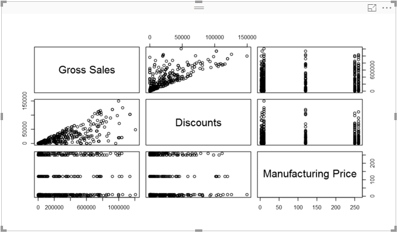
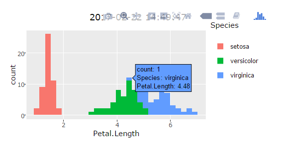

---
title:
description:
author: zBritva
ms.author: v-ilgali
manager: rkarlin
ms.reviewer: sranins
ms.service: powerbi
ms.subservice: powerbi-custom-visuals
ms.topic: conceptual
ms.date: 06/18/2019
---

# R Visuals

Read more about R Visuals in article [Use R-powered Power BI visuals in Power BI](../../desktop-r-powered-custom-visuals)

Read more about creating R Visuals in article [Create Power BI visuals using R](../../desktop-r-visuals)

# Creating a new R Powered Custom Visual

In order to create a new R Powered Custom Visual we will run the following command:

```cmd
pbiviz new sampleCorrPlotRVisual -t rvisual
```

This command will create a new folder stracture based on the template rvisual

This template includes a very basic ready to run R Visual which will actually run the following R script:

```R
plot(Values)
```

This R script calls a generic function for plotting of R object. The data frame “Values” will contain columns in “Values” data role.



## Enable HTML output

```cmd
pbiviz new sampleRHTMLVisual -t rhtml
```



In this sample the HTML has several capabilities, such as displaying data values and enables zooming.

For more information see R HTML See commit for what was added at this step.

