# Examples of Power BI visuals

This article describes some of the Power BI visuals you can download, use, and modify from GitHub. These sample visuals illustrate how to handle common situations when developing with Power BI.

## Slicers

A slicer narrows the portion of data shown in other visualizations in a report. Slicers are one of several ways to filter data in Power BI.

|   |  |
| ------------- | ------------- |
| [Chiclet Slicer](https://github.com/Microsoft/powerbi-visuals-chicletslicer/)   Display image or text buttons that act as an in-canvas filter on other visuals | [Timeline slicer](https://github.com/Microsoft/powerbi-visuals-timeline/)  Graphical date range selector that filters by date |
|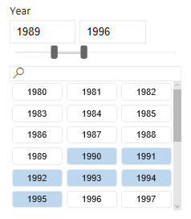|
|[Slicer sample](https://github.com/Microsoft/powerbi-visuals-sampleslicer/)  Demonstrates the use of the Advanced Filtering API|

## Charts

Get inspired with our gallery of Power BI visuals, including bar charts, pie charts, Word Cloud, and others.

| 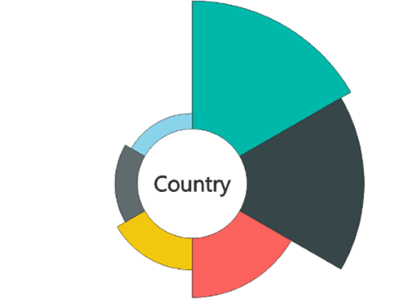  | 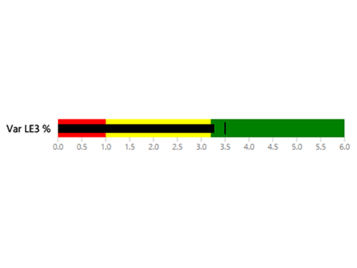 | 
| ------------- | ------------- |
| [Aster Plot](https://github.com/Microsoft/powerbi-visuals-asterplot/)   A twist on a standard donut chart that uses a second value to drive sweep angle | [Bullet chart ](https://github.com/Microsoft/powerbi-visuals-bulletchart/)  A bar chart with extra visual elements that provide context useful for tracking metrics | 
|| |
|[Chord](https://github.com/Microsoft/powerbi-visuals-chord/)  A graphical method that displays the relationships between data in a matrix | [Dot plot](https://github.com/Microsoft/powerbi-visuals-dotplot/)  Shows the distribution of frequencies in a great looking way| 
| 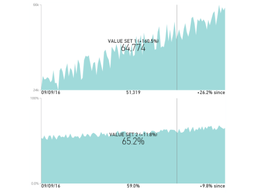|  |
| [Dual KPI](https://github.com/Microsoft/powerbi-visuals-dualkpi/)  Efficiently visualizes two measures over time, showing their trend on a joint timeline | [Enhanced Scatter](https://github.com/Microsoft/powerbi-visuals-enhancedscatter/)  Improvements on the existing scatter chart|
| | |
| [Force Graph](https://github.com/Microsoft/powerbi-visuals-forcegraph/)  Force layout diagram with curved path, which is useful to show connections between entities | [Gantt](https://github.com/Microsoft/powerbi-visuals-gantt/)  A bar chart that illustrates a project timeline or schedule with resources |
||  |
| [Table Heatmap](https://github.com/Microsoft/powerbi-visuals-heatmap/)  Compare data easily and intuitively using colors in a table | [Histogram chart](https://github.com/Microsoft/powerbi-visuals-histogram/)  Visualizes the distribution of data over a continuous interval or certain time period |
| 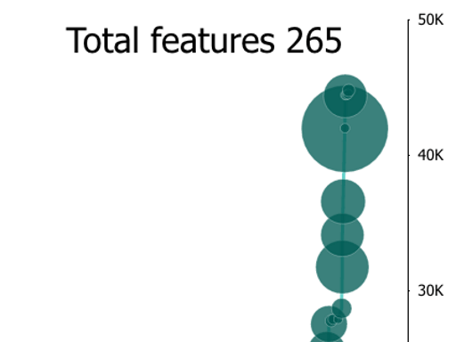 | 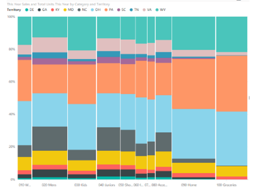|
| [LineDot chart](https://github.com/Microsoft/powerbi-visuals-linedotchart/)  An animated line chart with animated dots that engage an audience with data | [Mekko chart](https://github.com/Microsoft/powerbi-visuals-mekkochart/)  A mix of 100% stacked column chart and 100% stacked bar chart combined into one view|
|  | 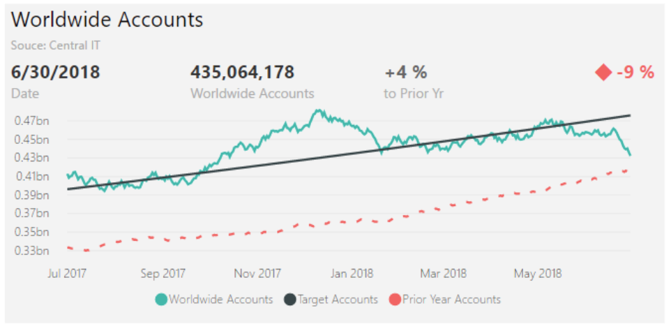 |
| [Multi KPI](https://github.com/microsoft/PowerBI-visuals-MultiKPI/)   A powerful Multi KPI visualization with a key KPI along with multiple sparklines of supporting data | [Power KPI](https://github.com/microsoft/PowerBI-visuals-PowerKPI/)  A powerful KPI Indicator with multi-line chart and labels for current date, value, and variances |
|  | 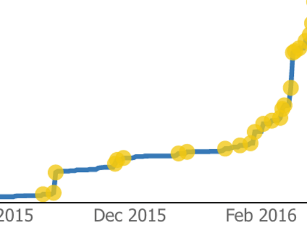|
| [Power KPI Matrix](https://github.com/microsoft/PowerBI-visuals-PowerKPIMatrix/)  Monitor balanced scorecards and unlimited number of metrics and KPIs in a compact, easy to read list| [Pulse chart](https://github.com/Microsoft/powerbi-visuals-pulsechart/)  This line chart annotated with key events is perfect for telling stories with data|
| 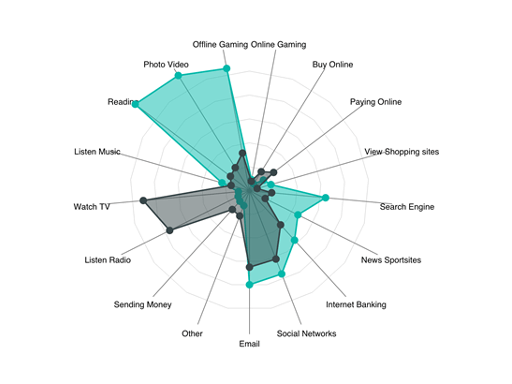 | 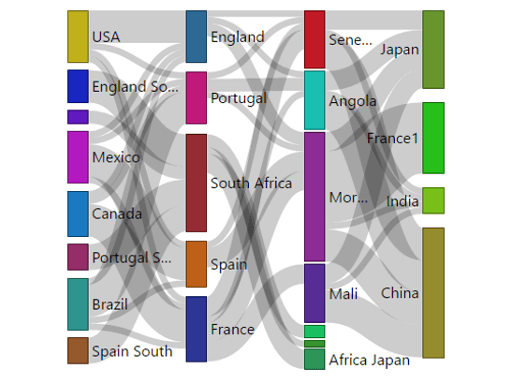 |
 [Radar chart](https://github.com/Microsoft/powerbi-visuals-radarchart/)  Presents multiple measures plotted over a categorical axis, which is useful to compare attributes | [Sankey chart](https://github.com/Microsoft/powerbi-visuals-sankey/)  Flow diagram where the width of the series is proportional to the quantity of the flow |
|  | 
| [Stream graph](https://github.com/Microsoft/powerbi-visuals-streamgraph/)  A stacked area chart with smooth interpolation, which is often used to display values over time | [Sunburst chart](https://github.com/Microsoft/powerbi-visuals-sunburst/)  Multilevel donut chart for visualizing hierarchical data|
| 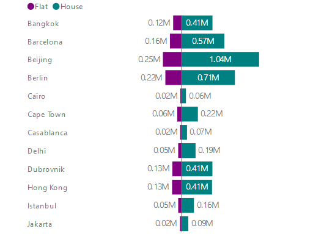| 
| [Tornado chart](https://github.com/Microsoft/powerbi-visuals-tornado/)  Compare the relative importance of variables between two groups | [Word Cloud](https://github.com/Microsoft/powerbi-visuals-wordcloud/)  Create a fun visual from frequent text in your data|

## WebGL

WebGL lets web content use an API based on OpenGL ES 2.0 to do 2D and 3D rendering in an HTML canvas.

| 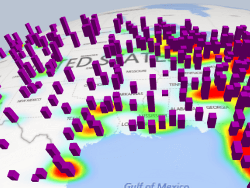|
| ------------- |
| [Globe Map](https://github.com/Microsoft/powerbi-visuals-globemap/)  Plot locations on an interactive 3D map

## R visuals

These examples demonstrate how to harness the analytic and visual power of R visuals and R scripts.

| | |
|------------- |------------- | 
| [Association rules](https://github.com/Microsoft/powerbi-visuals-assorules/)  Uncover relationships between seemingly unrelated data using if-then statements | [Clustering](https://github.com/Microsoft/powerbi-visuals-clustering-kmeans/)  Find similarity groups in your data using k-means algorithm |
|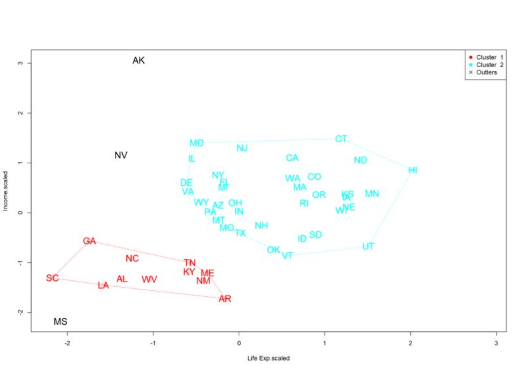 | 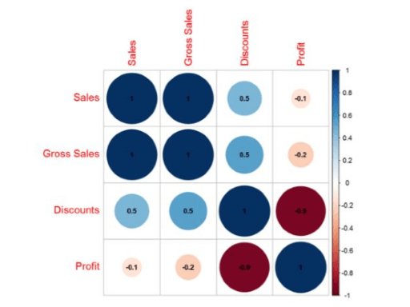 |
| [Clustering with outliers](https://github.com/microsoft/PowerBI-visuals-dbscan/)  Find similarity groups and outliers in your data| [Correlation plot](https://github.com/Microsoft/powerbi-visuals-corrplot/)  Highlight the most correlated variables in a data table|
|  | 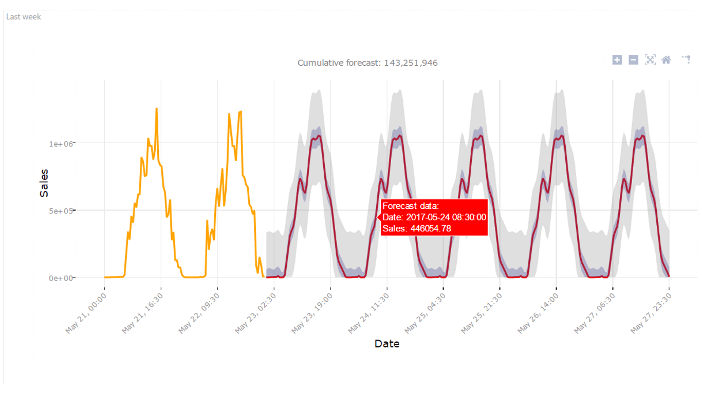 |
| [Decision tree chart](https://github.com/Microsoft/powerbi-visuals-decision-tree/)  Schematic tree-shaped diagram for determining statistical probability using recursive partitioning | [Forecasting TBATS](https://github.com/Microsoft/powerbi-visuals-forcasting-tbats/)  Time-series forecasting for series that have multiple seasonalities using the TBATS model |
|  | 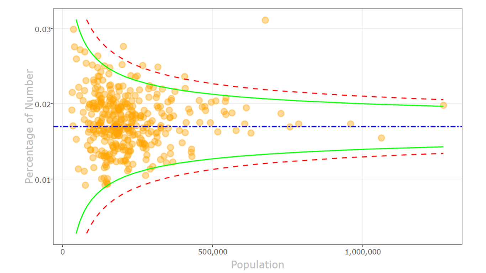 |
| [Forecasting with ARIMA](https://github.com/Microsoft/powerbi-visuals-forcastingarima/)  Predict future values based on historical data using Autoregressive Integrated Moving Avg (ARIMA) | [Funnel plot](https://github.com/Microsoft/powerbi-visuals-funnel/)  Find outliers in your data using a funnel plot |
|  |  |
| [Outliers detection](https://github.com/Microsoft/powerbi-visuals-outliers-det/)  Find outliers in your data using the most appropriate method and plot | [Spline chart](https://github.com/Microsoft/powerbi-visuals-spline/)  Visualize and understand noisy data |
|  | 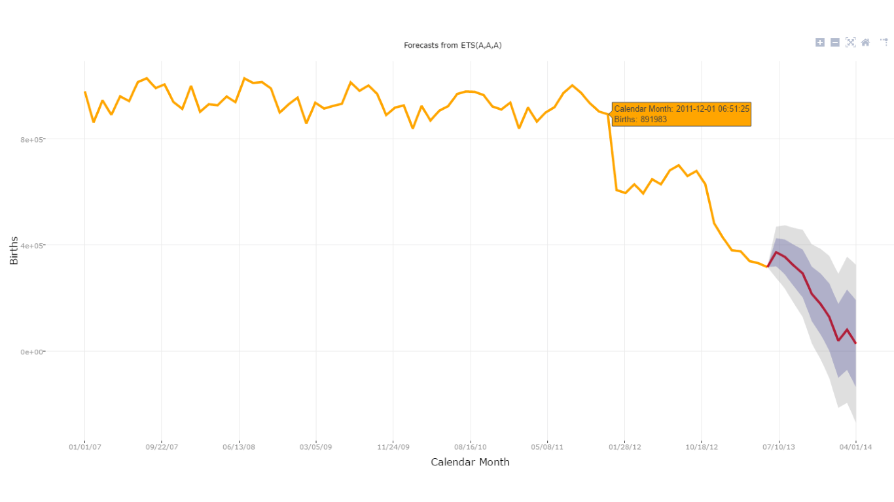|
|[Time series decomposition chart](https://github.com/Microsoft/powerbi-visuals-timeseriesdecomposition/)  Understand the time series components using "Seasonal and Trend decomposition using Loess" | [Time series forecasting chart](https://github.com/Microsoft/powerbi-visuals-forcasting-exp/)  Using exponential smoothing model to predict future values based on previously observed values |

## Related content

* [Import a Power BI visual](./import-visual.md)
* [Develop your own Power BI custom visual](./develop-circle-card.md)
