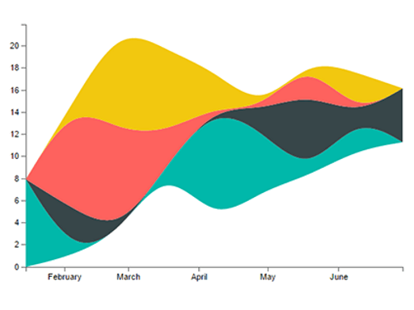

# Samples

A collection of samples demonstrating different Custom Visuals. These samples help illustrate how to handle common
situations when developing with PowerBI

## Slicers
A slicer narrows the portion of the dataset shown in other visualizations in a report. Slicers are an alternate way of filtering.

|   |  | |
| ------------- | ------------- | -------------|
| [Chiclet Slicer](https://github.com/Microsoft/powerbi-visuals-chicletslicer/)   Display image and/or text buttons that act as an in-canvas filter on other visuals | [Timeline slicer](https://github.com/Microsoft/powerbi-visuals-timeline/)  Graphical date range selector to use for filtering dates | [Sample slicer](https://github.com/Microsoft/powerbi-visuals-sampleslicer/)   Demonstrates the use of the Advanced Filtering API

## Charts
Be inspired with our gallery of charts including bar chart, pie chart, word cloud among others 20+ chart types.

|   |  | | |
| ------------- | ------------- | -------------| -------------|
| [Aster Plot](https://github.com/Microsoft/powerbi-visuals-asterplot/)   A twist on a standard donut chart, using a second value to drive sweep angle | [Bullet Chart ](https://github.com/Microsoft/powerbi-visuals-bulletchart/)  A bar chart with extra visual elements to provide additional context. Useful for tracking goals | [Chord](https://github.com/Microsoft/powerbi-visuals-chord/)   A graphical method of displaying the inter-relationships between data in a matrix | [Dot Plot](https://github.com/Microsoft/powerbi-visuals-dotplot/)   Show the distribution of frequencies in a great looking way 
| ||| 
| [Dual KPI](https://github.com/Microsoft/powerbi-visuals-dualkpi/)   Efficiently visualizes two measures over time, showing their trend on a joint timeline | [Enhanced Scatter](https://github.com/Microsoft/powerbi-visuals-enhancedscatter/)   Includes improvements to the existing scatter chart visual | [ForceGraph](https://github.com/Microsoft/powerbi-visuals-forcegraph/)   Force layout diagram with curved path. Useful to show connections between entities | [Gantt](https://github.com/Microsoft/powerbi-visuals-gantt/)   A type of bar chart which illustrates a project timeline or schedule with resources
| |  |  |  
| [Table Heatmap](https://github.com/Microsoft/powerbi-visuals-heatmap/)   Compare data easily and intuitively using colors in a table | [Histogram Chart](https://github.com/Microsoft/powerbi-visuals-histogram/)   Visualises the distribution of data over a continuous interval or certain time period | [LineDot Chart](https://github.com/Microsoft/powerbi-visuals-linedotchart/)   Animated line chart with fun animated dots. Useful for engaging an audience with data | [Mekko Chart](https://github.com/Microsoft/powerbi-visuals-mekkochart/)   A mix of 100% stacked column chart and 100% stacked bar chart combined into one view
|  |  |  | 
| [Multi KPI](https://github.com/microsoft/PowerBI-visuals-MultiKPI/)   A powerful Multi KPI visualization, of a key KPI along with multiple sparklines of supporting data | [Power KPI](https://github.com/microsoft/PowerBI-visuals-PowerKPI/)   A powerful KPI Indicator with multi-line chart and labels for current date, value and variances | [Power KPI Matrix](https://github.com/microsoft/PowerBI-visuals-PowerKPIMatrix/)   Monitor balanced scorecards and unlimited number of metrics and KPIs in a compact, easy to read list| [Pulse Chart](https://github.com/Microsoft/powerbi-visuals-pulsechart/)   Line chart annotated with key events. Perfect for story telling with data
|  |  |  | 
| [Radar chart](https://github.com/Microsoft/powerbi-visuals-radarchart/)   Multiple measures plotted over a categorical axis. Useful to compare attributes | [Sankey Chart](https://github.com/Microsoft/powerbi-visuals-sankey/)   Flow diagram where the width of the series is proportional to the quantity of the flow | [Stream Graph](https://github.com/Microsoft/powerbi-visuals-streamgraph/)   A stacked area chart with smooth interpolation. Often used to display values over time | [Sunburst](https://github.com/Microsoft/powerbi-visuals-sunburst/)   Multilevel donut chart for effectively visualizing hierarchical data
|  | 
| [Tornado](https://github.com/Microsoft/powerbi-visuals-tornado/)   Comparing the relative importance of variables between two groups | [Word Cloud](https://github.com/Microsoft/powerbi-visuals-wordcloud/)   Create a fun visual from frequent text in your data

## Webgl samples
WebGL enables web content to use an API based on OpenGL ES 2.0 to perform 2D and 3D rendering in an HTML canvas

| |
| ------------- | 
| [Globe Map](https://github.com/Microsoft/powerbi-visuals-globemap/)   Plot locations on an interactive 3D map

## R visuals
These samples demonsrate how to harness the analytic and visual power of R visuals, and R scripts

| || | |
|------------- |------------- |------------- |------------- |
| [Association rules](https://github.com/Microsoft/powerbi-visuals-assorules/)   Uncover relationships between seemingly unrelated data using if-then statements | [Clustering](https://github.com/Microsoft/powerbi-visuals-clustering-kmeans/)   Find similarity groups in your data, using k-means algorithm | [Clustering with outliers](https://github.com/microsoft/PowerBI-visuals-dbscan/)   Find similarity groups and outliers in your data | [Correlation plot](https://github.com/Microsoft/powerbi-visuals-corrplot/)   Highlight the most correlated variables in a data table 
|  |  |  | 
| [Decision Tree Chart](https://github.com/Microsoft/powerbi-visuals-decision-tree/)   Schematic tree-shaped diagram for determining statistical probability using recursive partitioning | [Forecasting TBATS](https://github.com/Microsoft/powerbi-visuals-forcasting-tbats/)   Time-series forecasting for series that exhibit multiple seasonalities using the TBATS model| [Forecasting with ARIMA](https://github.com/Microsoft/powerbi-visuals-forcastingarima/)   Predict future values based on historical data using Autoregressive Integrated Moving Avg (ARIMA) | [Funnel plot](https://github.com/Microsoft/powerbi-visuals-funnel/)   Find outliers in your data, using a funnel plot
|  |  |  | 
| [Outliers Detection](https://github.com/Microsoft/powerbi-visuals-outliers-det/)   Find outliers in your data, using the most appropriate method and plot | [Spline chart](https://github.com/Microsoft/powerbi-visuals-spline/)   Visualize and understand noisy data | [Time series decomposition chart](https://github.com/Microsoft/powerbi-visuals-timeseriesdecomposition/)   Understand the time series components using 'Seasonal and Trend decomposition using Loess' | [Time series forecasting chart](https://github.com/Microsoft/powerbi-visuals-forcasting-exp/)   Using exponential smoothing model to predict future values based on previously observed values