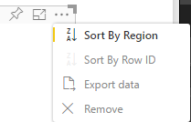

# Sorting options

`Sorting` specifies the default sorting behavior for the visual.
Capability requires one of the parameters described below:

## Default sorting

The `default` option is the simplest form. It allows sorting the data presented in the 'DataMappings' section.
This option enables sorting of the 'DataMappings' by the user and to specify the sorting direction.

```json
    "sorting": {
        "default": {   }
    }
```



## Implicit sorting

`implicit` is sorting with array parameter - `clauses` which describes sorting for each data role.
`implicit` means that visual's user can't change the sorting order.
Power BI won't display sorting options in visual's menu. However, Power BI will sort data according to specified settings.

`clauses` params can contain several objects with two parameters:

- `role` - determines `DataMapping` for sorting.

- `direction` - determines sort direction (1 = Ascending, 2 = Descending).

```json
    "sorting": {
        "implicit": {
            "clauses": [
                {
                    "role": "category",
                    "direction": 1
                },
                {
                    "role": "measure",
                    "direction": 2
                }
            ]
        }
    }
```

## Custom sorting

`custom` means the sorting is managed by developer in visual's code