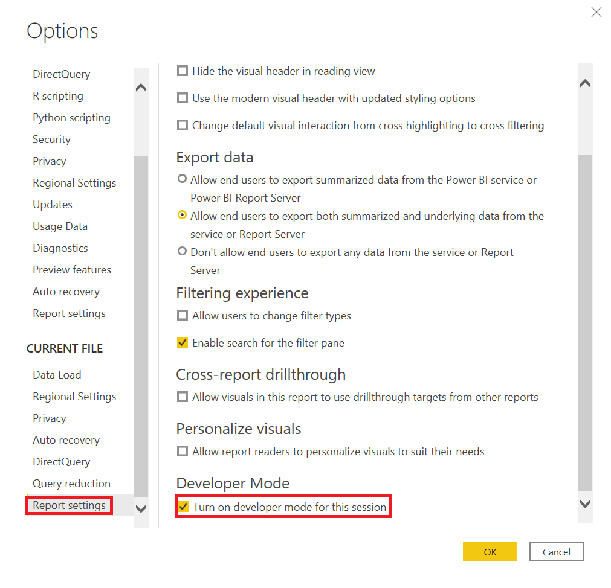

# Test a Power BI visual before submission

Before you publish your visual to [AppSource](https://appsource.microsoft.com/marketplace/apps?product=power-bi-visuals), it must pass the tests listed in this article. It is important to test your visual before you submit it. If your visual doesn't pass the required test cases, it will be rejected.

For more information about the publishing process, see [Publish Power BI visuals to Partner Center](./office-store.md).

## Testing a new version of a published visual

By default, Power BI loads the latest published version of the visual from AppSource, even if you import the visual from a local file.

When testing or debugging an already published visual, you can override the AppSource version with a local file version, by enabling Developer mode in either Power BI Desktop, or Power BI service.

>[!IMPORTANT]
>When testing or debugging a new version of a visual that is available in AppSource, **do not change the GUID of the visual**. Use Developer mode instead.

### Enable Developer mode in Power BI Desktop

In Power BI Desktop, Developer mode is only valid for one session. If you open a new Power BI Desktop instance for testing, you'll need to enable Developer mode again.

To enable Developer mode, follow these steps:

1. Open Power BI Desktop.
2. Select **File** > **Options and settings**.
3. Select **Options**.
4. In the Options window, from the CURRENT FILE list, select **Report settings**.
5. In Developer Mode, select the **Turn on developer mode for this session** option.

### Enable Developer mode in Power BI service

In Power BI service, Developer mode is kept per user account. Whenever a user loads the package from the local file, Power BI will ignore the AppSource version of the visual.

To enable Developer mode in Power BI service, follow the instructions in [Set up Power BI service for developing a visual](environment-setup.md#set-up-power-bi-service-for-developing-a-visual).

## General test cases

Verify that your visual passes the general test cases.

| Test case | Expected results
| --------- | ----------------
| Create a **Stacked column chart** with **Category** and **Value**. Convert it to your visual and then back to column chart. | No error appears after these conversions. |
| Create a **Gauge** with three measures. Convert it to your visual and then back to **Gauge**. | No error appears after these conversions. |
| Make selections in your visual. | Other visuals reflect the selections. |
| Select elements in other visuals. | Your visual shows filtered data according to selection in other visuals. |
| Check min/max **dataViewMapping** conditions. | Field buckets can accept multiple fields, a single field, or are determined by other buckets. The min/max **dataViewMapping** conditions must be correctly set up in the capabilities of your visual. |
| Remove all fields in different orders. | Visual cleans up properly as fields are removed in arbitrary order. There are no errors in the console or the browser. |
| Open the **Format** pane with each possible bucket configuration. | This test doesn't trigger null reference exceptions. |
| Filter data using the **Filter** pane at the visual, page, and report level. | Tooltips are correct after applying filters. Tooltips show the filtered value. |
| Filter data using a **Slicer**. | Tooltips are correct after applying filters. Tooltips show the filtered value. |
| Filter data using a published visual. For instance, select a pie slice or a column. | Tooltips are correct after applying filters. Tooltips show the filtered value. |
| If cross-filtering is supported, verify that filters work correctly. | Applied selection filters other visuals on this page of the report. |
| Select with Ctrl, Alt, and Shift keys. | No unexpected behaviors appear. |
| Change the **View Mode** to **Actual size**, **Fit to page**, and **Fit to width**. | Mouse coordinates are accurate. |
| Resize your visual. | Visual reacts correctly to resizing. |
| Set the report size to the minimum. | There are no display errors. |
| Ensure scroll bars work correctly. | Scroll bars should exist, if required. Check scroll bar sizes. Scroll bars shouldn't be too wide or tall. Position and size of scroll bars must be in accord with other elements of your visual. Verify that scroll bars are needed for different sizes of the visual. |
| Pin your visual to a **Dashboard**. | The visual should be displayed properly. |
| Add multiple versions of your visual to a single report page. | All versions of the visual be displayed and operate properly. |
| Add multiple versions of your visual to multiple report pages. | All versions of the visual be displayed and operate properly. |
| Switch between report pages. | The visual displays correctly. |
| Test Reading view and Edit view for your visual. | All functions work correctly. |
| If your visual uses animations, add, change, and delete elements of your visual. | Animation of visual elements works correctly. |
| Open the **Property** pane. Turn properties on and off, enter custom text, stress the options available, and input bad data. | The visual responds correctly. |
| Save the report and reopen it. | All properties settings persist. |
| Switch pages in the report and then switch back. | All properties settings persist. |
| Test all functionality of your visual, including different options that the visual provides. | All displays and features work correctly. |
| Test all numeric, date, and character data types, as in the following tests. | All data is formatted properly. |
| Review formatting of tooltip values, axis labels, data labels, and other visual elements with formatting. | All elements are formatted correctly. |
| Verify that data labels use the format string. | All data labels are formatted correctly. |
| Switch automatic formatting on and off for numeric values in Tooltips. | Tooltips display values correctly. |
| Test data entries with different types of data, including numeric, text, date-time, and different format strings from the model. Test different data volumes, such as thousands of rows, one row, and two rows. | All displays and features work correctly. |
| Provide bad data to your visual, such as null, infinity, negative values, and wrong value types. | All displays and features work correctly. |

## Optional browser testing

The AppSource team validates visual on the most current Windows versions of Google Chrome, Microsoft Edge, and Mozilla Firefox browsers.
Optionally, test your visual in the following browsers.

| Test case | Expected results
| --------- | ----------------
| **Windows** |
| Google Chrome (previous version) | All displays and features work correctly. |
| Mozilla Firefox (previous version) | All displays and features work correctly. |
| Microsoft Edge (previous version) | All displays and features work correctly. |
| Microsoft Internet Explorer 11 (optional) | All displays and features work correctly. |
| **macOS** |
| Chrome (previous version) | All displays and features work correctly. |
| Firefox (previous version) | All displays and features work correctly. |
| Safari (previous version) | All displays and features work correctly. |
| **Linux** |
| Firefox (latest and previous versions) | All displays and features work correctly. |
| **Mobile iOS** |
| Apple Safari iPad (previous Safari version) | All displays and features work correctly. |
| Chrome iPad (latest Safari version) | All displays and features work correctly. |
| **Mobile Android** |
| Chrome (latest and previous versions) | All displays and features work correctly. |

## Desktop testing

Test your visual in the current version of [Power BI Desktop](https://powerbi.microsoft.com/en-us/desktop/).

| Test case | Expected results
| --------- | ----------------
| Test all features of your visual. | All displays and features work correctly. |
| Import, save, open a file, and publish to the Power BI web service by using the **Publish** button in Power BI Desktop. | All displays and features work correctly. |
| Change the numeric format string to have zero decimal places or three decimal places by increasing or decreasing the precision. | The visual displays correctly. |

## Performance testing

Your visual should perform at an acceptable level. Use developer tools to validate performance. Don't rely on visual cues and the console time logs.

| Test case | Expected results
| --------- | ----------------
| Create a visual with many visual elements. | The visual should perform well and not freeze the application. There should be no performance issues with elements such as animation speed, resizing, filtering, and selecting.

## Next steps

>[!div class="nextstepaction"]
>[Publish Power BI visuals to Partner Center](./office-store.md)

>[!div class="nextstepaction"]
>[Get a Power BI visual certified](power-bi-custom-visuals-certified.md)

**More questions?** [Ask the Power BI Community](https://community.powerbi.com/).
