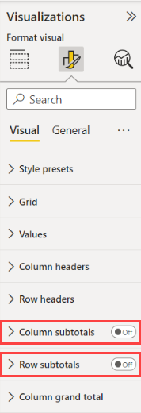

# Request aggregated subtotal data

The *Total and Subtotal API* allows custom visuals with a matrix data-view to request aggregated subtotal data from the Power BI host. The subtotals can be calculated for the entire matrix dataset or specified for individual levels of the matrix data hierarchy (see this [sample report](https://github.com/microsoft/Powerbi-Visuals-SampleMatrix/tree/master/doc)).

>[!NOTE]
>Requesting subtotal data is supported from API version 2.6.0. The ??? property is available from version 5.?. To find out which version you’re using, check the `apiVersion` in the *pbiviz.json* file.

Every time a visual refreshes its data, it issues a [data fetch request](fetch-more-data.md) to the Power BI backend. These data requests are usually for values of the fields the user dragged into the field wells of the visual. Sometimes the visual needs other aggregations/subtotals (for example, sum, count) applied to these fields. The API customizes the outgoing data query to request the extra aggregation/subtotal data.

The `rowSubtotalsType` property lets you decide if the aggregated data should be put at the beginning or end (top or bottom) of the returned data. The default is *bottom*, which means that you can only see the aggregated data after all the data points have been fetched. If you define it as *top*, you can display the aggregated data even before you fetch all the data. This option is more efficient and especially applicable to large datasets where you would otherwise have to fetch and scroll through much data before seeing the aggregated data.

:::image type="content" source="media/total-subtotal-api/subtotal-visual-results.png" alt-text="Screenshot of visual with subtotals row and columns highlighted.":::

## The subtotals API

The API offers the following **boolean customization switches** for each data-view type (currently just the matrix):

* *rowSubtotals*: Indicates if the *subtotal* data should be requested for all fields in the rows field well
* *rowSubtotalsPerLevel*: Indicates if the *subtotal* data can be toggled for individual fields in the row's field well
* *columnSubtotals*: Indicates if the *subtotal* data should be requested for all fields in the columns field well
* *columnSubtotalsPerLevel*: Indicates if the *subtotal* data can be toggled for individual fields in the columns field well
* *levelSubtotalEnabled*: Unlike all other properties, this property is applied to individual rows/columns. This property indicates if the subtotals are requested for the row/column
* *rowSubtotalsType*: Indicates if the row with the *total* data should be retrieved before or after the rest of the data. If *bottom* is selected, the total can only be displayed after all the data has been fetched.

Each of the above switches is assigned a value based on the related properties in the property pane and the defaults.

## How to use the subtotal API

The visual's *capabilities* JSON file has to:

* specify the property each of the above switches maps to
* provide the default value to be used if the property is undefined

The switches all look like this:

```json
    "rowSubtotals": { 
                "propertyIdentifier": { 
                    "objectName": "subTotals", 
                    "propertyName": "rowSubtotals" 
                }, 
                "defaultValue": true 
            },
```

For example, the above indicates that the row subtotals are enabled by the property “rowSubtotals” in the “subTotals” object. It has a default value of “true”.

The API is automatically enabled for a visual whenever the subtotals structure and all the switch mappings are defined in the *capabilities.json* file.

Below is an example of the complete API configuration in the *capabilities.json* file (copied from the API sample visual):

```json
"subtotals": { 
        "matrix": { 
            "rowSubtotals": { 
                "propertyIdentifier": { 
                    "objectName": "subTotals", 
                    "propertyName": "rowSubtotals" 
                }, 
                "defaultValue": true 
            }, 
            "rowSubtotalsPerLevel": { 
                "propertyIdentifier": { 
                    "objectName": "subTotals", 
                    "propertyName": "perRowLevel" 
                }, 
                "defaultValue": false 
            }, 
            "columnSubtotals": { 
                "propertyIdentifier": { 
                    "objectName": "subTotals", 
                    "propertyName": "columnSubtotals" 
                }, 
                "defaultValue": true 
            }, 
            "columnSubtotalsPerLevel": { 
                "propertyIdentifier": { 
                    "objectName": "subTotals", 
                    "propertyName": "perColumnLevel" 
                }, 
                "defaultValue": false 
            }, 
            "levelSubtotalEnabled": { 
                "propertyIdentifier": { 
                    "objectName": "subTotals", 
                    "propertyName": "levelSubtotalEnabled" 
                }, 
                "defaultValue": true 
            },
            "rowSubtotalsType": {
                "propertyIdentifier": {
                    "objectName": "subtotals",
                    "propertyName": "rowSubtotalsType"
                },
                "defaultValue": "Bottom"
            }
        } 
    }
```

It’s important that the `enumerateProperities()` function of the visual is aligned with the defaults specified in the capabilities. The customization logic operates according to the defaults specified in the capabilities. If the two aren't aligned,  the actual subtotal customizations might differ that the user expects.

```typescript
enum RowSubtotalType {
        Top = "Top",
        Bottom = "Bottom",
   }
```

Check out this [sample report](https://github.com/Microsoft/Powerbi-Visuals-SampleMatrix) in the DOC folder.

To review the available customizations, expand the Subtotals drop-down menu in the Format property pane, modify the subtotals settings, and track the changes to the subtotals presentation (named *Totals*) by the visual.



## Considerations and limitations

The `rowSubtotalsType` property is only available for rows. You can't set column subtotals to the beginning of a column.

## Next steps

[Add interactivity to visual using Power BI visuals selections](selection-api.md)
