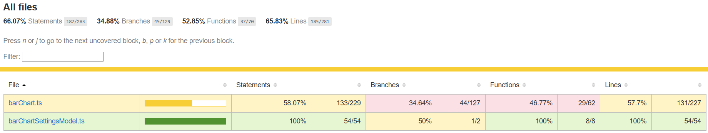
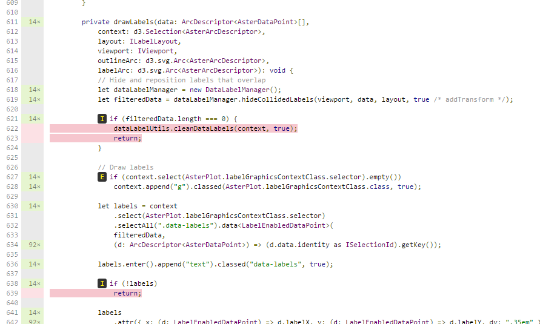

# Tutorial: Add unit tests for Power BI visual projects

This article describes the basics of writing unit tests for your Power BI visuals, including how to:

* Set up the Karma JavaScript test runner testing framework, Jasmine.
* Use the powerbi-visuals-utils-testutils package.
* Use mocks and fakes to help simplify unit testing of Power BI visuals.

## Prerequisites

* An installed Power BI visuals project
* A configured Node.js environment

## Install and configure the Karma JavaScript test runner and Jasmine

Add the required libraries to the *package.json* file in the `devDependencies` section:

```json
"@babel/polyfill": "^7.2.5",
"@types/d3": "5.5.0",
"@types/jasmine": "2.5.37",
"@types/jasmine-jquery": "1.5.28",
"@types/jquery": "2.0.41",
"@types/karma": "3.0.0",
"@types/lodash-es": "4.17.1",
"coveralls": "3.0.2",
"istanbul-instrumenter-loader": "^3.0.1",
"jasmine": "2.5.2",
"jasmine-core": "2.5.2",
"jasmine-jquery": "2.1.1",
"jquery": "3.1.1",
"karma": "3.1.1",
"karma-chrome-launcher": "2.2.0",
"karma-coverage": "1.1.2",
"karma-coverage-istanbul-reporter": "^2.0.4",
"karma-jasmine": "2.0.1",
"karma-junit-reporter": "^1.2.0",
"karma-sourcemap-loader": "^0.3.7",
"karma-typescript": "^3.0.13",
"karma-typescript-preprocessor": "0.4.0",
"karma-webpack": "3.0.5",
"puppeteer": "1.17.0",
"style-loader": "0.23.1",
"ts-loader": "5.3.0",
"ts-node": "7.0.1",
"tslint": "^5.12.0",
"webpack": "4.26.0"
```

To learn more about *package.json*, see the description at [npm-package.json](https://docs.npmjs.com/files/package.json).

Save the *package.json* file and, at the `package.json` location, run the following command:

```cmd
npm install
```

The package manager installs all new packages that are added to *package.json*.

To run unit tests, configure the test runner and `webpack` config.

The following code is a sample of the *test.webpack.config.js* file:

```typescript
const path = require('path');
const webpack = require("webpack");

module.exports = {
    devtool: 'source-map',
    mode: 'development',
    optimization : {
        concatenateModules: false,
        minimize: false
    },
    module: {
        rules: [
            {
                test: /\.tsx?$/,
                use: 'ts-loader',
                exclude: /node_modules/
            },
            {
                test: /\.json$/,
                loader: 'json-loader'
            },
            {
                test: /\.tsx?$/i,
                enforce: 'post',
                include: /(src)/,
                exclude: /(node_modules|resources\/js\/vendor)/,
                loader: 'istanbul-instrumenter-loader',
                options: { esModules: true }
            },
            {
                test: /\.less$/,
                use: [
                    {
                        loader: 'style-loader'
                    },
                    {
                        loader: 'css-loader'
                    },
                    {
                        loader: 'less-loader',
                        options: {
                            paths: [path.resolve(__dirname, 'node_modules')]
                        }
                    }
                ]
            }
        ]
    },
    externals: {
        "powerbi-visuals-api": '{}'
    },
    resolve: {
        extensions: ['.tsx', '.ts', '.js', '.css']
    },
    output: {
        path: path.resolve(__dirname, ".tmp/test")
    },
    plugins: [
        new webpack.ProvidePlugin({
            'powerbi-visuals-api': null
        })
    ]
};
```

The following code is a sample of the *karma.conf.ts* file:

```typescript
"use strict";

const webpackConfig = require("./test.webpack.config.js");
const tsconfig = require("./test.tsconfig.json");
const path = require("path");

const testRecursivePath = "test/visualTest.ts";
const srcOriginalRecursivePath = "src/**/*.ts";
const coverageFolder = "coverage";

process.env.CHROME_BIN = require("puppeteer").executablePath();

import { Config, ConfigOptions } from "karma";

module.exports = (config: Config) => {
    config.set(<ConfigOptions>{
        mode: "development",
        browserNoActivityTimeout: 100000,
        browsers: ["ChromeHeadless"], // or Chrome to use locally installed Chrome browser
        colors: true,
        frameworks: ["jasmine"],
        reporters: [
            "progress",
            "junit",
            "coverage-istanbul"
        ],
        junitReporter: {
            outputDir: path.join(__dirname, coverageFolder),
            outputFile: "TESTS-report.xml",
            useBrowserName: false
        },
        singleRun: true,
        plugins: [
            "karma-coverage",
            "karma-typescript",
            "karma-webpack",
            "karma-jasmine",
            "karma-sourcemap-loader",
            "karma-chrome-launcher",
            "karma-junit-reporter",
            "karma-coverage-istanbul-reporter"
        ],
        files: [
            "node_modules/jquery/dist/jquery.min.js",
            "node_modules/jasmine-jquery/lib/jasmine-jquery.js",
            {
                pattern: './capabilities.json',
                watched: false,
                served: true,
                included: false
            },
            testRecursivePath,
            {
                pattern: srcOriginalRecursivePath,
                included: false,
                served: true
            }
        ],
        preprocessors: {
            [testRecursivePath]: ["webpack", "coverage"]
        },
        typescriptPreprocessor: {
            options: tsconfig.compilerOptions
        },
        coverageIstanbulReporter: {
            reports: ["html", "lcovonly", "text-summary", "cobertura"],
            dir: path.join(__dirname, coverageFolder),
            'report-config': {
                html: {
                    subdir: 'html-report'
                }
            },
            combineBrowserReports: true,
            fixWebpackSourcePaths: true,
            verbose: false
        },
        coverageReporter: {
            dir: path.join(__dirname, coverageFolder),
            reporters: [
                // reporters not supporting the `file` property
                { type: 'html', subdir: 'html-report' },
                { type: 'lcov', subdir: 'lcov' },
                // reporters supporting the `file` property, use `subdir` to directly
                // output them in the `dir` directory
                { type: 'cobertura', subdir: '.', file: 'cobertura-coverage.xml' },
                { type: 'lcovonly', subdir: '.', file: 'report-lcovonly.txt' },
                { type: 'text-summary', subdir: '.', file: 'text-summary.txt' },
            ]
        },
        mime: {
            "text/x-typescript": ["ts", "tsx"]
        },
        webpack: webpackConfig,
        webpackMiddleware: {
            stats: "errors-only"
        }
    });
};
```

If necessary, you can modify this configuration.

The code in *karma.conf.js* contains the following variable:

* `recursivePathToTests`: Locates the test code

* `srcRecursivePath`: Locates the output JavaScript code after compiling

* `srcCssRecursivePath`: Locates the output CSS after compiling less file with styles

* `srcOriginalRecursivePath`: Locates the source code of your visual

* `coverageFolder`: Determines where the coverage report is to be created

The configuration file includes the following properties:

* `singleRun: true`: Tests are run on a continuous integration (CI) system, or they can be run one time. You can change the setting to *false* for debugging your tests. Karma keeps the browser running so that you can use the console for debugging.

* `files: [...]`: In this array, you can specify the files to load to the browser. Usually, there are source files, test cases, libraries (Jasmine, test utilities). You can add additional files to the list, as necessary.

* `preprocessors`: In this section, you configure actions that run before the unit tests run. They precompile the typescript to JavaScript, prepare source map files, and generate code coverage report. You can disable `coverage` when you debug your tests. Coverage generates additional code for check code for the test coverage, which complicates debugging tests.

For descriptions of all Karma configurations, go to the [Karma Configuration File](https://karma-runner.github.io/1.0/config/configuration-file.html) page.

For your convenience, you can add a test command into `scripts`:

```json
{
    "scripts": {
        "pbiviz": "pbiviz",
        "start": "pbiviz start",
        "typings":"node node_modules/typings/dist/bin.js i",
        "lint": "tslint -r \"node_modules/tslint-microsoft-contrib\"  \"+(src|test)/**/*.ts\"",
        "pretest": "pbiviz package --resources --no-minify --no-pbiviz --no-plugin",
        "test": "karma start"
    }
    ...
}
```

You're now ready to begin writing your unit tests.

## Check the DOM element of the visual

To test the visual, first create an instance of visual.

### Create a visual instance builder

Add a *visualBuilder.ts* file to the *test* folder by using the following code:

```typescript
import {
    VisualBuilderBase
} from "powerbi-visuals-utils-testutils";

import {
    BarChart as VisualClass
} from "../src/visual";

import  powerbi from "powerbi-visuals-api";
import VisualConstructorOptions = powerbi.extensibility.visual.VisualConstructorOptions;

export class BarChartBuilder extends VisualBuilderBase<VisualClass> {
    constructor(width: number, height: number) {
        super(width, height);
    }

    protected build(options: VisualConstructorOptions) {
        return new VisualClass(options);
    }

    public get mainElement() {
        return this.element.children("svg.barChart");
    }
}
```

There's `build` method for creating an instance of your visual. `mainElement` is a get method, which returns an instance of "root" document object model (DOM) element in your visual. The getter is optional, but it makes writing the unit test easier.

You now have a build of an instance of your visual. Let's write the test case. The test case checks the SVG elements that are created when your visual is displayed.

### Create a typescript file to write test cases

Add a *visualTest.ts* file for the test cases by using the following code:

```typescript
import powerbi from "powerbi-visuals-api";

import { BarChartBuilder } from "./VisualBuilder";

import {
    BarChart as VisualClass
} from "../src/visual";

import VisualBuilder = powerbi.extensibility.visual.test.BarChartBuilder;

describe("BarChart", () => {
    let visualBuilder: VisualBuilder;
    let dataView: DataView;

    beforeEach(() => {
        visualBuilder = new VisualBuilder(500, 500);
    });

    it("root DOM element is created", () => {
        expect(visualBuilder.mainElement).toBeInDOM();
    });
});
```

Several methods are called:

* [`describe`](https://jasmine.github.io/api/2.6/global.html#describe): Describes a test case. In the context of the Jasmine framework, it often describes a suite or group of specs.

* `beforeEach`: Is called before each call of the `it` method, which is defined in the [`describe`](https://jasmine.github.io/api/2.6/global.html#beforeEach) method.

* [`it`](https://jasmine.github.io/api/2.6/global.html#it): Defines a single spec. The `it` method should contain one or more `expectations`.

* [`expect`](https://jasmine.github.io/api/2.6/global.html#expect): Creates an expectation for a spec. A spec succeeds if all expectations pass without any failures.

* `toBeInDOM`: One of the *matchers* methods. For more information about matchers, see [Jasmine Namespace: matchers](https://jasmine.github.io/api/2.6/matchers.html).

For more information about Jasmine, see the [Jasmine framework documentation](https://jasmine.github.io/) page.

### Launch unit tests

This test checks that root SVG element of the visuals is created. To run the unit test, enter the following command in the command-line tool:

```cmd
npm run test
```

`karma.js` runs the test case in the Chrome browser.


> [!NOTE]
> You must install Google Chrome locally.

In the command-line window, you'll get following output:

```cmd
> karma start

23 05 2017 12:24:26.842:WARN [watcher]: Pattern "E:/WORKSPACE/PowerBI/PowerBI-visuals-sampleBarChart/data/*.csv" does not match any file.
23 05 2017 12:24:30.836:WARN [karma]: No captured browser, open https://localhost:9876/
23 05 2017 12:24:30.849:INFO [karma]: Karma v1.3.0 server started at https://localhost:9876/
23 05 2017 12:24:30.850:INFO [launcher]: Launching browser Chrome with unlimited concurrency
23 05 2017 12:24:31.059:INFO [launcher]: Starting browser Chrome
23 05 2017 12:24:33.160:INFO [Chrome 58.0.3029 (Windows 10 0.0.0)]: Connected on socket /#2meR6hjXFmsE_fjiAAAA with id 5875251
Chrome 58.0.3029 (Windows 10 0.0.0): Executed 1 of 1 SUCCESS (0.194 secs / 0.011 secs)

=============================== Coverage summary ===============================
Statements   : 27.43% ( 65/237 )
Branches     : 19.84% ( 25/126 )
Functions    : 43.86% ( 25/57 )
Lines        : 20.85% ( 44/211 )
================================================================================
```

### How to add static data for unit tests

Create the *visualData.ts* file in the *test* folder by using the following code:

```typescript
import powerbi from "powerbi-visuals-api";
import DataView = powerbi.DataView;

import {
    testDataViewBuilder,
    getRandomNumbers
} from "powerbi-visuals-utils-testutils";

export class SampleBarChartDataBuilder extends TestDataViewBuilder {
    public static CategoryColumn: string = "category";
    public static MeasureColumn: string = "measure";

    public constructor() {
        super();
        ...
    }

    public getDataView(columnNames?: string[]): DataView {
        let dateView: any = this.createCategoricalDataViewBuilder([
            ...
        ],
        [
            ...
        ], columnNames).build();

        // there's client side computed maxValue
        let maxLocal = 0;
        this.valuesMeasure.forEach((item) => {
                if (item > maxLocal) {
                    maxLocal = item;
                }
        });
        (<any>dataView).categorical.values[0].maxLocal = maxLocal;
    }
}
```

The `SampleBarChartDataBuilder` class extends `TestDataViewBuilder` and implements the abstract method `getDataView`.

When you put data into data-field buckets, Power BI produces a categorical `dataview` object that's based on your data.


In unit tests, you don't have Power BI core functions to reproduce the data. But you need to map your static data to the categorical `dataview`. The `TestDataViewBuilder` class can help you map it.

For more information about Data View mapping, see [DataViewMappings](https://github.com/PowerBi-Projects/PowerBI-visuals/blob/master/Capabilities/DataViewMappings.md).

In the `getDataView` method, you call the `createCategoricalDataViewBuilder` method with your data.

In `sampleBarChart` visual [capabilities.json](https://github.com/Microsoft/PowerBI-visuals-sampleBarChart/blob/master/capabilities.json#L2) file, we have dataRoles and dataViewMapping objects:

```json
"dataRoles": [
    {
        "displayName": "Category Data",
        "name": "category",
        "kind": "Grouping"
    },
    {
        "displayName": "Measure Data",
        "name": "measure",
        "kind": "Measure"
    }
],
"dataViewMappings": [
    {
        "conditions": [
            {
                "category": {
                    "max": 1
                },
                "measure": {
                    "max": 1
                }
            }
        ],
        "categorical": {
            "categories": {
                "for": {
                    "in": "category"
                }
            },
            "values": {
                "select": [
                    {
                        "bind": {
                            "to": "measure"
                        }
                    }
                ]
            }
        }
    }
],
```

To generate the same mapping, you must set the following params to `createCategoricalDataViewBuilder` method:

```typescript
([
    {
        source: {
            displayName: "Category",
            queryName: SampleBarChartData.CategoryColumn,
            type: ValueType.fromDescriptor({ text: true }),
            roles: {
                Category: true
            },
        },
        values: this.valuesCategory
    }
],
[
    {
        source: {
            displayName: "Measure",
            isMeasure: true,
            queryName: SampleBarChartData.MeasureColumn,
            type: ValueType.fromDescriptor({ numeric: true }),
            roles: {
                Measure: true
            },
        },
        values: this.valuesMeasure
    },
], columnNames)
```

Where `this.valuesCategory` is an array of categories:

```ts
public valuesCategory: string[] = ["Monday", "Tuesday", "Wednesday", "Thursday", "Friday", "Saturday", "Sunday"];
```

And `this.valuesMeasure` is an array of measures for each category:

```ts
public valuesMeasure: number[] = [742731.43, 162066.43, 283085.78, 300263.49, 376074.57, 814724.34, 570921.34];
```

Now, you can use the `SampleBarChartDataBuilder` class in your unit test.

The `ValueType` class is defined in the powerbi-visuals-utils-testutils package. And the
`createCategoricalDataViewBuilder` method requires the `lodash` library.

Add these packages to the dependencies.

In `package.json` at `devDependencies` section

```json
"lodash-es": "4.17.1",
"powerbi-visuals-utils-testutils": "2.2.0"
```

Call

```cmd
npm install
```

to install `lodash-es` library.

Now, you can run the unit test again. You must get the following output:

```cmd
> karma start

23 05 2017 16:19:54.318:WARN [watcher]: Pattern "E:/WORKSPACE/PowerBI/PowerBI-visuals-sampleBarChart/data/*.csv" does not match any file.
23 05 2017 16:19:58.333:WARN [karma]: No captured browser, open https://localhost:9876/
23 05 2017 16:19:58.346:INFO [karma]: Karma v1.3.0 server started at https://localhost:9876/
23 05 2017 16:19:58.346:INFO [launcher]: Launching browser Chrome with unlimited concurrency
23 05 2017 16:19:58.394:INFO [launcher]: Starting browser Chrome
23 05 2017 16:19:59.873:INFO [Chrome 58.0.3029 (Windows 10 0.0.0)]: Connected on socket /#NcNTAGH9hWfGMCuEAAAA with id 3551106
Chrome 58.0.3029 (Windows 10 0.0.0): Executed 1 of 1 SUCCESS (1.266 secs / 1.052 secs)

=============================== Coverage summary ===============================
Statements   : 56.72% ( 135/238 )
Branches     : 32.54% ( 41/126 )
Functions    : 66.67% ( 38/57 )
Lines        : 52.83% ( 112/212 )
================================================================================
```

Your visual opens in the Chrome browser, as shown:


The summary shows that coverage has increased. To learn more about current code coverage, open `coverage\index.html`.


Or look at the scope of the `src` folder:



In the scope of file, you can view the source code. The `Coverage` utilities would highlight the row in red if certain code isn't executed during the unit tests.



> [!IMPORTANT]
> Code coverage doesn't mean that you have good functionality coverage of the visual. One simple unit test provides over 96 percent coverage in `src\visual.ts`.

## Next steps

When your visual is ready, you can submit it for publication. For more information, see [Publish Power BI visuals to AppSource](office-store.md).
