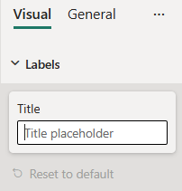

# TextInput formatting slice

*TextInput* is a simple formatting slice which is used to represent *text* object type from `capabilities.json` file.



## Example: TextInput implementation

In this example, we show how to build a *TextInput* slice using formatting model utils.

### Capabilities object

Insert the following JSON fragment into the object labeled objects in the `capabilities.json` file.

```typescript
    "labels": {
      "properties": {
        "title": {
          "type": {
            "text": true
          }
        },
      }
    }
```

### Formatting model class

Insert the following code fragment into the `settings.ts` file.

```typescript
import { formattingSettings } from "powerbi-visuals-utils-formattingmodel";

class LabelsCardSetting extends formattingSettings.SimpleCard {
    name: string = "labels"; // same as capabilities object name
    displayName: string = "Labels";

    public title: formattingSettings.TextInput = new formattingSettings.TextInput({
        name: "title", // same as capabilities property name
        displayName: "Title",
        value: "",
        placeholder: "Title placeholder"
    });
    
    public slices: formattingSettings.Slice[] = [ this.title ];
}

export class VisualSettings extends formattingSettings.Model {
    public labels: LabelsCardSetting = new LabelsCardSetting();
    public cards: formattingSettings.SimpleCard[] = [this.labels];
}
```
