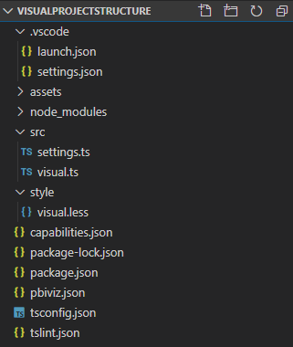
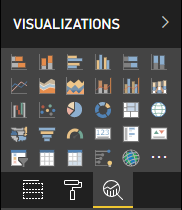

# Power BI visual project structure

After executing the pbiviz new `<visual project name>`, the tool creates basic structure of files and folders in `<visual project name>` folder.



* `.vscode` - contains settings of project for VS Code. To configure your workspace edit `.vscode/settings.json` file. Read more [about VS Code settings in documentation](https://code.visualstudio.com/docs/getstarted/settings)

* `assets` folder contains only `icon.png` file. The tool uses this file as an icon of the visual in Visualization pane of Power BI.

    

* `node_modules` folder contains all packages [installed by Node Package Manager](https://docs.npmjs.com/files/folders.html).

* `src` folder contains source code of the visual. By default the tool creates two files:

  * `visual.ts` - the main source code of the visual.

  * `settings.ts` - the code of settings for the visual. The classes in file simplify [work with the visual properties](./objects-properties.md#properties).

* `style` folder contains `visual.less` file with styles for the visual.

* `capabilities.json` file contains main properties and settings for the visual. It allows visual to declare supported features, objects, properties, and data view mapping.

    Read more [about capabilities in documentation](./capabilities.md).

* `package-lock.json` is automatically generated for any operations where npm modifies either the `node_modules` tree, or `package.json`.

    Read more [about `package-lock.json` in official documentation of NPM](https://docs.npmjs.com/files/package-lock.json).

* `package.json` describes the project package. Usually it contains info about the project, its authors, description, and dependencies of the project.

    Read more [about `package.json` in official documentation of NPM](https://docs.npmjs.com/files/package.json.html).

* `pbiviz.json` contains the visual metadata. Specify the metadata of the visual in this file.

    Typical content of file:

  ```json
    {
        "visual": {
            "name": "<visual project name>",
            "displayName": "<visual project name>",
            "guid": "<visual project name>23D8B823CF134D3AA7CC0A5D63B20B7F",
            "visualClassName": "Visual",
            "version": "1.0.0",
            "description": "",
            "supportUrl": "",
            "gitHubUrl": ""
        },
        "apiVersion": "2.6.0",
        "author": { "name": "", "email": "" },
        "assets": { "icon": "assets/icon.png" },
        "externalJS": null,
        "style": "style/visual.less",
        "capabilities": "capabilities.json",
        "dependencies": null,
        "stringResources": []
    }
  ```

    where

  * `name` - internal name of the visual.

  * `displayName` - the name of the visual in UI interface of Power BI.

  * `guid` - unique ID of the visual.

  * `visualClassName` - the name of main class for the visual. Power BI creates the instance of this class to start using the visual in Power BI report.

  * `version` - the version number of the visual.

  * `author` - contains name of Author and contact e-mail.

  * `icon` in `assets` - the path to icon file for the visual.

  * `externalJS` contains paths for JS libraries used in the visual.

  > [!IMPORTANT]
  > The latest version of tool 3.x.x or higher doesn't use `externalJS` anymore.

  * `style` is the path to style files.

  * `capabilities` is path to `capabilities.json` file.

  * `dependencies` is path to `dependencies.json` file. `dependencies.json` contains info about R packages used in R-based visuals.

  * `stringResources` is an array of paths to files with localizations.

  Read more [about localization in visuals in documentation](./localization.md)

* `tsconfig.json` is configuration file for TypeScript.

    Read more [about TypeScript configuration in official documentation](https://www.typescriptlang.org/docs/handbook/tsconfig-json.html)

    The `tsconfig.json` in `files` section has to contain the path to *.ts file where the main class of the visual is located specified in `visualClassName` property of `pbiviz.json` file.

* `tslint.json` file contains TSLint configuration.

    Read more [about TSLint configuration in official documentation](https://palantir.github.io/tslint/usage/configuration/)

## Next steps

* Read more [about visual concept](./power-bi-visuals-concept.md) for better understanding how visual, user, and Power BI interact with each other.

* Start developing your own Power BI Visuals from scratch [with step by step guide](./custom-visual-develop-tutorial.md).
