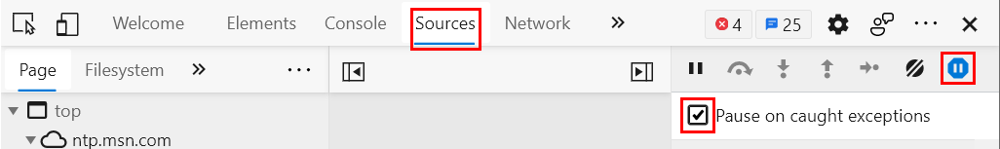

# Debug Power BI custom visuals

This article describes some basic debugging procedures that you can use when developing your visual. After you read this article, you should be able to debug your visual by inserting breakpoints and working with exceptions.

## Insert breakpoints

The visual's entire JavaScript is reloaded every time the visual is updated. Any breakpoints that you add will be lost when the debug visual is refreshed.

As a workaround, use `debugger` statements in your code. We recommend that you turn off automatic reload while using `debugger` in your code.
Here's an example of how to use a `debugger` statement in your `update` method:

```typescript
public update(options: VisualUpdateOptions) {
    console.log('Visual update', options);
    debugger;
    this.target.innerHTML = `<p>Update count: <em>${(this.updateCount</em></p>`;
}
```

## Catch exceptions

When you're working on your visual, you notice that the Power BI service "consumes" all errors. This behavior is an intentional feature of Power BI. It prevents misbehaving visuals from causing the entire app to become unstable.

As a workaround, add code to catch and log your exceptions, or set your debugger to break on caught exceptions.

### Log exceptions with a decorator

To log exceptions in your Power BI visual, you need define an exception-logging decorator. To define the decorator, add the following code to your visual:

```typescript
export function logExceptions(): MethodDecorator {
    return function (target: Object, propertyKey: string, descriptor: TypedPropertyDescriptor<any>): TypedPropertyDescriptor<any> {
        return {
            value: function () {
                try {
                    return descriptor.value.apply(this, arguments);
                } catch (e) {
                    console.error(e);
                    throw e;
                }
            }
        }
    }
}
```

You can use this decorator on any function to see error logging as follows:

```typescript
@logExceptions()
public update(options: VisualUpdateOptions) {
```

### Break on exceptions

You can set the browser to break on caught exceptions. Breaking stops code execution wherever an error happens, and you can debug from there.

#### [Microsoft Edge](#tab/Edge)

1. Open DevTools (F12).
2. Go to the **Sources** tab.
3. Select the **Pause on exceptions** icon (stop sign with a pause symbol).
4. Select the **Pause on caught exceptions** checkbox.

    

#### [Google Chrome](#tab/Chrome)

1. Open DevTools (F12).
2. Go to the **Sources** tab.
3. Select the **Pause on exceptions** icon (stop sign with a pause symbol).
4. Select the **Pause On Caught Exceptions** checkbox.

    

---

## Related content

* [Troubleshoot your Power BI developer environment setup](power-bi-custom-visuals-troubleshoot.md)
* [Frequently asked questions about Power BI visuals](power-bi-custom-visuals-faq.yml)
