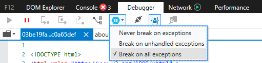

# Debugging

This page shows some tips for debugging while building your visual. It includes basic steps and shows differences between standard frontend applications and Power BI visual's debugging.
After reading the article you will be able to debug custom visuals using breakpoints, log exceptions programmatically and catch exceptions in Chrome and Edge.

## Using breakpoints

First steps are described [here](../power-bi-custom-visuals-troubleshoot.md).

Because the visual’s JavaScript is entirely reloaded every time the visual is updated, any breakpoints you add will be lost when the debug visual is refreshed. To work around it, use `debugger` statements in your code. It is recommended that you turn off auto reload while using `debugger` in your code.

```typescript
public update(options: VisualUpdateOptions) {
    console.log('Visual update', options);
    debugger;
    this.target.innerHTML = `<p>Update count: <em>${(this.updateCount</em></p>`;
}
```


## Showing exceptions

When working on your visual, you’ll notice that all errors are “eaten” by the Power BI service. It is an intentional feature of Power BI to prevent misbehaving visuals from causing the entire app to become unstable.

To work around it, you need to add code to programmatically catch and log your exceptions or just set your debugger to “break on caught exceptions”


## Log exceptions programmatically

To log exceptions in your visual, add the following code to your visual to define an exception logging decorator:

```typescript
export function logExceptions(): MethodDecorator {
     return function (target: Object, propertyKey: string, descriptor: TypedPropertyDescriptor<Function>)
    : TypedPropertyDescriptor<Function> {
            
        return {
            value: function () {
                try {
                    return descriptor.value.apply(this, arguments);
                } catch (e) {
                    console.error(e);
                    throw e;
                }
            }
        }
    }
}
```
Then, you can use this decorator on any function to see error logging like this:

```typescript
@logExceptions()
public update(options: VisualUpdateOptions) {
```

## Break on exceptions

You can also set the browser to break on caught exceptions, which will stop code execution wherever an error happens and allow you to debug from there.

## Edge

* Open developer tools (F12)
* Go to the `Debugger` tab
* Click the `break on exceptions` icon (hexagon with a pause symbol)
* Select `Break on all exceptions`



## Chrome

* Open developer tools (F12)
* Go to the  `Sources` tab
* Click the `break on exceptions` icon (stop sign with a pause symbol)
* Check the `Pause On Caught Exceptions` checkbox


## Next steps
For more information and answers to questions, visit [Frequently asked questions about Power BI visuals](../power-bi-custom-visuals-faq.md#organizational-power-bi-visuals).