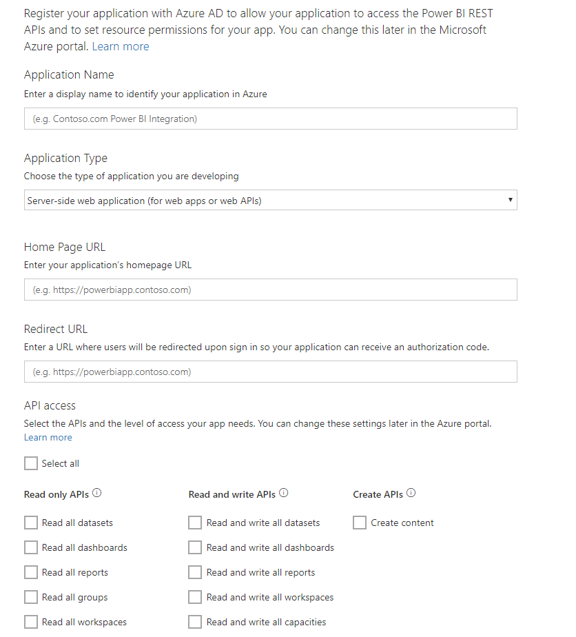

# Step 1: Register an app with Azure AD

This article is part of a step-by-step walkthrough to [push data into a dataset](walkthrough-push-data.md).

The first step to push data into a Power BI dataset is to register your app in Azure AD. You need to do this first so that you have a **Client ID** that identifies your app in Azure AD. Without a **Client ID**, Azure AD cannot authenticate your app.

> **NOTE**: Before you register an app for Power BI, you need to [Sign up for Power BI](create-an-azure-active-directory-tenant.md).

Here are the steps to register an app in Azure AD.

## Register an app in Azure AD

1. Go to dev.powerbi.com/apps.
2. Click **Sign in with your existing account**, and sign into your Power BI account.
3. Enter an **App Name** such as "Sample push data app".
4. For **App Type**, choose **Native app**.
5. Enter a **Redirect URL**, such as **https://login.live.com/oauth20_desktop.srf**. For a **Native client app**, a redirect uri gives **Azure AD** more details on the specific application that it will authenticate. The standard Uri for a client app is https://login.live.com/oauth20_desktop.srf.
6. For **Choose APIs to access**, choose **Read and Write All Datasets**. For all Power BI app permissions, see [Power BI Permissions](power-bi-permissions.md).
7. Click **Register app**, and save the **Client ID** that was generated. A **Client ID** identifies the app in Azure AD.

Here's how your **Register an Application for Power BI** page should look:

The next step shows you how to [get an authentication access token](walkthrough-push-data-get-token.md).

[Next Step >](walkthrough-push-data-get-token.md)

## Next steps

[Sign up for Power BI](create-an-azure-active-directory-tenant.md)  
[Get an authentication access token](walkthrough-push-data-get-token.md)  
[Walkthrough: Push data into a dataset](walkthrough-push-data.md)  
[Register an application](register-app.md)  
[Overview of Power BI REST API](overview-of-power-bi-rest-api.md)  

More questions? [Try asking the Power BI Community](http://community.powerbi.com/)