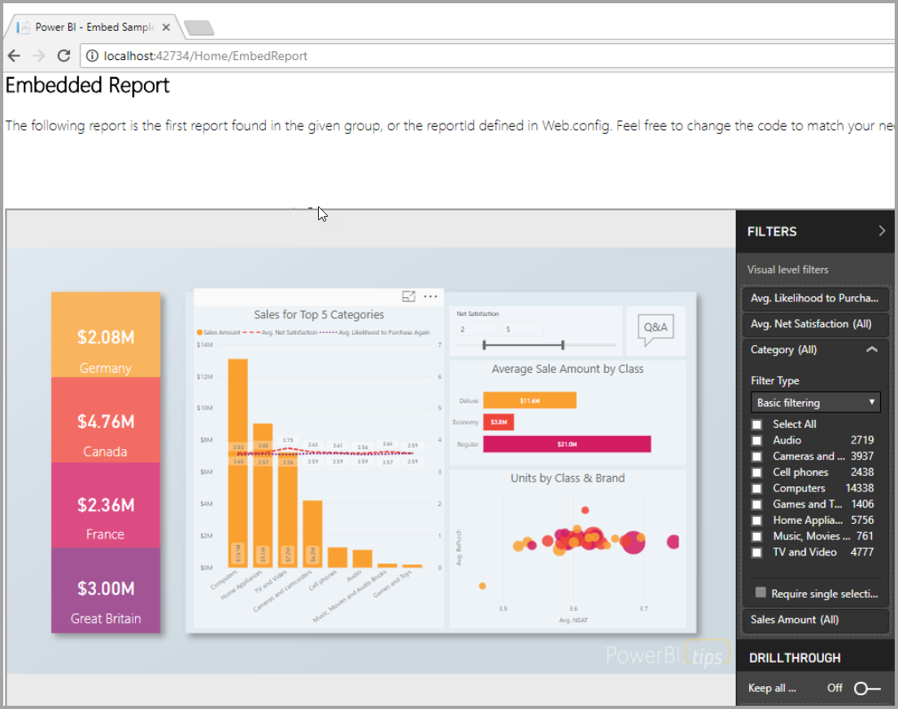

# What can developers do with Power BI?

Developers have different options trying to include Power BI content into applications. These options include **embedding with Power BI**, **custom visuals**, and **pushing data into Power BI**.

## Embedding
The Power BI service (SaaS) and the Power BI Embedded service in Azure (PaaS) have APIs for embedding your dashboards and reports. This means you will have a set of capabilities and access to the latest Power BI features – such as dashboards, gateways and app workspaces – when embedding your content.

## Develop custom visuals
Custom visuals allow you to create your own visuals for use within Power BI reports. Custom visuals are written in TypeScript which is a superset of JavaScript. TypeScript supports some advanced features and early access to ES6/ES7 functionality. Visual styling is handled using cascading styles sheets (css). For your convenience, we use the Less pre-compiler which supports some advanced features such as nesting, variables, conditions, loops, etc. If you don't want to use any of those features, you can just write plain css in the less file.

## Push data into Power BI
You can use the Power BI API to push data into a dataset. This allows you to add a row to a table within a dataset. The new data can then be reflected in tiles on a dashboard and within visuals within your report.

## Next steps
[Embedding with Power BI](embedding.md)  
[Publish custom visuals to the Office store](office-store.md)  
[Push data into a dashboard](walkthrough-push-data.md)
