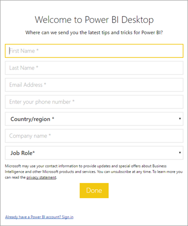

# Manage the Power BI Desktop sign-in form

The first time Power BI Desktop is launched, a sign-in form is displayed. Information can be filled in, or sign in to Power BI to continue. Administrators manage this form by using a registry key.



Administrators use the following registry key to disable the sign-in form. This change can also be pushed to an entire organization by using global policies.

```console
Key: HKEY_CURRENT_USER\SOFTWARE\Policies\Microsoft\Microsoft Power BI Desktop
valueName: ShowLeadGenDialog
```

You can also try the following key, which has been successful for some customers based on their configurations:

```console
Key: HKEY_CURRENT_USER\SOFTWARE\Microsoft\Microsoft Power BI Desktop
valueName: ShowLeadGenDialog
```

A value of 0 disables the dialog.

More questions? [Ask the Power BI Community](https://community.powerbi.com)
