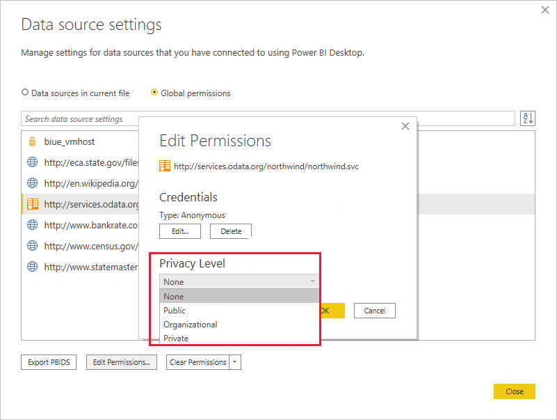
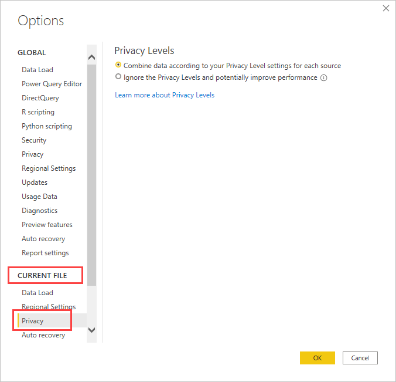

# Power BI Desktop privacy levels

In **Power BI Desktop**, privacy levels specify isolation levels that determine the degree to which one data source is isolated from other data sources. Although a restrictive isolation level blocks information from being exchanged between data sources, it can reduce functionality and performance.

## Data source settings

To configure data source settings:

1. Select **File**, and then select  **Options and settings**.
1. Select **Data source settings**.
1. Select a data source from the list, and then select **Edit Permissions**.
1. Under **Privacy Levels**, select a privacy level.
1. Select **OK**, and then select **Close**.

The following table describes data source privacy levels:

| Setting | Description | Example data sources |
| --- | --- | --- |
| **Private** |Data sources set to **Private** contain sensitive or confidential information. Visibility can be restricted to authorized users. Data from a private data source won't fold in to other data sources, including other private data sources. |Facebook data, a text file containing stock awards, or a workbook containing employee review information. |
| **Organizational** |Data sources set to **Organizational** can fold in to private and other organizational data sources. They can't fold in to public data sources. Visibility is set to a trusted group.  |A Microsoft Word document on an intranet SharePoint site with permissions enabled for a trusted group. |
| **Public** |Files, internet data sources, and workbook data can be set to **Public**. Data can fold in to other data sources. Visibility is available to everyone. |Free data from the Azure Marketplace, data from a Wikipedia page, or a local file containing data copied from a public web page. |

> [!CAUTION]
> Configure a data source containing highly sensitive or confidential data as **Private**.
## Privacy levels

To configure privacy options for a file:

1. Select **File**, and then select **Options and settings**.
1. Select **Options**.
1. Under **Current File**, select **Privacy**.
1. Under **Privacy Levels**, select a privacy level.
1. Select **OK**.

The following table describes privacy level settings:

 Setting | Description |
| --- | --- |
| **Combine data according to your Privacy Level settings for each source** (Default) | When selected, data is combined according to your privacy levels setting. Merging data across Privacy isolation zones will result in some data buffering.|
| **Ignore the Privacy Levels and potentially improve performance** | When selected, data is combined ignoring your privacy level setting. Ignoring the privacy setting can reveal sensitive or confidential data to an unauthorized user. This setting might improve performance and functionality.  |

> [!CAUTION]
>
> - **Ignore the Privacy Levels and potentially improve performance** doesn't work in the Power BI service. Reports created in Power BI Desktop with this setting and published to the Power BI service don't adhere to the setting. However, the privacy levels are available on the personal gateway.
> - Power BI Desktop can't ensure the privacy of data merged into another Power BI Desktop file.

## Related content

- [Power BI implementation planning: Content creator security planning](/power-bi/guidance/powerbi-implementation-planning-security-content-creator-planning#privacy-levels)
- Questions? [Try asking the Power BI Community](https://community.powerbi.com/)
- Suggestions? [Contribute ideas to improve Power BI](https://ideas.powerbi.com/)
