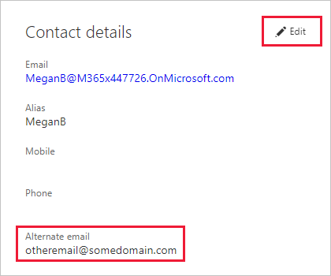

# Use an alternate email address

When you sign up for Power BI, you provide an email address. By default, Power BI uses this address to send you updates about activity in the service. For example, when someone sends you a sharing invitation, it goes to this address.

In some cases, you might want these emails delivered to an alternate email address rather than the one you signed up with. This article explains how to specify an alternate address in Microsoft 365 and in PowerShell. The article also explains how Azure Active Directory (Azure AD) resolves an email address.

> [!NOTE]
> Specifying an alternate address doesn't affect which email address Power BI uses for e-mail subscriptions, service updates, newsletters, and other promotional communications. Those communications are always sent to the email address you used when you signed up for Power BI.

## Use Microsoft 365

To specify an alternate address in Microsoft 365, follow these steps.

1. Open the [personal info](https://portal.office.com/account/#personalinfo) page of your account. If the app prompts you, sign in with the email address and password you use for Power BI.

1. On the left menu, select **Personal info**.

1. In the **Contact details** section, select **Edit**.

    If you can't edit your details, an admin manages your email address. Contact your admin to update your alternate email address.

    

1. In the **Alternate email** field, enter the email address you'd like Microsoft 365 to use for Power BI updates.

## Use PowerShell

To specify an alternate address in PowerShell, use the [Set-AzureADUser](/powershell/module/azuread/set-azureaduser/) command.

```powershell
Set-AzureADUser -ObjectId john@contoso.com -OtherMails "otheremail@somedomain.com"
```

## Email address resolution in Azure AD

To capture an Azure AD embed token for Power BI, you can use one of three different types of email addresses:

* The main email address associated with your Azure AD account

* The UserPrincipalName (UPN) email address

* The *other email address* array attribute

Power BI selects which email to use based on the following sequence:

1. If the mail attribute in the Azure AD user object is present, then Power BI uses that mail attribute for the email address.

1. If the UPN email isn't a **\*.onmicrosoft.com** domain email address (the information after the "\@" symbol), then Power BI uses that mail attribute for the email address.

1. If the *other email address* array attribute in the Azure AD user object is present, then Power BI uses the first email in that list (since there can be a list of emails in this attribute).

1. If none of the above conditions are present, then Power BI uses the UPN address.

More questions? [Ask the Power BI Community](https://community.powerbi.com/)
