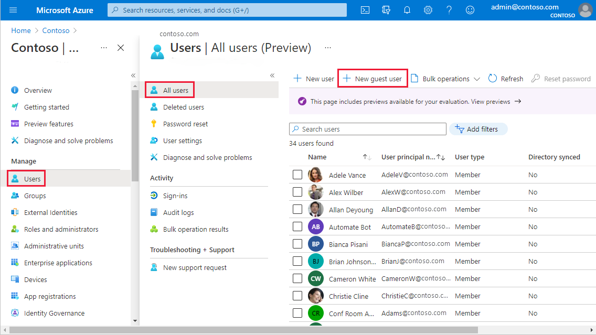
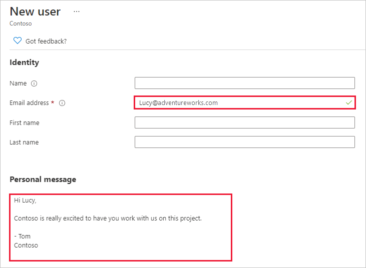
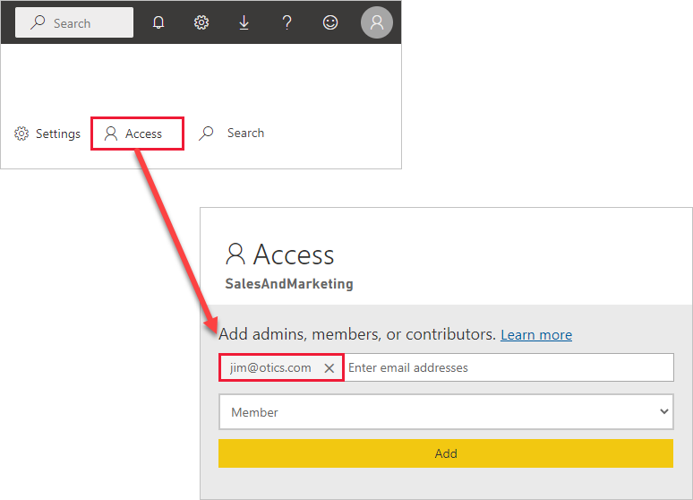
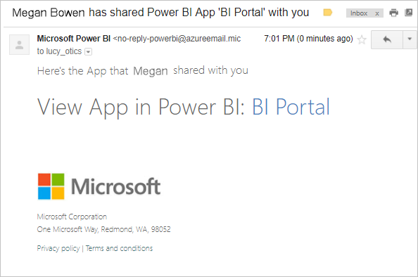
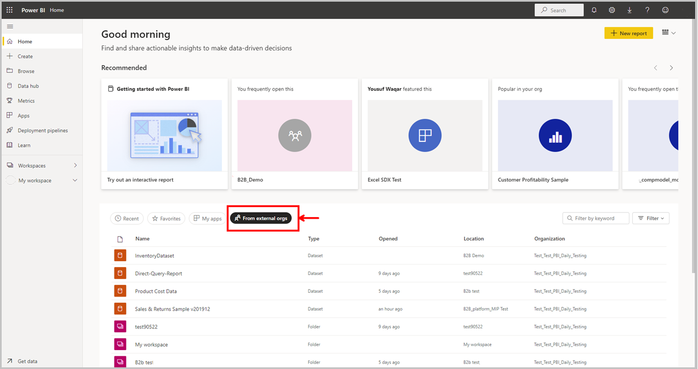

# Distribute Power BI content to external guest users with Microsoft Entra B2B

Power BI enables sharing content with external guest users through Microsoft Entra Business-to-Business (Microsoft Entra B2B). By using Microsoft Entra B2B, your organization enables and governs sharing with external users in a central place.

Another way to share content with external guest users is in-place semantic model sharing with Power BI. This allows you share content with external guest users that they can then access in their own home tenant. For more information about in-place semantic model sharing, see [About Power BI in-place semantic model sharing with guest users in external organizations](../collaborate-share/service-dataset-external-org-share-about.md).

This article provides a basic introduction to Microsoft Entra B2B in Power BI. For more information, see [Distribute Power BI content to external guest users using Microsoft Entra B2B](../guidance/whitepaper-azure-b2b-power-bi.md).

## Enable Invite external users to your organization setting

Make sure you enable the [Invite external users to your organization](/fabric/admin/service-admin-portal-export-sharing) feature in the Power BI admin portal before inviting guest users. Even when this option is enabled, the user must be granted the Guest Inviter role in Microsoft Entra ID to invite guest users.  

> [!NOTE]
> The [Invite external users to your organization](/fabric/admin/service-admin-portal-export-sharing) setting controls whether Power BI allows inviting external users to your organization. After an external user accepts the invite, they become a Microsoft Entra B2B guest user in your organization. They appear in people pickers throughout the Power BI experience. If the setting is disabled, existing guest users in your organization continue to have access to any items they already had access to and continue to be listed in people picker experiences. Additionally, if guests are added through the [planned invite](#planned-invites) approach they will also appear in people pickers. To prevent guest users from accessing Power BI, use a Microsoft Entra Conditional Access policy.

## Who can you invite?

Most email addresses are supported for guest user invitations, including personal email accounts like gmail.com, outlook.com, and hotmail.com. Microsoft Entra B2B calls these addresses *social identities*.

> [!NOTE]
> In Microsoft Entra ID, external users can be set to UserType Member. In Power BI, support for UserType Member is currently in preview. Note the following:
> * Microsoft Purview Information Protection is not supported for external members. Admins in the provider tenant are advised not to enable information protection for external members.
>
> In some situations, external members may see errors during their first sign-in attempt on the provider tenant. To unblock these external members, grant them permission to a Power BI item, such as a workspace, semantic model, or report, and then have them sign in again.

## Invite guest users

Guest users only require invitations the first time you invite them to your organization. To invite users, use planned or ad hoc invites.

To use ad hoc invites, use the following capabilities:

* Report and Dashboard sharing
* Report and Dashboard subscriptions
* App access list

Ad hoc invites aren't supported in the workspace access list. Use the [planned invites approach](#planned-invites) to add these users to your organization. After the external user becomes a guest in your organization, add them to the workspace access list.

### Planned invites

Use a planned invite if you know which users to invite. The Azure portal or PowerShell enables you to send the invites. You must be assigned the user admin role to invite people.

Follow these steps to send an invite in the Azure portal.

1. In the [Azure portal](https://portal.azure.com), select Menu button then select **Microsoft Entra ID**.

1. Under **Manage**, select **Users** > **All users** > **New guest user**.

    

1. Scroll down and enter an **email address** and **personal message**.

    

1. Select **Invite**.

To invite more than one guest user, use PowerShell or create a bulk invite in Microsoft Entra ID. To use PowerShell for the bulk invite, follow the steps in [Tutorial: Use PowerShell to bulk invite Microsoft Entra B2B collaboration users](/azure/active-directory/b2b/bulk-invite-powershell/). To use the Azure portal for the bulk invite, follow the steps in [Tutorial: Bulk invite Microsoft Entra B2B collaboration users](/azure/active-directory/b2b/tutorial-bulk-invite/).

The guest user must select **Get Started** in the email invitation they receive. The guest user is then added to the organization.

### Ad hoc invites

To invite an external user at any time, add them to your dashboard or report through the share feature or to your app through the access page. Here's an example of what to do when inviting an external user to use an app.

The guest user gets an email indicating that you shared the app with them.

The guest user must sign in with their organization email address. They'll receive a prompt to accept the invitation after signing in. After they sign in, the app opens for the guest user. To return to the app, they should bookmark the link or save the email.

## Discoverability for B2B content

### Tenant switcher

If you have access to more than one tenant, you can switch between tenants using the tenant switcher.

1. Select your profile picture to open your account manager and choose **Switch**.

   :::image type="content" source="media/service-admin-azure-ad-b2b/tenant-switcher-link.png" alt-text="Screenshot of the tenant switcher link in the Fabric account manager pane.":::

1. In the **Switch tenant (preview)** dialog, open the dropdown menu and choose the tenant you want to navigate to.

   :::image type="content" source="media/service-admin-azure-ad-b2b/tenant-switcher-selector.png" alt-text="Screenshot of the tenant switcher selector where you can choose which tenant you want to switch to.":::

   > [!NOTE]
   > The dropdown list displays a maximum of 50 tenants.

### From external orgs tab

The discoverability for B2B content feature in Power BI makes accessing shared B2B content easy for consumers. Power BI users who are guest users in any other tenant have a tab on their home page (in their home tenant) called *From external orgs*. When you select the tab, it lists all the items shared with you from external tenants that you can access as a guest user. You can filter and sort through the list to find content easily, and see which organization is sharing a specific item with you. When you select an item on the tab, a new window opens and takes you to the relevant provider tenant where you can access the item.

## Licensing

### Licensing Requirements

The following table lists the licensing requirements for B2B access to Power BI. The columns on the left indicate the workspace type and the per user license for the user sharing data externally. The license limitations across Free user, Pro user, and PPU user outlines limitations for the user consuming the data from an external tenant. Also note to invite guest users, a Power BI Pro or Premium Per User (PPU) license is needed: 

|Provider|Provider| . |Consumer User Type| . |
|-----|-----|------|------|------|
|**Workspace Type**|**User Type**|**Free User**|**Pro User**|**PPU User**|
|All Workspaces|Free User|Not Supported|Not Supported|Not Supported| 
|Pro Workspace|Pro/PPU/PPU Trial|Not Supported|Supported|Supported|  
|PPU Workspace|PPU User|Not Supported|Not Supported|Supported|  
|PPU Workspace|PPU Trial User|Not Supported|Not Supported|Supported|  
|PPC Workspace|Pro/PPU/PPU Trial|Supported|Supported|Supported| 

> [!NOTE] 
> Pro Trial users can't invite guest users in Power BI. 

### Steps to address licensing requirements
As noted above, the guest user must have the proper licensing in place to view the content that you shared. There are a few ways to make sure the user has a proper license: 
* Use Power BI Premium capacity.
* Assign a Power BI Pro or a Premium Per User (PPU) license.
* Use a guest's Power BI Pro or PPU license.

#### Use Power BI Premium capacity

Assigning the workspace to [Power BI Premium capacity](service-premium-what-is.md) lets the guest user use the app without requiring a Power BI Pro license. Power BI Premium also lets apps take advantage of other capabilities like increased refresh rates and large model sizes.

#### Assign a Power BI Pro or Premium Per User (PPU) license to guest user

Assigning a Power BI Pro or PPU license from your organization to a guest user lets that guest user view content shared with them. For more information about assigning licenses, see [Assign licenses to users on the Licenses page](/office365/admin/manage/assign-licenses-to-users#assign-licenses-to-users-on-the-licenses-page). Before assigning Pro or PPU licenses to guest users, consult the [Product Terms site](https://www.microsoft.com/licensing/terms) to ensure you're in compliance with the terms of your licensing agreement with Microsoft.

#### Guest user brings their own Power BI Pro or Premium Per User (PPU) license

The guest user may already have a Power BI Pro or PPU license that was assigned to them through their own organization.

To help allowed guests sign in to Power BI, provide them with the Tenant URL. To find the tenant URL, follow these steps.

1. In the Power BI service, in the header menu, select help (**?**), then select **About Power BI**.

2. Look for the value next to **Tenant URL**. Share the tenant URL with your allowed guest users.

    

## Cross-cloud B2B

You can use Power BI's B2B capabilities across Microsoft Azure clouds by configuring Microsoft cloud settings for B2B collaboration. Read [Microsoft cloud settings](/azure/active-directory/external-identities/cross-tenant-access-overview#microsoft-cloud-settings) to learn how to establish mutual B2B collaboration between the following clouds:

* Microsoft Azure global cloud and  Microsoft Azure Government
* Microsoft Azure global cloud and Microsoft Azure China 21Vianet

There are some limitations to the B2B experience that you should be aware of:

* Guest users may already have a Power BI license that was assigned to them through their own organization. But “Bring your own license” doesn’t work across different Microsoft Azure clouds for B2B guest users. A new license has to be assigned to these guest users by the provider tenant. 

* New external users can't be invited to the organization through Power BI sharing, permissions, and subscription experiences.

* On the Home page, the “From external orgs” tab won't list content shared from other clouds.

* Cross-cloud sharing does not work when sharing with a security group. For instance, if a user using Power BI in a national cloud invites a security group from the public cloud or vice versa, access is not granted. This is because the service can't resolve the members of these groups across clouds.

## Admin Info for B2B Collaboration 

The following tenant level settings in Power BI provide controls to admins. See [Export and sharing admin settings](/fabric/admin/service-admin-portal-export-sharing) for documentation on these settings: 
  * [Guest users can access Microsoft Fabric](/fabric/admin/service-admin-portal-export-sharing#guest-users-can-access-microsoft-fabric)
  * [Users can invite guest users to collaborate through item sharing and permissions](/fabric/admin/service-admin-portal-export-sharing#users-can-invite-guest-users-to-collaborate-through-item-sharing-and-permissions)
  * [Guest users can browse and access Fabric content](/fabric/admin/service-admin-portal-export-sharing#guest-users-can-browse-and-access-fabric-content)
  * [Users can see guest users in lists of suggested people](/fabric/admin/service-admin-portal-export-sharing#users-can-see-guest-users-in-lists-of-suggested-people) 

There are also Microsoft Entra ID settings that can limit what external guest users can do within your organization. Those settings also apply to your Power BI environment. The following documentation discusses the settings: 
  * [Manage External Collaboration Settings](/azure/active-directory/external-identities/external-collaboration-settings-configure#configure-b2b-external-collaboration-settings)
  * [Allow or block invitations to B2B users from specific organizations](/azure/active-directory/external-identities/allow-deny-list)
  * [Use Conditional Access to allow or block access](/azure/active-directory/conditional-access/concept-conditional-access-cloud-apps)

Additionally, to use in-place semantic model sharing, tenant admins need to enable the following settings: 
* [Guest users can work with shared semantic models in their own tenants](../collaborate-share/service-dataset-external-org-share-admin.md#guest-users-can-work-with-shared-semantic-models-in-their-own-tenants)
* [Allow specific users to turn on external data sharing](../collaborate-share/service-dataset-external-org-share-admin.md#allow-specific-users-to-turn-on-external-data-sharing) 

## Considerations and Limitations

* Information protection in Power BI doesn't support B2B and multi-tenant scenarios. This means that although external users may be able to see sensitivity labels in Power BI:
    * They can't set labels
    * [Mandatory](/fabric/governance/service-security-sensitivity-label-mandatory-label-policy) and [default label](/fabric/governance/service-security-sensitivity-label-default-label-policy) polices won't be enforced for them
    * While they can view a report that has a label with protection settings, if they export data from that report to a file, they may not be able to open the file, as it has the Microsoft Entra permissions of the original organization that it got due to the label on the report.

* Some experiences aren't available to guest users even when they have higher-level permissions. To update or publish reports, guest users need to use the Power BI service, including Get Data, to upload Power BI Desktop files. The following experiences aren't supported:
  * Direct publishing from Power BI desktop to the Power BI service
  * Guest users can't use Power BI desktop to connect to service semantic models or dataflows in the Power BI service
  * Sending ad hoc invites isn't supported for workspace access lists
  * Guest users can't install a Power BI Gateway and connect it to your organization
  * Guest users can't install apps published to the entire organization
  * Guest users can't use Analyze in Excel
  * Guest users can't be @mentioned in commenting
  * Guest users who use this capability should have a work or school account

* Guest users using social identities will experience more limitations because of sign-in restrictions.
  * They can use consumption experiences in the Power BI service through a web browser
  * They can't use the Power BI Mobile apps
  * They won't be able to sign in where a work or school account is required

* This feature isn't currently available with the Power BI SharePoint Online report web part.

* If you share directly to a guest user, Power BI sends them an email with the link. To avoid sending an email, add the guest user to a security group and share to the security group.
* If you disable the **Guest users can browse and access Fabric content** tenant setting, guest users continue to have any workspace role and item permissions that they were previously granted, or will be granted, in the provider environment. For more information, see the [Guest users can browse and access Fabric content](/fabric/admin/service-admin-portal-export-sharing#guest-users-can-browse-and-access-fabric-content) tenant setting.  

## Related content

* For more detailed info, including how row-level security works, check out the whitepaper: [Distribute Power BI content to external guest users using Microsoft Entra B2B](../guidance/whitepaper-azure-b2b-power-bi.md).
* For information about Microsoft Entra B2B, see [What is Microsoft Entra B2B collaboration?](/azure/active-directory/active-directory-b2b-what-is-azure-ad-b2b/)
* For information about in-place semantic model sharing, see [Power BI in-place semantic model sharing with guest users in external organizations (preview)](../collaborate-share/service-dataset-external-org-share-about.md).
* For information about government clouds, see [Power BI for US Government](service-govus-overview.md).
