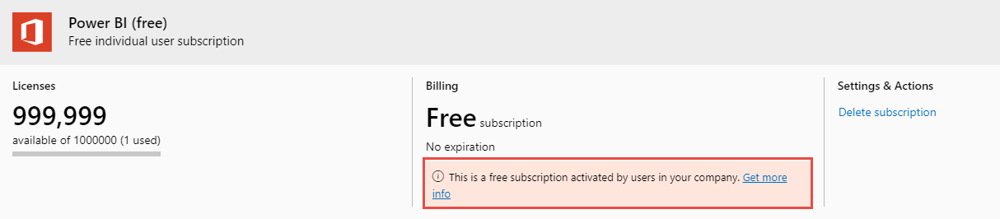

# View and manage Power BI user licenses

This article explains how admins can use the Microsoft 365 admin center or the Azure portal to view and manage user licenses for the Power BI service.

> [!NOTE]
>
>It's possible for a user to have both a Power BI (free) and a Power BI Pro license assigned. This can happen when a user signs up for a free license and then is later assigned a Power BI Pro license. The highest licensing level takes effect in this case.
>

## View your subscriptions

To see which Power BI subscriptions your organization has, follow these steps.

1. Sign in to the [Microsoft 365 admin center](https://admin.microsoft.com).
2. In the navigation menu, select **Billing** > **Your products**.

Your active Power BI subscriptions are listed along with any other subscriptions you have. You may see an unexpected subscription for Power BI (free), as shown here.

  

This type of subscription is created for you when users take advantage of self-service sign-up. To read more, see [Power BI in your organization](/microsoft-365/admin/misc/power-bi-in-your-organization).

## Manage user licenses in Microsoft 365

To use Microsoft 365 admin center to manage user licenses, see the [Business subscriptions and billing documentation](/microsoft-365/commerce/).

## Manage user licenses in Azure portal

Follow these steps to view and assign Power BI licenses using the Azure portal.

1. Sign in to the [Azure portal](https://portal.azure.com).

2. Search for and select **Azure Active Directory**.

3. Under **Manage** on the Azure Active Directory resource menu, select **Licenses**.

4. Select **All products** from the resource menu, then select a Power BI license type to display the list of licensed users.

5. To assign a license, from the command bar, select **+ Assign**. On the **Assign license** page, choose a user then select **Assignment options** to turn on a Power BI license for the selected user account.

6. To remove a license, select the checkbox next to the user's name, then select **Remove license**.

## Next steps

- [Purchase Power BI Pro](service-admin-purchasing-power-bi-pro.md)
- [Licensing for your organization](service-admin-licensing-organization.md)