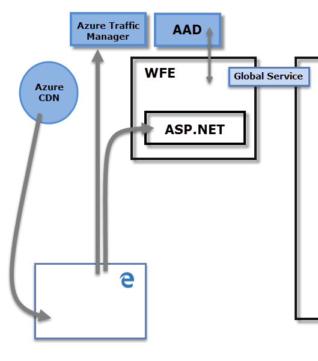

# Power BI Security

For detailed information about Power BI security, see the [Power BI Security white paper](/power-bi/guidance/whitepaper-powerbi-security).

To plan for Power BI security, see the Power BI implementation planning [security series of articles](/power-bi/guidance/powerbi-implementation-planning-security-overview). It expands upon the content in the Power BI Security white paper. While the Power BI security white paper focuses on key technical topics such as authentication, data residency, and network isolation, the primary goal of the series is to provide you with considerations and decisions to help you plan for security and privacy.

The Power BI service is built on **Azure**, Microsoft's cloud computing infrastructure and platform. The architecture of the Power BI service is based on two clusters:

- The Web Front End (**WFE**) cluster. The **WFE** cluster manages the initial connection and authentication to the Power BI service.
- The **Back-End** cluster. Once authenticated, the **Back-End** handles all subsequent user interactions. Power BI uses Microsoft Entra ID to store and manage user identities. Microsoft Entra ID also manages data storage and metadata using Azure BLOB and Azure SQL Database, respectively.

## Power BI Architecture

The **WFE** cluster uses Microsoft Entra ID to authenticate clients, and provide tokens for subsequent client connections to the Power BI service. Power BI uses the **Azure Traffic Manager** (Traffic Manager) to direct user traffic to the nearest datacenter. Traffic Manager directs requests using the DNS record of the client attempting to connect, authenticate, and to download static content and files. Power BI uses the **Azure Content Delivery Network** (CDN) to efficiently distribute the necessary static content and files to users based on geographical locale.

The **Back-End** cluster determines how authenticated clients interact with the Power BI service. The **Back-End** cluster manages visualizations, user dashboards, semantic models, reports, data storage, data connections, data refresh, and other aspects of interacting with the Power BI service. The **Gateway Role** acts as a gateway between user requests and the Power BI service. Users don't interact directly with any roles other than the **Gateway Role**. **Azure API Management**  eventually handles the **Gateway Role**.

> [!IMPORTANT]
> Only **Azure API Management** and **Gateway** roles are accessible through the public Internet. They provide authentication, authorization, DDoS protection, throttling, load balancing, routing, and other capabilities.

## Data Storage Security

Power BI uses two primary repositories for storing and managing data:

- Data uploaded from users is typically sent to **Azure Blob Storage**.
- All metadata including items for the system itself are stored in the **Azure SQL Database**.

The dotted line shown in the **Back-End** cluster diagram, clarifies the boundary between the two components that are accessible by users shown on the left of the dotted line. Roles that are only accessible by the system are shown on the right. When an authenticated user connects to the Power BI Service, the connection and any request by the client is accepted and managed by the **Gateway Role** which then interacts on the user's behalf with the rest of the Power BI Service. For example, when a client attempts to view a dashboard, the **Gateway Role** accepts that request, and then separately sends a request to the **Presentation Role** to retrieve the data needed by the browser to display the dashboard. Eventually, connections and client requests are handled by **Azure API Management**.

## User Authentication

Power BI uses [Microsoft Entra ID](https://azure.microsoft.com/services/active-directory/) to authenticate users who sign in to the Power BI service. Sign in credentials are required whenever a user attempts to access secure resources. Users sign in to the Power BI service using the email address with which they established their Power BI account. Power BI uses the same credentials as the *effective username* and passes it to resources whenever a user attempts to connect to data. The *effective username* is then mapped to a [User Principal Name](/windows/win32/secauthn/user-name-formats#user-principal-name) and resolves to the associated Windows domain account against which authentication is applied.

For organizations that used work email addresses for Power BI sign-in, for example `david@contoso.com`, the *effective username* to UPN mapping is straightforward. For organizations that didn't use work email addresses, for example `david@contoso.onmicrosoft.com` mapping between Microsoft Entra ID and on-premises credentials requires [directory synchronization](/azure/active-directory-domain-services/synchronization) to work properly.

Platform security for Power BI also includes multi-tenant environment security, networking security, and the ability to add other Microsoft Entra ID-based security measures.

## Data and Service Security

For more information, see [Microsoft Trust Center, Products and services that run on trust](https://www.microsoft.com/trust-center/product-overview).

As described earlier, on-premises AD servers use a Power BI sign-in to map to a UPN for credentials. However, users must understand the sensitivity of the data they share. After you securely connect to a data source, and then share reports, dashboards, or semantic models with others, the recipients are granted access to the report. Recipients don't have to sign in to the data source.

An exception is connecting to **SQL Server Analysis Services** using the **On-premises data gateway**. Dashboards are cached in Power BI, but access to underlying reports or semantic models initiates authentication for each user that attempts to access the report or semantic model. Access will only be granted if the user has sufficient credentials to access the data. For more information, see [On-premises data gateway in-depth](../connect-data/service-gateway-onprem-indepth.md).

## Enforcing TLS version usage

Network and IT administrators can enforce the requirement for using current Transport Layer Security (TLS) for any secured communication on their network. Windows provides support for TLS versions over the Microsoft Schannel Provider, for more information, see [Protocols in the TLS/SSL (Schannel SSP)](/windows/desktop/SecAuthN/protocols-in-tls-ssl--schannel-ssp-).

This enforcement is implemented by administratively setting registry keys. For enforcement details, see [Managing SSL/TLS Protocols and Cipher Suites for AD FS](/windows-server/identity/ad-fs/operations/manage-ssl-protocols-in-ad-fs).

**Power BI Desktop** requires TLS (Transport Layer Security) version 1.2 (or higher) to secure your endpoints. Web browsers and other client applications that use TLS versions earlier than TLS 1.2 won't be able to connect. If newer versions of TLS is required, Power BI Desktop respects the registry key settings described in those articles, and only creates connections meeting the version requirement of TLS allowed based on those registry settings, when present.

For more information about setting these registry keys, see [Transport Layer Security (TLS) registry settings](/windows-server/security/tls/tls-registry-settings).
