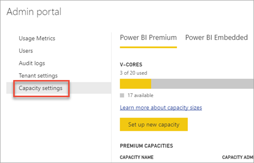
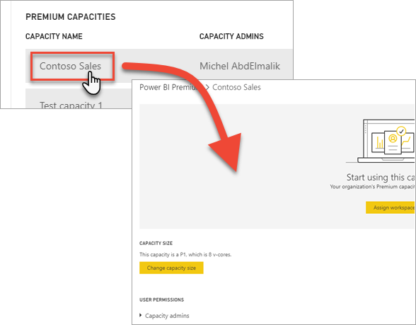
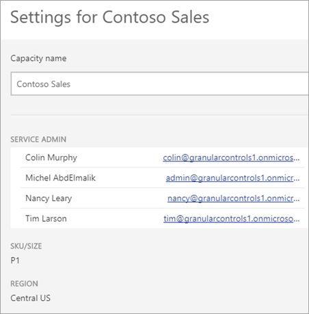
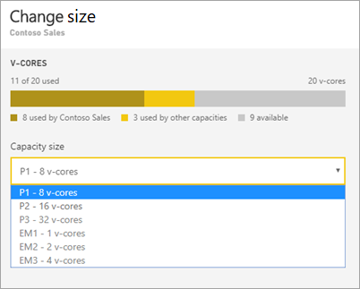
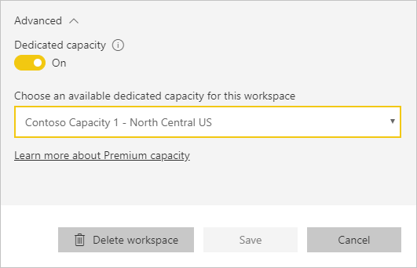
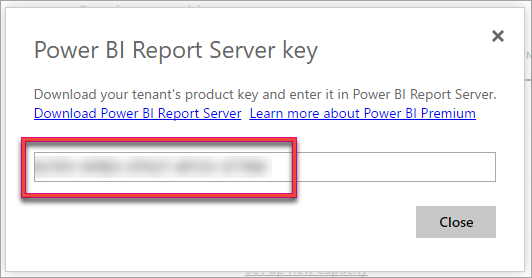

# Configure and manage capacities in Power BI Premium

Managing Power BI Premium involves creating, managing, and monitoring Premium capacities. This article provides step-by-step instructions; for an overview of capacities.

Learn how to manage Power BI Premium and Power BI Embedded capacities, which provide reserved resources for your content.

:::image type="content" source="media/service-admin-premium-manage/powerbi-premium-capacity-settings.png" alt-text="Screenshot that shows the Power B I Premium capacity settings screen.":::

*Capacity* is at the heart of the Power BI Premium and [Power BI Embedded](../developer/embedded/embedded-analytics-power-bi.md) offerings. It's a set of resources reserved for exclusive use by your organization. Having a capacity enables you to publish dashboards, reports, and semantic models to users throughout your organization without having to purchase per-user licenses for them. It also offers dependable, consistent performance for the content hosted in capacity. For more information, see [What is Power BI Premium?](service-premium-what-is.md).

>[!NOTE]
>You can get [Premium Per User (PPU)](service-premium-per-user-faq.yml) licenses for individuals, which provide many of the features and capabilities of a Premium capacity, and incorporate all functionality included with a Power BI Pro license.

## Manage capacity

After you have purchased capacity nodes in Microsoft 365, you set up the capacity in the Power BI admin portal. You manage Power BI Premium capacities in the **Capacity settings** section of the portal.

You manage a capacity by selecting the name of the capacity. This takes you to the capacity management screen.

If no workspaces have been assigned to the capacity, you'll see a message about [assigning a workspace to the capacity](#assign-a-workspace-to-a-capacity).

### Renew your capacity

Each capacity has a certain amount of v-cores allocated to it. When the v-cores expire, your capacity stops working. To renew your capacity, visit the [Microsoft 365 admin center](https://go.microsoft.com/fwlink/p/?linkid=2024339).

>[!NOTE]
>If your v-cores expire, you may see this error in the Power BI admin portal:
>
>*One or more of your premium capacity v-cores have expired. Please contact your tenant administrator or Microsoft account representative to learn whether these v-cores will be renewed*.

### Setting up a new capacity (Power BI Premium)

The admin portal shows the number of *virtual cores* (v-cores) that you've used and that you still have available. The total number of v-cores is based on the Premium SKUs that you've purchased. For example, purchasing a P3 and a P2 results in 48 available cores – 32 from the P3 and 16 from the P2.

If you have available v-cores, set up your new capacity by following these steps.

1. Select **Set up new capacity**.

1. Give your capacity a name.

1. Define who the admin is for this capacity.

1. Select your capacity size. Available options are dependent on how many available v-cores you have. You can't select an option that is larger than what you have available.

    

1. Select **Set up**.

    

Capacity admins, as well as Power BI admins and global administrators, then see the capacity listed in the admin portal.

### Capacity settings

1. In the Premium capacity management screen, under **Actions**, select the **gear icon** to review and update settings. 

    

1. You can see who the service admins are, the SKU/size of the capacity, and what region the capacity is in.

    

1. You can also rename or delete a capacity.

    

> [!NOTE]
> Power BI Embedded capacity settings are managed in the Microsoft Azure portal.

### Change capacity size

Power BI admins and global administrators can change Power BI Premium capacity. Capacity admins who aren't a Power BI admin or global administrator don't have this option.

1. Select the capacity name you want to change the size of.

1. Select **Change size**. You can see the 

    :::image type="content" source="media/service-admin-premium-manage/powerbi-settings-change-capacity-size.png" alt-text="Screenshot that shows the Power BI Change Size button for capacity.":::

1. On the **Change size** screen, upgrade or downgrade your capacity as appropriate.

    >[!NOTE]
    >To upgrade to a P4 or a P5 capacity you need to [buy](service-admin-premium-purchase.md#purchase-a-power-bi-premium-capacity-for-an-existing-organization) a few smaller SKUs that will add up to the size of the capacity you want.

    

    Administrators are free to create, resize and delete nodes, so long as they have the requisite number of v-cores.

    P SKUs can't be downgraded to EM SKUs. You can hover over any disabled options to see an explanation.

> [!IMPORTANT]
> If your Power BI Premium capacity is experiencing high resource usage, resulting in performance or reliability issues, you can receive notification emails to identify and resolve the issue. See [Notifications](../admin/service-admin-premium-capacity-notifications.md) for more information.

### Manage user permissions

You can assign additional capacity admins, and assign users that have *contributor* permissions. Users that have contributor permissions can assign a workspace to a capacity if they're an admin of that workspace. They can also assign their personal *My Workspace* to the capacity. Users with contributor permissions don't have access to the admin portal.

> [!NOTE]
> For Power BI Embedded, capacity admins are defined in the Microsoft Azure portal.

Expand **Contributor permissions**, then add users or groups as appropriate.

:::image type="content" source="media/service-admin-premium-manage/powerbi-contributor-permissions.png" alt-text="Screenshot that shows the Contributor Permissions menu":::

## Assign a workspace to a capacity

There are two ways to assign a workspace to a capacity: in the admin portal; and from a workspace.

### Assign from the admin portal

Capacity admins, along with Power BI admins and global administrators, can bulk assign workspaces in the premium capacity management section of the admin portal. When you manage a capacity, you see a **Workspaces assigned to this capacity** section that allows you to assign workspaces.

:::image type="content" source="media/service-admin-premium-manage/workspaces-assigned-capacity.png" alt-text="Screenshot that shows the Workspace assignment area of capacity management.":::

1. Select **Assign workspaces**.

1. Select an option for **Apply to**.

    

   | Selection | Description |
   | --- | --- |
   | **Workspaces by users** | When you assign workspaces by user, or group, all the workspaces that the user or group is admin of become part of the Premium capacity, including the user's personal workspace. The users automatically get workspace assignment permissions. This includes workspaces already assigned to a different capacity. |
   | **Specific workspaces** | Enter the name of a specific workspace to assign to the selected capacity. |
   | **The entire organization's workspaces** | Assigning the entire organization's workspaces to Premium capacity assigns all workspaces and My Workspaces, in your organization, to this Premium capacity. In addition, all current and future users will have the permission to reassign individual workspaces to this capacity. |

1. Select **Apply**.

### Assign from workspace settings

You can also assign a workspace to a Premium capacity from the settings of that workspace. To move a workspace into a capacity, you must have admin permissions to that workspace, and also capacity assignment permissions to that capacity. Note that workspace admins can always remove a workspace from Premium capacity, unless it's a personal workspace and the Power BI admin has disabled the [Users can reassign personal workspaces]() tenant admin setting.

1. Edit a workspace by selecting the ellipsis **(. . .)** then selecting **Edit this workspace**.

    :::image type="content" source="media/service-admin-premium-manage/edit-app-workspace.png" alt-text="Screenshot of the Edit this workspace context menu.":::

1. Under **Edit this workspace**, expand **Advanced**.

1. Select the capacity that you want to assign this workspace to.

    

1. Select **Save**.

Once saved, the workspace and all its contents are moved into Premium capacity without any experience interruption for end users.

## Designate a default capacity for My workspaces

A Power BI admin or capacity admin can designate a capacity as the default capacity for My workspaces. They have two options:

* [They can designate the capacity as the default capacity for all new My workspaces](#designate-a-default-capacity-for-all-new-my-workspaces). In this case, all new My workspaces will be assigned to that capacity by default upon creation. Existing My workspaces remain where they are.
* [They can designate the capacity as the default capacity for all new My workspaces **and** all existing My workspaces](#designate-a-default-capacity-for-all-existing-and-new-my-workspaces). In this case, all existing My workspaces will be reassigned to that capacity, and all new My workspaces will be assigned to that capacity by default upon creation.

> [!NOTE]
> My workspace owners can remove their My workspace from Premium capacity and reassign it to non-premium capacity. Reassigning My workspaces to non-premium capacity may cause data residency compliance issues. Power BI administrators can prevent such issues by turning off the [Users can reassign personal workspaces](/fabric/admin/portal-workspace#block-users-from-reassigning-personal-workspaces) tenant admin setting in the Admin portal. When this admin setting is off, My workspace owners can't reassign their My workspaces to other capacities.

### Designate a default capacity for all new My workspaces

1. In the Admin portal, select **Capacity settings** from the navigation pane.
1. From the list of capacities that appears, select the name of the capacity you wish to specify as the default capacity.
1. On the capacity page, expand the **Preferred capacity for My workspace** option and turn on the toggle.

    :::image type="content" source="./media/service-admin-premium-manage/preferred-capacity-my-workspace-setting.png" alt-text="Screenshot of preferred capacity-for-my-workspaces setting.":::

    When the toggle is on, all new My workspaces will be assigned to this Premium capacity by default upon creation.

### Designate a default capacity for all existing and new My workspaces  

1. In the Admin portal, select **Capacity settings** from the navigation pane.
1. From the list of capacities that appears, select the name of the capacity you wish to specify as the default capacity.
1. On the capacity page, expand the **Workspaces assigned to this capacity** option and then choose **Assign workspaces**, as described in [Assign from the admin portal](#assign-from-the-admin-portal).
1. On the assign workspaces side panel that opens, select the **The entire organization's My Workspaces** option.

    When this option is selected, all existing My workspaces will be assigned to this Premium capacity, and all new My workspaces will be assigned to this capacity by default upon creation.

## Power BI Report Server product key

If your organization has purchased a Power BI Premium capacity, you can obtain the key for Power BI Report Server from the **Power BI Premium** tab in the admin portal. To access the key you need to be a Global admin or a Fabric admin.

Selecting **Power BI Report Server key** will display a dialog contain your product key. You can copy it and use it with the installation.

For more information, see [Install Power BI Report Server](../report-server/install-report-server.md).

## Related content

* [Managing Premium capacities](/power-bi/enterprise/service-premium-capacity-manage)

More questions? [Try asking the Power BI Community](https://community.powerbi.com/)
