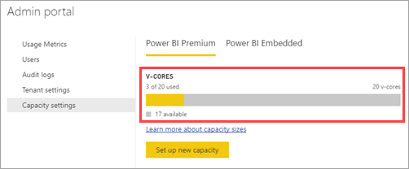

# How to purchase Power BI Premium

This article describes how to purchase a Power BI Premium capacity for your organization. The article covers using P SKUs for typical production scenarios. P SKUs require a monthly or yearly commitment, and are billed monthly.

For more information about Power BI Premium, see [What is Power BI Premium?](service-premium-what-is.md). For current pricing and planning information, see the [Power BI pricing page](https://powerbi.microsoft.com/pricing/). Content creators still need a [Power BI Pro license](service-admin-purchasing-power-bi-pro.md), even if your organization uses Power BI Premium. Ensure you purchase at least one Power BI Pro license for your organization.

> [!NOTE]
> If a Premium subscription expires, you have 30 days of full access to your capacity. After that, your content reverts to a shared capacity where it will continue to be accessible. However, you will not be able to view reports that are based on semantic models that are greater than 1 GB or reports that require Premium capacities to render.

## Purchase P SKUs for typical production scenarios

You can create a new tenant with a Power BI Premium P1 SKU configured, or you can purchase a Power BI Premium capacity for an existing organization. In both cases, you can then add capacity if you need it.

### Create a new tenant with Power BI Premium P1

If you don't have an existing tenant and want to create one, you can purchase Power BI Premium at the same time. The following link walks you through the process of creating a new tenant and enables you to purchase Power BI Premium: [Power BI Premium P1 offer](https://signup.microsoft.com/Signup?OfferId=b3ec5615-cc11-48de-967d-8d79f7cb0af1). When you create your tenant, you will automatically be assigned to the Microsoft 365 Global Administrator role for that tenant.

After you purchase capacity, learn how to [manage capacities](service-admin-premium-manage.md#manage-capacity) and [assign workspaces](service-admin-premium-manage.md#assign-a-workspace-to-a-capacity) to a capacity.

### Purchase a Power BI Premium capacity for an existing organization

If you have an existing organization (tenant), you must be in the Microsoft 365 Global Administrator role or Billing Administrator role to purchase subscriptions and licenses. For more information, see [About Microsoft 365 admin roles](https://support.office.com/article/About-Office-365-admin-roles-da585eea-f576-4f55-a1e0-87090b6aaa9d).

To purchase Premium capacity, follow these steps.

1. From within the Power BI service, select the Microsoft 365 app picker, and then select **Admin**.

    :::image type="content" source="media/service-admin-premium-purchase/powerbi-select-admin.png" alt-text="Screenshot that shows the Microsoft 365 app picker.":::

    Alternatively, you can browse to the Microsoft 365 admin center.

1. Select **Billing** > **Purchase services**.

1. Under **Power BI**, look for Power BI Premium offerings. This will list as P1 through P3, EM3 and P1 (month to month).

1. Select **Details** under the service you want, select a license quantity, and then select **Buy**.

    :::image type="content" source="media/service-admin-premium-purchase/powerbi-premium-purchase-options.png" alt-text="Screenshot that shows purchase options for Power B I Premium with the Details button selected.":::

1. Follow the steps to complete the purchase.

After you have completed the purchase, the **Purchase services** page shows that the item is purchased and active.

After you purchase capacity, learn how to [manage capacities](service-admin-premium-manage.md#manage-capacity) and [assign workspaces](service-admin-premium-manage.md#assign-a-workspace-to-a-capacity) to a capacity.

### Purchase additional capacities

Now that you have a capacity, you can add more as your needs grow. You can use any combination of Premium capacity SKUs (P1 through P3) within your organization. The different SKUs provide different resource capabilities.

1. In the Microsoft 365 admin center, select **Billing** > **Your products**.

1. Select the Power BI Premium service you want to add capacity to.

1. Select **Buy licenses**.

1. Change the number of instances that you want to have for this item. Then select **Submit** when finished.

   > [!IMPORTANT]
   > Selecting **Submit** charges the credit card on file.

The **Your products** page will then indicate the number of instances you have. Within the Power BI admin portal, under **Capacity settings**, the available v-cores reflects the new capacity purchased.

### Cancel your subscription

You can cancel your subscription from within the Microsoft 365 admin center. To cancel your Premium subscription, do the following.

1. Browse to the Microsoft 365 admin center.

1. Select **Billing** > **Your products**.

1. Select your Power BI Premium product from the list.

1. Under **Subscription status**, select **Cancel subscription**.

1. The **Cancel subscription** page will indicate whether or not you are responsible for an [early termination fee](https://support.office.com/article/early-termination-fees-6487d4de-401a-466f-8bc3-c0beb5cc40d3).  

1. Read through the information, and if you want to proceed, select **Cancel subscription**.

#### When canceling or your license expires

When you cancel your Premium subscription, or your capacity license expires, you can continue to access your Premium capacities for a period of 30 days from the date of cancellation or license expiration. After 30 days, your workspaces will move to a shared capacity and will still be accessible. However, you will not be able to view reports that are based on semantic models that require Premium capacities to render. This includes semantic models larger than 1GB and refreshes of those semantic models.

## Purchase A SKUs for testing and other scenarios

You can also purchase A SKUs for testing and other scenarios, which provides Premium capacity on an hourly basis. For more information and steps, see [Purchase Power BI Premium for testing](service-admin-premium-testing.md).

## Purchase Premium Per User (PPU) licenses

You can purchase Power BI Premium for individual users, using the Premium Per User (PPU) license model. For more information about Premium Per User, see [Power BI Premium Per User](service-premium-per-user-faq.yml).

## Related content

- [Configure and manage capacities in Power BI Premium](service-admin-premium-manage.md)\
- [Power BI pricing page](https://powerbi.microsoft.com/pricing/)\
- [Power BI Premium FAQ](service-premium-faq.yml)\
- [Planning a Power BI Enterprise Deployment whitepaper](https://aka.ms/pbienterprisedeploy)

More questions? [Try asking the Power BI Community](https://community.powerbi.com/)
