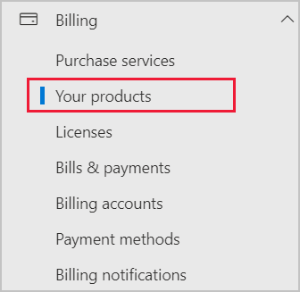
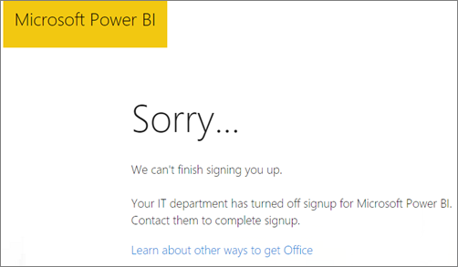

# Add Power BI to a Microsoft 365 partner subscription

Microsoft 365 enables companies to resell Microsoft 365 bundled and integrated with their own solutions, providing customers with a single point of contact for purchasing, billing, and support.

If you're interested in adding Power BI to your Microsoft 365 subscription, we recommend you contact your partner to do so. If your partner doesn't currently offer Power BI, you can pursue the options described in this article.

## Work with your partner to purchase Power BI

If you want to buy a subscription to Power BI Pro or Power BI Premium, work with your partner to consider what options you have:

* Your partner agrees to add Power BI to their portfolio so that you can purchase from them.

* Your partner can transition you to a model where you can buy Power BI directly from Microsoft or another partner who offers Power BI.

## Purchase from Microsoft or another channel

Depending on the relationship with your partner, you might be able to purchase Power BI directly from Microsoft or another partner. You can verify whether you can add Power BI subscriptions in the Microsoft 365 admin center (requires membership in the global admin or billing admin role).

1. Go to the [Microsoft 365 admin center](https://admin.microsoft.com/AdminPortal/Home#/homepage).

1. In the left menu, open **Billing**, then select **Your products**:

   

1. Look for **Subscriptions** in the menu. If you see **Subscriptions**, you can acquire the service from Microsoft directly, or you can contact another partner that offers Power BI.

   

   If you don't see **Subscriptions**, you can't buy from Microsoft directly or from another partner.

If your partner doesn't offer Power BI and you can't buy directly from Microsoft or another partner, consider signing up for a free trial.

## Sign up for a free trial

You can sign up for a free trial of Power BI Premium Per User. If you don't purchase Power BI at the end of the trial period, your license returns to the version you had prior to starting the trial. You still have a Pro or free license that offers many of the features of Power BI. For more information, see [Sign up for Power BI as an individual](../fundamentals/service-self-service-signup-for-power-bi.md).

### Enable ad-hoc subscriptions

By default, individual sign-ups (also known as ad-hoc subscriptions) are disabled. In this case, you see the following message when you try to sign up: *Your IT department has turned off signup for Microsoft Power BI*.

To enable ad-hoc subscriptions, you can contact your partner and request that they turn them on. If you're an administrator of your tenant you can enable ad-hoc subscriptions yourself. For more information, follow the steps in [Enable or disable self-service purchasing](/fabric/admin/service-admin-disable-self-service).

## Related content

* [Power BI licensing in your organization](service-admin-licensing-organization.md)
* [Purchase and assign Power BI Pro licenses](service-admin-purchasing-power-bi-pro.md)

More questions? [Try asking the Power BI Community](https://community.powerbi.com/)
