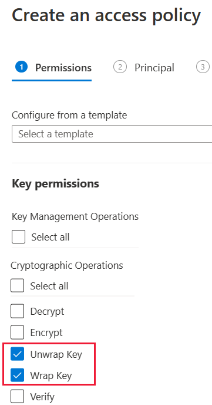
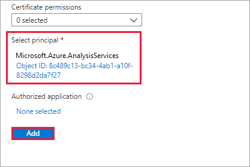
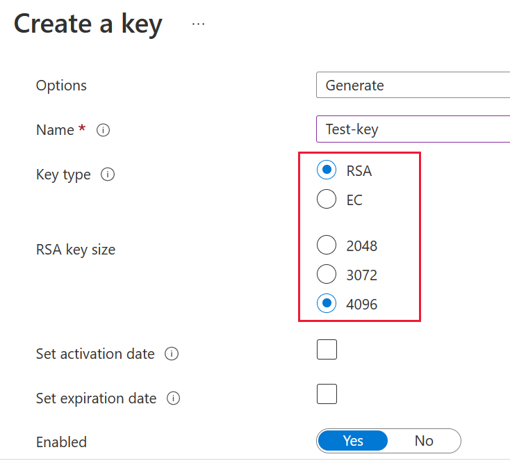
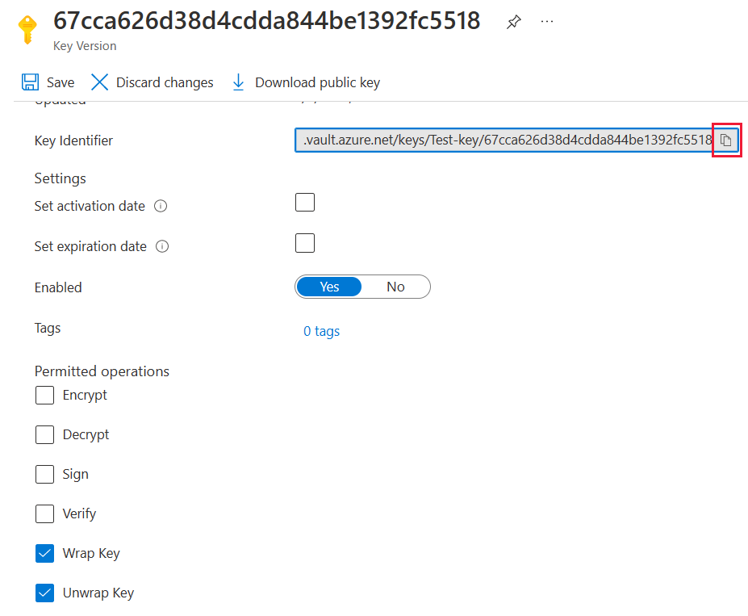

# Bring your own encryption keys for Power BI

Power BI encrypts data _at-rest_ and _in process_. By default, Power BI uses Microsoft-managed keys to encrypt your data. In Power BI Premium you can also use your own keys for data at-rest that is imported into a dataset (see [Data source and storage considerations](#data-source-and-storage-considerations) for more information). This approach is often described as _bring your own key_ (BYOK).

## Why use BYOK?

BYOK makes it easier to meet compliance requirements that specify key arrangements with the cloud service provider (in this case Microsoft). With BYOK, you provide and control the encryption keys for your Power BI data at-rest at the application level. As a result, you can exercise control and revoke your organization's keys, should you decide to exit the service. By revoking the keys, the data is unreadable to the service within 30 minutes.

## Data source and storage considerations

To use BYOK, you must upload data to the Power BI service from a Power BI Desktop (PBIX) file. You cannot use BYOK in the following scenarios:

- Analysis Services Live Connection
- Excel workbooks (unless data is first imported into Power BI Desktop)
- [Push datasets](/rest/api/power-bi/pushdatasets)
- [Streaming datasets](../connect-data/service-real-time-streaming.md#set-up-your-real-time-streaming-dataset-in-power-bi)
- [Power BI goals](../create-reports/service-goals-introduction.md) do not currently support bring your own key (BYOK).

BYOK applies only to datasets. Push datasets, Excel files, and CSV files that users can upload to the service are not encrypted using your own key. To identify which items are stored in your workspaces, use the following PowerShell command:

```PS C:\> Get-PowerBIWorkspace -Scope Organization -Include All```

> [!NOTE]
> This cmdlet requires Power BI management module v1.0.840. You can see which version you have by running `Get-InstalledModule -Name MicrosoftPowerBIMgmt`. Install the latest version by running `Install-Module -Name MicrosoftPowerBIMgmt`. You can get more information about the Power BI cmdlet and its parameters in [Power BI PowerShell cmdlet module](/powershell/power-bi/overview).

## Configure Azure Key Vault

In this section you learn how to configure Azure Key Vault, a tool for securely storing and accessing secrets, like encryption keys. You can use an existing key vault to store encryption keys, or you can create a new one specifically for use with Power BI.

The instructions in this section assume basic knowledge of Azure Key Vault. For more information, see [What is Azure Key Vault?](/azure/key-vault/key-vault-whatis)

Configure your key vault in the following way:

1. [Add the Power BI service as a service principal](#add-the-service-principal) for the key vault, with wrap and unwrap permissions.

2. [Create an RSA key](#create-an-rsa-key) with a 4096-bit length (or use an existing key of this type), with wrap and unwrap permissions.

    > [!IMPORTANT]
    > Power BI BYOK supports only RSA keys with a 4096-bit length.

3. (Recommended) Check that the key vault has the [_soft delete_ option enabled](#soft-delete-option).

### Add the service principal

1. In the Azure portal, in your key vault, under **Access policies**, select **Add Access Policy**.

2. Under **Key permissions**, select **Unwrap Key** and **Wrap Key**.

    

3. Under **Select principal**, search for and select Microsoft.Azure.AnalysisServices.

    > [!NOTE]
    > If you can't find "Microsoft.Azure.AnalysisServices", it's likely that the Azure subscription associated with your Azure Key Vault never had a Power BI resource associated with it. Try searching for the following string instead: 00000009-0000-0000-c000-000000000000.

    

4. Select **Add**, then **Save**.

> [!NOTE]
> To revoke access of Power BI to your data in the future remove access rights to this service principal from your Azure Key Vault.

### Create an RSA key

1. In your key vault, under **Keys**, select **Generate/Import**.

2. Select a **Key Type** of RSA and an **RSA Key Size** of 4096.

    

3. Select **Create**.

4. Under **Keys**, select the key you created.

5. Select the GUID for the **Current Version** of the key.

6. Check that **Wrap Key** and **Unwrap Key** are both selected. Copy the **Key Identifier** to use when you enable BYOK in Power BI.

    

### Soft delete option

We recommend that you enable [soft-delete](/azure/key-vault/key-vault-ovw-soft-delete) on your key vault, to protect from data loss in case of accidental key – or key vault – deletion. You must use [PowerShell to enable the "soft-delete" property](/azure/key-vault/key-vault-soft-delete-powershell) on the key vault, because this option is not available from the Azure portal yet.

With Azure Key Vault properly configured, you're ready to enable BYOK on your tenant.

## Configure the Azure Key Vault firewall

This section describes using the trusted Microsoft service firewall bypass, to configure a firewall around your Azure Key Vault.

>[!NOTE]
>Enabling firewall rules on your key vault is optional. You can also choose to leave the firewall disabled on your key vault as per the default setting.

Power BI is a trusted Microsoft service. You can instruct the key vault firewall to allow access to all trusted Microsoft services, a setting that enables Power BI to access your key vault without specifying end point connections.

To configure Azure Key Vault to allow access to trusted Microsoft services, follow these steps:

1. Log into the [Azure portal](https://portal.azure.com).

2. Search for **Key Vaults**.

3. Select the key vault you want to allow access to Power BI (and all other trusted Microsoft services).

4. Select **Networking** and then select **Firewalls and virtual networks**.

5. From the *Allow access from* option, select **Selected networks**.

    :::image type="content" source="media/service-encryption-byok/key-vault-firewall.png" alt-text="A screenshot showing the Azure Key Vault networking option, with the firewalls and virtual networks option selected.":::

6. In the *firewall* section, in the *Allow trusted Microsoft services to bypass this firewall*, select **Yes**.

    :::image type="content" source="media/service-encryption-byok/trusted-service.png" alt-text="A screenshot showing the allow trusted Microsoft services to bypass this firewall option selected.":::

7. Select **Save**.

    :::image type="content" source="media/service-encryption-byok/save.png" alt-text="A screenshot showing the Azure Key Vault networking save button highlighted.":::

## Enable BYOK on your tenant

You enable BYOK at the tenant level with [PowerShell](https://www.powershellgallery.com/packages/MicrosoftPowerBIMgmt.Admin), by first introducing to your Power BI tenant the encryption keys you created and stored in Azure Key Vault. You then assign these encryption keys per Premium capacity for encrypting content in the capacity.

### Important considerations

Before you enable BYOK, keep the following considerations in mind:

- At this time, you cannot disable BYOK after you enable it. Depending on how you specify parameters for `Add-PowerBIEncryptionKey`, you can control how you use BYOK for one or more of your capacities. However, you can't undo the introduction of keys to your tenant. For more information, see [Enable BYOK](#enable-byok).

- You cannot _directly_ move a workspace that uses BYOK from a capacity in Power BI Premium to a shared capacity. You must first move the workspace to a capacity that doesn't have BYOK enabled.

- If you move a workspace that uses BYOK from a capacity in Power BI Premium, to shared, reports and datasets will become inaccessible, as they are encrypted with the Key. To avoid this situation, you must first move the workspace to a capacity that doesn’t have BYOK enabled.

### Enable BYOK

To enable BYOK, you must be a Power BI admin, signed in using the `Connect-PowerBIServiceAccount` cmdlet. Then use [`Add-PowerBIEncryptionKey`](/powershell/module/microsoftpowerbimgmt.admin/Add-PowerBIEncryptionKey) to enable BYOK, as shown in the following example:

```powershell
Add-PowerBIEncryptionKey -Name'Contoso Sales' -KeyVaultKeyUri'https://contoso-vault2.vault.azure.net/keys/ContosoKeyVault/b2ab4ba1c7b341eea5ecaaa2wb54c4d2'
```

To add multiple keys, run `Add-PowerBIEncryptionKey` with different values for -`-Name` and `-KeyVaultKeyUri`. 

The cmdlet accepts two switch parameters that affect encryption for current and future capacities. By default, neither of the switches are set:

- `-Activate`: Indicates that this key will be used for all existing capacities in the tenant that aren't already encrypted.

- `-Default`: Indicates that this key is now the default for the entire tenant. When you create a new capacity, the capacity inherits this key.

> [!IMPORTANT]
> If you specify `-Default`, all of the capacities created on your tenant from this point will be encrypted using the key you specify (or an updated default key). You cannot undo the default operation, so you lose the ability to create a premium capacity in your tenant that doesn't use BYOK.

After you enable BYOK on your tenant, set the encryption key for one or more Power BI capacities:

1. Use [`Get-PowerBICapacity`](/powershell/module/microsoftpowerbimgmt.capacities/get-powerbicapacity) to get the capacity ID that's required for the next step.

    ```powershell
    Get-PowerBICapacity -Scope Individual
    ```

    The cmdlet returns output similar to the following output:

    ```
    Id              : xxxxxxxx-xxxx-xxxx-xxxx-xxxxxxxxxxxx
    DisplayName     : Test Capacity
    Admins          : adam@sometestdomain.com
    Sku             : P1
    State           : Active
    UserAccessRight : Admin
    Region          : North Central US
    ```

1. Use [`Set-PowerBICapacityEncryptionKey`](/powershell/module/microsoftpowerbimgmt.admin/set-powerbicapacityencryptionkey) to set the encryption key:

    ```powershell
    Set-PowerBICapacityEncryptionKey -CapacityId xxxxxxxx-xxxx-xxxx-xxxx-xxxxxxxxxxxx -KeyName 'Contoso Sales'
    ```

You have control over how you use BYOK across your tenant. For example, to encrypt a single capacity, call `Add-PowerBIEncryptionKey` without `-Activate` or `-Default`. Then call `Set-PowerBICapacityEncryptionKey` for the capacity where you want to enable BYOK.

## Manage BYOK

Power BI provides additional cmdlets to help manage BYOK in your tenant:

- Use [`Get-PowerBICapacity`](/powershell/module/microsoftpowerbimgmt.capacities/get-powerbicapacity) to get the key that a capacity is currently using:

    ```powershell
    Get-PowerBICapacity -Scope Organization -ShowEncryptionKey
    ```

- Use [`Get-PowerBIEncryptionKey`](/powershell/module/microsoftpowerbimgmt.admin/get-powerbiencryptionkey) to get the key that your tenant is currently using:

    ```powershell
    Get-PowerBIEncryptionKey
    ```

- Use [`Get-PowerBIWorkspaceEncryptionStatus`](/powershell/module/microsoftpowerbimgmt.admin/get-powerbiworkspaceencryptionstatus) to see whether the datasets in a workspace are encrypted and whether their encryption status is in sync with the workspace:

    ```powershell
    Get-PowerBIWorkspaceEncryptionStatus -Name'Contoso Sales'
    ```

    Note that encryption is enabled at the capacity level, but you get encryption status at the dataset level for the specified workspace.

- Use [`Switch-PowerBIEncryptionKey`](/powershell/module/microsoftpowerbimgmt.admin/switch-powerbiencryptionkey) to switch (or _rotate_) the version of the key being used for encryption. The cmdlet simply updates the `-KeyVaultKeyUri` for a key `-Name`:

    ```powershell
    Switch-PowerBIEncryptionKey -Name'Contoso Sales' -KeyVaultKeyUri'https://contoso-vault2.vault.azure.net/keys/ContosoKeyVault/b2ab4ba1c7b341eea5ecaaa2wb54c4d2'
    ```

    Please note that the current key should be enabled.

## Next steps

> [!div class="nextstepaction"]
> [Power BI PowerShell cmdlet module](/powershell/power-bi/overview) 

> [!div class="nextstepaction"]
> [Ways to share your work in Power BI](../collaborate-share/service-how-to-collaborate-distribute-dashboards-reports.md)

> [!div class="nextstepaction"]
> [Filter a report using query string parameters in the URL](../collaborate-share/service-url-filters.md)

> [!div class="nextstepaction"]
> [Embed with report web part in SharePoint Online](../collaborate-share/service-embed-report-spo.md)

> [!div class="nextstepaction"]
> [Publish to Web from Power BI](../collaborate-share/service-publish-to-web.md)

> [!div class="nextstepaction"]
> [Power BI Premium Generation 2](service-premium-what-is.md#power-bi-premium-generation-2)
