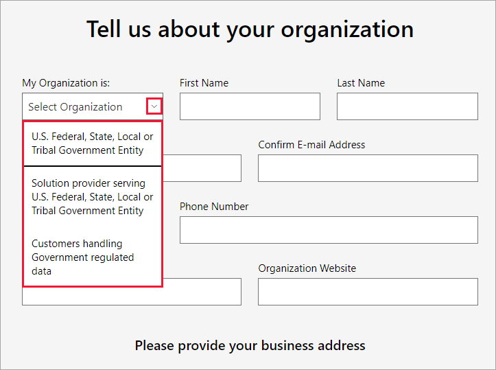

# Enroll your US government organization in the Power BI service

This article describes the US government enrollment process for the Power BI service. The process is intended for administrators who have authority to sign up their US government organization for Power BI. If you're not an admin, contact your administrator about getting a subscription to Power BI for US government organizations.

The Power BI service has a special US government version, which is part of the [Microsoft 365 Government plans](https://www.microsoft.com/microsoft-365/government/compare-office-365-government-plans?rtc=1). The enrollment process that this article describes is different from the process for the commercial version of the Power BI service.

For more information, see [Power BI for United States government customers](service-govus-overview.md).

>[!IMPORTANT]
>To maintain continuity of data access, US government customers must complete an explicit request for onboarding the following US government clouds:
>
>* Microsoft 365 Government Community Cloud (GCC)
>
>* Microsoft 365 Government Community Cloud High (GCC High)
>
>* Microsoft 365 Department of Defense (DoD)

## Select the right sign-up process for your US government organization

Microsoft 365 provides different environments for government agencies to meet varying compliance requirements. The  [Microsoft 365 Government Community Cloud (GCC)](/office365/servicedescriptions/office-365-platform-service-description/office-365-us-government/gcc) is designed for federal, state, and local government. If your organization is in GCC, use the steps in this article to sign up and purchase services.

>[!IMPORTANT]
>Don't follow these instructions if you belong to one of the following clouds:
>
>* [Microsoft 365 Government Community Cloud High (GCC High)](/office365/servicedescriptions/office-365-platform-service-description/office-365-us-government/gcc-high-and-dod)
>
>* [Microsoft 365 Department of Defense (DoD)](/office365/servicedescriptions/office-365-platform-service-description/office-365-us-government/gcc-high-and-dod)
>
>To purchase the Power BI service for these US government clouds, see [How do I buy Microsoft 365 Government?](/office365/servicedescriptions/office-365-platform-service-description/office-365-us-government/microsoft-365-government-how-to-buy#how-do-i-buy-microsoft-365-government) and work with your reseller to ensure new services are properly associated with your tenant.

After you sign up for the Power BI service for the US government, work with your account team to start the [allowlist process](#more-sign-up-information) described in this article. That step is needed to fully enable your organization in the government community cloud.

## Sign up for a new Microsoft 365 Government plan

If your organization is new to the government cloud community, get a Microsoft 365 Government plan with the following steps:

After this process is complete, follow the steps for existing Microsoft 365 Government customers to [add a Power BI subscription](#add-power-bi-to-a-microsoft-365-government-plan).

> [!NOTE]
> These steps should be performed by the global administrator.

1. Go to [Microsoft 365 Government plans](https://products.office.com/government/office-365-web-services-for-government).

1. Select **Get started with a free trial**.

1. Under **My Organization is**, select your organization type.

   

1. Enter your business address and agree to the **Office 365 terms and conditions**.
1. Select **Submit** to start the onboarding process. Your Microsoft representative or partner can help with any questions.

## Add Power BI to a Microsoft 365 Government plan

If your organization already has a Microsoft 365 Government plan, add a Power BI subscription.

1. Sign in to the Microsoft 365 admin center by using a global admin or billing admin account.

2. On the navigation menu, select **Billing**, and then select **Purchase services**.

3. Search or scroll to locate the Power BI Pro Government offer, and select **Buy Now**.

4. Complete your order.

5. Assign licenses to user accounts.

## More sign-up information

Before you can use the Power BI service for the US government, you have to work with your Microsoft account team to have your organization added to the allowlist. The allowlist process is used by the Power BI engineering team to move customers from the commercial cloud environment into the secure, government community cloud. This step ensures that features available in the US government cloud work as expected.

To start the allowlist process, contact your Microsoft account team for assistance. Only administrators can request to be added to the allowlist. The process takes about three weeks. During this time, the Power BI engineering team makes appropriate changes to ensure your tenant operates properly in the US government cloud.

## Related content

>[!div class="nextstepaction"]
>[Overview of Power BI for US government](service-govus-overview.md)

>[!div class="nextstepaction"]
>[How do I buy Microsoft 365 Government?](/office365/servicedescriptions/office-365-platform-service-description/office-365-us-government/microsoft-365-government-how-to-buy#how-do-i-buy-microsoft-365-government)
