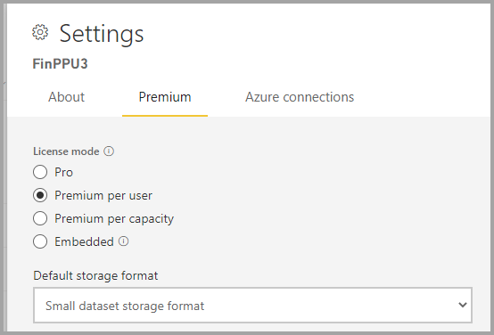
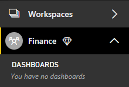

# Managing Premium capacities

Managing Power BI Premium involves creating, managing, and monitoring Premium capacities. This article provides an overview of capacities; see [Configure and manage capacities](service-admin-premium-manage.md) for step-by-step instructions.

## Creating and managing capacities

The **Capacity Settings** page of the Power BI Admin portal displays the number of v-cores purchased and Premium capacities available. The page allows Global administrators or Power BI service administrators to create Premium capacities from available v-cores, or to modify existing Premium capacities.

> [!NOTE]
> You can also get Premium Per User (PPU) licenses for individuals, which provides many of the features and capabilities of a Premium capacity, and also incorporates all functionality included with a Power BI Pro license. For more information, see [Power BI Premium Per User](service-premium-per-user-faq.yml).

When creating a Premium capacity, administrators are required to define:

- Capacity name (unique within the tenant).
- Capacity admin(s).
- Capacity size.
- Region for data residency.

At least one Capacity Admin must be assigned. Users assigned as Capacity Admins can:

* Remove assigned workspaces from the capacity
* Specify a default capacity for My workspaces
* Manage user permissions and assign:
    * Additional Capacity Admins
    * Contributors - Users who are allowed to assign workspaces to that capacity (Capacity Admins are automatically also Contributors)
* Manage Autoscale settings for that capacity
* Set up email alerts for resource utilization level
* Track capacity resources usage using the dedicated out of the box app 

Capacity Admins can't access workspace content unless explicitly assigned in workspace permissions. They also don't have access to all Power BI admin areas (unless explicitly assigned) such as usage metrics, audit logs, or tenant settings. Importantly, Capacity Admins don't have permissions to create new capacities or scale existing capacities. Admins are assigned on a per capacity basis, ensuring that they can only view and manage capacities to which they're assigned.

Capacity size is selected from an available list of SKU options, which is constrained by the number of available v-cores in the pool. It's possible to create multiple capacities from the pool, which could be sourced from one or more purchased SKUs. For example, a P3 SKU (32 v-cores) could be used to create three capacities: one P2 (16 v-cores), and two P1 (2 x 8 v-cores). The following image shows an example setup for the fictitious Contoso organization consisting of five Premium capacities (3 x P1, and 2 x P3) with each containing workspaces, and several workspaces in shared capacity.

A Premium capacity can be assigned to a region other than the home region of the Power BI tenant, known as multi-geo. Multi-geo provides administrative control over which datacenters within defined geographic regions your Power BI content resides. The rationale for a multi-geo deployment is typically for corporate or government compliance, rather than performance and scale. Report and dashboard loading still involves requests to the home region for metadata. To learn more, see [Multi-Geo support for Power BI Premium](../admin/service-admin-premium-multi-geo.md).

Power BI service administrators and Global Administrators can modify Premium capacities. Specifically, they can:

* Change the capacity size to scale-up or scale-down resources.
* Add or remove Capacity Admins.
* Add or remove users that have assignment permissions.

>[!NOTE]
>Service and global administrators do not have access to capacity metrics unless explicitly added as capacity admins.

Contributor assignment permissions are required to assign a workspace to a specific Premium capacity. The permissions can be granted to the entire organization, specific users, or groups.

By default, Premium capacities support workloads associated with running Power BI queries. Premium capacities also support other workloads: **AI (Cognitive Services)**, **Paginated Reports**, and **Dataflows**.

Deleting a Premium capacity is possible and won't result in the deletion of its workspaces and content. Instead, it moves any assigned workspaces to shared capacity. When the Premium capacity was created in a different region, the workspace is moved to shared capacity of the home region.

Capacities have limited resources, defined by each capacity SKU. Resources consumption by Power BI items (such as reports and dashboards) across capacities can be tracked using the [Microsoft Fabric Capacity Metrics](/fabric/enterprise/metrics-app-install) app.

### Assigning workspaces to capacities

Workspaces can be assigned to a Premium capacity in the Power BI Admin portal or, for a workspace, in the **Workspace** pane.

Capacity Admins, as well as Global Administrators or Power BI service administrators, can bulk assign workspaces in the Power BI Admin portal. Bulk assigned can apply to:

- **Workspaces by users** - All workspaces owned by those users, including My workspaces, are assigned to the Premium capacity. This will include the reassignment of workspaces when they're already assigned to a different Premium capacity. In addition, the users are also assigned workspace assignment permissions.

- **Specific workspaces**
- **The entire organization's workspaces** - All workspaces, including My workspaces, are assigned to the Premium capacity. All current and future users are assigned workspace assignment permissions. This approach isn't recommended. A more targeted approach is preferred.

You can enable Premium capabilities in a workspace by setting the proper license mode. To set a license mode, you must be both a workspace admin, and have assignment permissions.

- **P SKUs** - Set the license mode to Premium per capacity.

- **A SKUs** - Set the license mode to Embedded.

- **Premium Per User (PPU)** Mark the license mode as Premium Per User.

- **EM SKUs** Set the license mode to Embedded.

To remove a workspace from Premium, mark the workspace license mode as Pro.

Workspace admins can remove a workspace from a capacity (to shared capacity) without requiring assignment permission. Removing workspaces from reserved capacities effectively relocates the workspace to shared capacity. Note that removing a workspace from a Premium capacity may have negative consequences resulting, for example, in shared content becoming unavailable to Fabric Free licensed users, or the suspension of scheduled refresh when they exceed the allowances supported by shared capacities.

In the Power BI service, a workspace assigned to a Premium capacity is easily identified by the diamond icon that adorns the workspace name.

### Planning your capacity size in advance

Different Premium capacity SKUs have different amounts of resources that are made available to support Power BI items (such as reports, dashboards and semantic models) processed by each capacity. The SKUs differentiate by the number of standard v-cores they have. The most influential resources to consider when sizing in advance are:

* **CPU power** – The amount of CPU power each capacity has is a function of its base v-core and the number of [autoscale](service-premium-auto-scale.md) cores it has (purchased in-advance and allocated in advance during capacity instantiation). The CPU power exhaustion of a capacity is measured by aggregating CPU power used across all the Power BI items it processes. The more operations done against more items, the higher the CPU spent.

* **Item size** - The size of a Power BI item relates to the amount of data available for processing inside the item. Size can have multiple dimensions depending on the item. Semantic model size, for example, is determined by the footprint the semantic model has in memory while being processed. Different items may have size measures that are defined differently. The size footprint across the capacity, unlike CPU, isn't aggregated across all active items but is evaluated per item only. This means a capacity can support multiple items running concurrently if neither of those items exceeds the capacity size limit.

Due to the individually enforced nature of a Power BI item's size measure, the size usually dictates how large a capacity should be. For example, if you have a P1 SKU, semantic models are supported up to a [limit of 25 Gb](service-premium-what-is.md#capacities-and-skus). As long as your semantic models don't exceed this value, the SKU should meet your needs. You can evaluate a typical semantic model’s size by measuring the memory footprint of the Power BI Desktop tool. Take into consideration that depending on the type of semantic model mode you're using, your semantic model size might grow when it's refreshed. For example, semantic models that use [import mode](../connect-data/refresh-data.md#semantic-models-in-import-mode) require double the size during a full refresh. In such cases, your maximum semantic model size should be smaller than half of the maximum memory allocated to your capacity.

A typical item's usage pattern will dictate its CPU power spend, which if exhausted can severely degrade report interaction performance for end-users. Therefore, once you have a typical report for evaluation, it will be beneficial to use that report in a load test, and evaluate the results to determine whether a higher SKU size or turning on autoscale is required.

#### How to decide when to turn on autoscale? 

Using the Power BI Premium [Microsoft Fabric Capacity Metrics app](/fabric/enterprise/metrics-app-install) will indicate cases of overload impact in the *overloaded minutes* visual, in the overview page. You can evaluate the severity of the impact of those overload minutes by using the evidence page, where you can track how much impact an overload moment had, what Power BI items it impacted and how many users got affected. If based on your evaluation the impact is too high, you should turn on autoscale.  

#### How to decide when to scale up to a higher SKU?

 There are two different indicators that suggest you need to scale up your capacity:  

* Using autoscale beyond a certain degree isn't economically viable. If your autoscaling patterns lead you to consume more than 25% of your capacity size on a regular basis, it may be less costly to upgrade your capacity to a higher SKU since your capacity CPU Power requirements are significantly higher than the capacity’s original power. Here we consider over 25% as both how many cores got added and how long were they added for. For example, a P1 SKU with eight v-cores that uses auto scale in a way that is equivalent to two additional cores consistently applied, will cost the same as a P2.

* The size of your Power BI items approach or exceed capacity limits. If the item size of any of the items reported in the metrics app approaches your capacity limit or exceeds it, operations against that item will fail. Therefore if a critical item approaches those limits (80% of the capacity size) it's advisable to consider upgrading the capacity in advance, to avoid interruption of service should that item exceed the capacity limit.

## Related content

>[!div class="nextstepaction"]
>[Using autoscale with Premium](service-premium-auto-scale.md)
