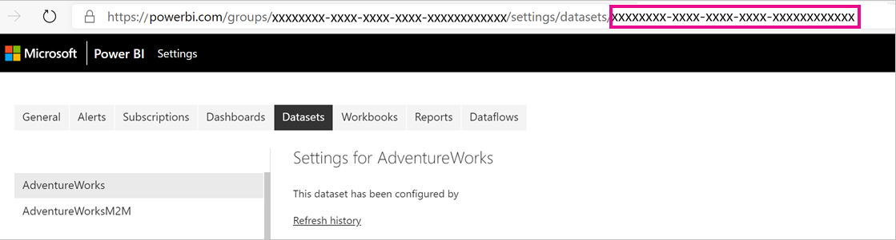

# Large semantic models in Power BI Premium

Power BI semantic models can store data in a highly compressed in-memory cache for optimized query performance, enabling fast user interactivity. With Premium capacities, large semantic models beyond the default limit can be enabled with the **Large semantic model storage format** setting. When enabled, semantic model size is limited by the Premium *capacity* size or the maximum size set by the administrator.

Large semantic models can be enabled for all Premium P SKUs, Embedded A SKUs, and with Premium Per User (PPU). The large semantic model size limit in Premium is comparable to Azure Analysis Services, in terms of data model size limitations.

While required for semantic models to grow beyond 10 GB, enabling the Large semantic model storage format setting has other benefits. If you're planning to use XMLA endpoint-based tools for semantic model write operations, be sure to enable the  setting, even for semantic models that you wouldn't necessarily characterize as a *large* semantic model. When enabled, the large semantic model storage format can improve XMLA write operations performance.

Large semantic models in the service don't affect the Power BI Desktop model upload size, which is still limited to 10 GB. Instead, semantic models can grow beyond that limit in the service on refresh.

> [!IMPORTANT]
> Power BI Premium does support large semantic models. Enable the **Large semantic model storage format** option to use semantic models in Power BI Premium that are larger than the default limit.

> [!NOTE]
> Large semantic models in Power BI Premium are not available in the Power BI service for U.S. Government DoD customers. For more information about which features are available, and which are not, see [Power BI feature availability for U.S. Government customers](service-govus-overview.md#power-bi-feature-availability).

## Enable large semantic models

Steps here describe enabling large semantic models for a new model published to the service. For existing semantic models, only step 3 is necessary.

1. Create a model in Power BI Desktop. If your semantic model will become larger and progressively consume more memory, be sure to configure [Incremental refresh](../connect-data/incremental-refresh-overview.md).

2. Publish the model as a semantic model to the service.

3. In the service > semantic model > **Settings**, expand **Large semantic model storage format**, set the slider to **On**, and then select **Apply**.

    :::image type="content" source="media/service-premium-large-models/enable-large-dataset.png" alt-text="Enable large semantic model slider":::

4. Invoke a refresh to load historical data based on the incremental refresh policy. The first refresh could take a while to load the history. Subsequent refreshes should be faster, depending on your incremental refresh policy.

## Set default storage format

In supported regions, all new semantic models created in a workspace assigned to a Premium capacity can have the large semantic model storage format enabled by default. If the region doesn't support large semantic models, the *large semantic model storage format* option described below is disabled. You can see which regions are supported in the [region availability](#region-availability) section.

1. In the workspace, select **Settings** > **Premium**.

2. In **Default storage format**, select **Large semantic model storage format**, and then select **Save**.

    :::image type="content" source="media/service-premium-large-models/default-storage-format.png" alt-text="Enable default storage format":::

### Enable with PowerShell

You can also enable large semantic model storage format by using PowerShell. You must have capacity admin and workspace admin privileges to run the PowerShell cmdlets.

1. Find the semantic model ID (GUID). On the **Semantic models** tab for the workspace, under the semantic model settings, you can see the ID in the URL.

    

2. From a PowerShell admin prompt, install the [MicrosoftPowerBIMgmt](/powershell/module/microsoftpowerbimgmt.data/) module.

    ```powershell
    Install-Module -Name MicrosoftPowerBIMgmt
    ```

3. Run the following cmdlets to sign in and check the semantic model storage mode.

    ```powershell
    Login-PowerBIServiceAccount

    (Get-PowerBIDataset -Scope Organization -Id <Semantic model ID> -Include actualStorage).ActualStorage
    ```

    The response should be the following. The storage mode is ABF (Analysis Services backup file), which is the default.

    ```
    Id                   StorageMode

    --                   -----------

    <Semantic model ID>         Abf
    ```

4. Run the following cmdlets to set the storage mode. It can take a few seconds to convert to Premium Files.

    ```powershell
    Set-PowerBIDataset -Id <Semantic model ID> -TargetStorageMode PremiumFiles

    (Get-PowerBIDataset -Scope Organization -Id <Semantic model ID> -Include actualStorage).ActualStorage
    ```

    The response should be the following. The storage mode is now set to Premium Files.

    ```
    Id                   StorageMode
    
    --                   -----------
    
    <Semantic model ID>         PremiumFiles
    ```

You can check the status of semantic model conversions to and from Premium Files by using the [Get-PowerBIWorkspaceMigrationStatus](/powershell/module/microsoftpowerbimgmt.workspaces/get-powerbiworkspacemigrationstatus) cmdlet.

## Semantic model eviction

Semantic model eviction is a Premium feature that allows the sum of semantic model sizes to be significantly greater than the memory available for the purchased SKU size of the capacity. A single semantic model is still constrained to the memory limits of the SKU. Power BI uses dynamic memory management to evict inactive semantic models from memory. Semantic models are evicted so that Power BI can load other semantic models to address user queries.

>[!NOTE]
>If you have to wait for an evicted semantic model to be reloaded, you might experience a noticeable delay.

## On-demand load

On-demand load is enabled by default for large semantic models, and can provide significantly improved load time of evicted semantic models. With on-demand load, you get the following benefits during subsequent queries and refreshes:

* Relevant data pages are loaded on-demand (paged in to memory).

* Evicted semantic models are quickly made available for queries.

On-demand loading surfaces additional Dynamic Management View (DMV) information that can be used to identify usage patterns and understand the state of your models. For example, you can check the *Temperature* and *Last Accessed* statistics for each column in the semantic model, by running the following DMV query from SQL Server Management Studio (SSMS):

```sql
Select * from SYSTEMRESTRICTSCHEMA ($System.DISCOVER_STORAGE_TABLE_COLUMN_SEGMENTS, [DATABASE_NAME] = '<Semantic model Name>')
```

## Checking semantic model size

After loading historical data, you can use [SSMS](/sql/ssms/download-sql-server-management-studio-ssms) through the [XMLA endpoint](service-premium-connect-tools.md) to check the estimated semantic model size in the model properties window.


You can also check the semantic model size by running the following DMV queries from SSMS. Sum the DICTIONARY\_SIZE and USED\_SIZE columns from the output to see the semantic model size in bytes.

```sql
SELECT * FROM SYSTEMRESTRICTSCHEMA
($System.DISCOVER_STORAGE_TABLE_COLUMNS,
 [DATABASE_NAME] = '<Semantic model Name>') //Sum DICTIONARY_SIZE (bytes)

SELECT * FROM SYSTEMRESTRICTSCHEMA
($System.DISCOVER_STORAGE_TABLE_COLUMN_SEGMENTS,
 [DATABASE_NAME] = '<Semantic model Name>') //Sum USED_SIZE (bytes)
```

## Default segment size

For semantic models using the large semantic model storage format, Power BI automatically sets the default segment size to 8 million rows to strike a good balance between memory requirements and query performance for large tables. This is the same segment size as in Azure Analysis Services. Keeping the segment sizes aligned helps ensure comparable performance characteristics when migrating a large data model from Azure Analysis Services to Power BI.

## Considerations and limitations

Keep in mind the following restrictions when using large semantic models:

* **Download to Power BI Desktop**: If a semantic model is stored on Premium Files, [downloading as a .pbix](../create-reports/service-export-to-pbix.md) file will fail.

* **Supported regions**: Large semantic models are available in Azure regions that support [Azure Premium Files Storage](/azure/storage/files/storage-files-planning#storage-tiers). Review the table in [region availability](#region-availability) to see a list of all the supported regions.

* **Setting maximum semantic model size**: Maximum semantic model size can be set by administrators. For more information, see *Max Memory* in [Datasets](service-admin-premium-workloads.md#semantic-models).

* **Refreshing large semantic models**: Semantic models that are close to half the size of the capacity size (for example, a 12-GB semantic model on a 25-GB capacity size) may exceed the available memory during refreshes. Using the [enhanced refresh REST API](../connect-data/asynchronous-refresh.md) or the [XMLA endpoint](service-premium-connect-tools.md), you can perform fine grained data refreshes, so that the memory needed by the refresh can be minimized to fit within your capacity's size.

* **Push semantic models**: Push semantic models don't support the large semantic model storage format.

* **Pro isn't supported** - Large semantic models aren't supported in Pro workspaces. If a workspace is migrated from Premium to Pro, any semantic models with the *large semantic model storage format* setting, will fail to load.

* You can't use REST APIs to change the settings of a workspace to allow new semantic models to use the large semantic model storage format by default.

## Region availability

Large semantic models in Power BI are only available in Azure regions that support [Azure Premium Files Storage](/azure/storage/files/storage-files-planning#storage-tiers).

The following list provides regions where large semantic models in Power BI are available. Regions not in the following list aren't supported for large models.

>[!NOTE]
>Once a large semantic model is created in a workspace, it must stay in that region. You cannot reassign a workspace with a large semantic model to a Premium capacity in another region.

| Azure region        | Azure region abbreviation |
|---------------------|---------------------------|
| Australia East      | australiaeast             |
| Australia Southeast | australiasoutheast        |
| Brazil South        | brazilsouth               |
| Canada East         | canadaeast                |
| Canada Central      | canadacentral             |
| Central India       | centralindia              |
| Central US          | centralus                 |
| East Asia           | eastasia                  |
| East US             | eastus                    |
| East US 2           | eastus2                   |
| France Central      | francecentral             |
| France South        | francesouth               |
| Germany North       | germanynorth              |
| Germany West Central| germanywestcentral        |
| Japan East          | japaneast                 |
| Japan West          | japanwest                 |
| Korea Central       | koreacentral              |
| Korea South         | koreasouth                |
| North Central US    | northcentralus            |
| North Europe        | northeurope               |
| South Africa North  | southafricanorth          |
| South Africa West   | southafricawest           |
| South Central US    | southcentralus            |
| Southeast Asia      | southeastasia             |
| Switzerland North   | switzerlandnorth          |
| Switzerland West    | switzerlandwest           |
| UAE Central         | uaecentral                |
| UAE North           | uaenorth                  |
| UK South            | uksouth                   |
| UK West             | ukwest                    |
| West Europe         | westeurope                |
| West India          | westindia                 |
| West US             | westus                    |
| West US 2           | westus2                   |

## Related content

The following links provide information that can be useful for working with large models:

> [!div class="nextstepaction"]
> [Azure Premium Files Storage](/azure/storage/files/storage-files-planning#storage-tiers)

> [!div class="nextstepaction"]
> [Configure Multi-Geo support for Power BI Premium](../admin/service-admin-premium-multi-geo.md)

> [!div class="nextstepaction"]
> [Bring your own encryption keys for Power BI](service-encryption-byok.md)

> [!div class="nextstepaction"]
> [Incremental refresh for semantic models](../connect-data/incremental-refresh-overview.md)

> [!div class="nextstepaction"]
> [Power BI Premium Generation 2](service-premium-what-is.md).
