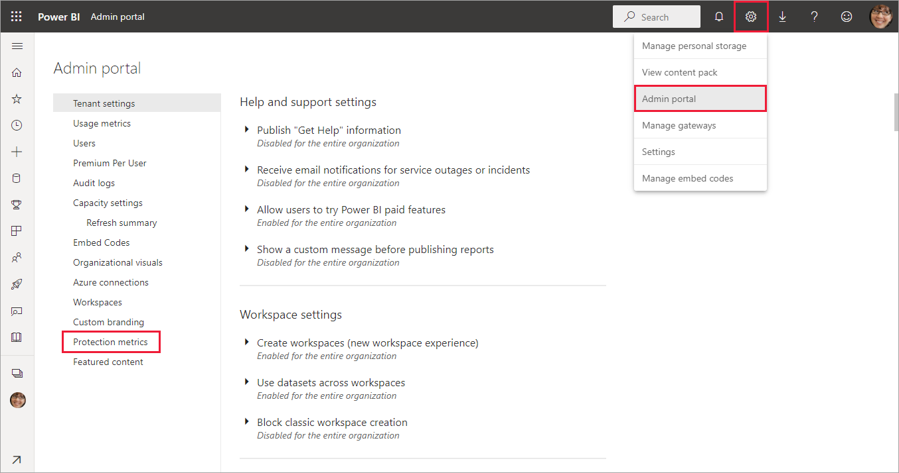

# Data protection metrics report

The data protection metrics report is a dedicated report that [Power BI administrators](../admin/service-admin-role.md) can use to monitor and track sensitivity label usage and adoption in their tenant.

The report features:

* A 100 percent stacked column chart that shows daily sensitivity label usage in the tenant for the last 7, 30, or 90 days. This chart makes it easy to track the relative usage of the different label types over time.
* Donut charts that show the current state of sensitivity label usage in the tenant for dashboards, reports, semantic models, and dataflows.
* A link to the Defender for Cloud Apps portal where Power BI alerts, users-at-risk, activity logs, and other information is available. For more information, see [Using Microsoft Defender for Cloud Apps controls in Power BI](/fabric/governance/service-security-using-defender-for-cloud-apps-controls).

The report refreshes every 24 hours.

## View the data protection metrics report

You must have a [Fabric administrator role](../admin/service-admin-role.md) to open and view the report.
To view the report, go to **Settings > Admin portal**, and then select **Protection metrics**.

The first time you open the data protection metrics report, it can take a few seconds to load. A report and a semantic model entitled **Data protection metrics (automatically generated)** are created in your private environment under **My workspace**. We don't recommend viewing it here because it isn't the full-featured report. Instead, view the report in the Admin portal as described earlier.

> [!CAUTION]
> Don't change the report or semantic model in any way, because new versions of the report are rolled out from time to time, and any changes you make to the original report are overwritten if you update to the new version.

## Report updates

Improved versions of the data protection metrics report are released periodically. When you open the report, if a new version is available, you can open the new version. If you accept the new version, the report loads and then overwrites the old version. Any changes you made to the old report or semantic model are lost. If you don't accept the new version, you can't take advantage of the new version's improvements.

## Notes and considerations

* In order for the data protection metrics report to be successfully generated, you must enable [sensitivity labels](./service-security-enable-data-sensitivity-labels.md) on your tenant, and [sensitivity labels should be applied to reports](./service-security-apply-data-sensitivity-labels.md).
* In order to access Defender for Cloud Apps information, your organization must have the appropriate [Defender for Cloud Apps license](/fabric/governance/service-security-using-defender-for-cloud-apps-controls#defender-for-cloud-apps-licensing).
* Before you share information from the data protection metrics report with a user who isn't a Power BI administrator, keep in mind that this report contains sensitive information about your organization.
* The data protection metrics report is a special report and doesn't show up in the **Shared with me**, **Recent**, and **Favorites** lists.

* The data protection metrics report isn't available to [external users such as Microsoft Entra B2B (Microsoft Entra B2B) guest users](./service-admin-azure-ad-b2b.md).

## Related content

* [Sensitivity labels in Power BI](./service-security-sensitivity-label-overview.md)
* [Using Microsoft Defender for Cloud Apps controls in Power BI](/fabric/governance/service-security-using-defender-for-cloud-apps-controls)
* [Understanding Power BI administration roles](../admin/service-admin-role.md)
* [Enable sensitivity labels in Power BI](service-security-enable-data-sensitivity-labels.md)
