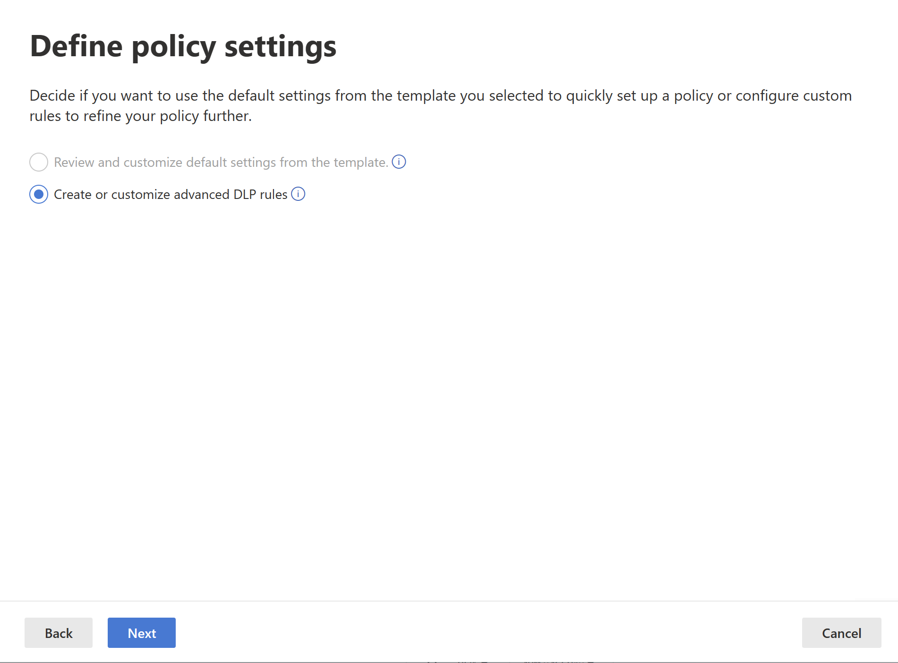
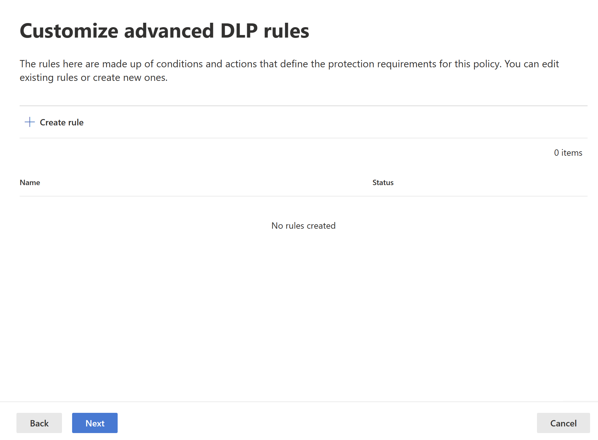
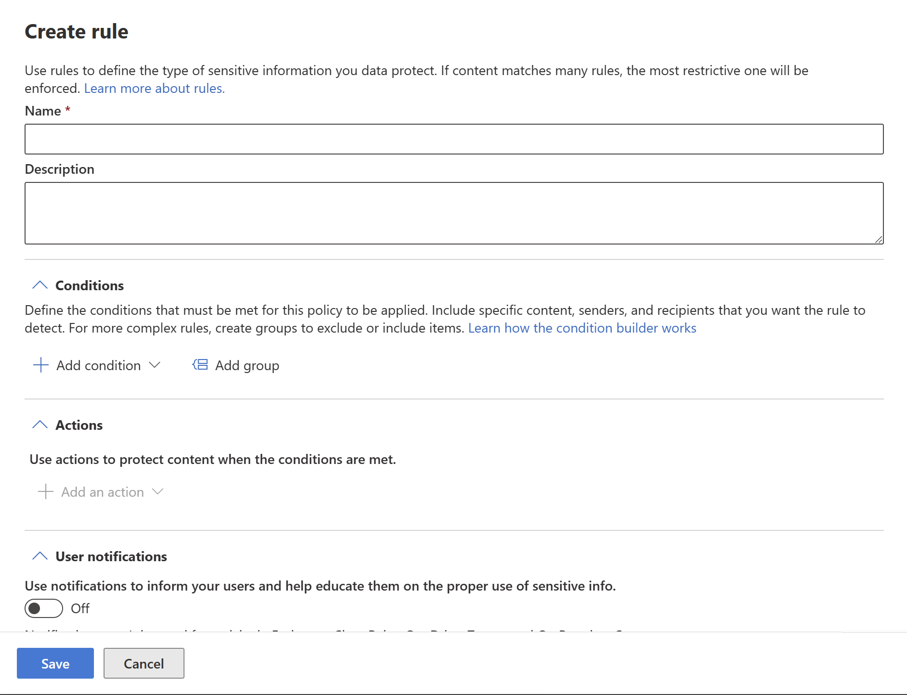
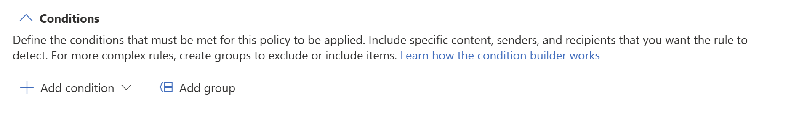
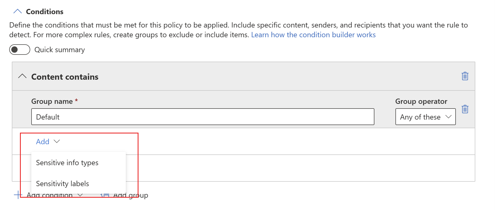
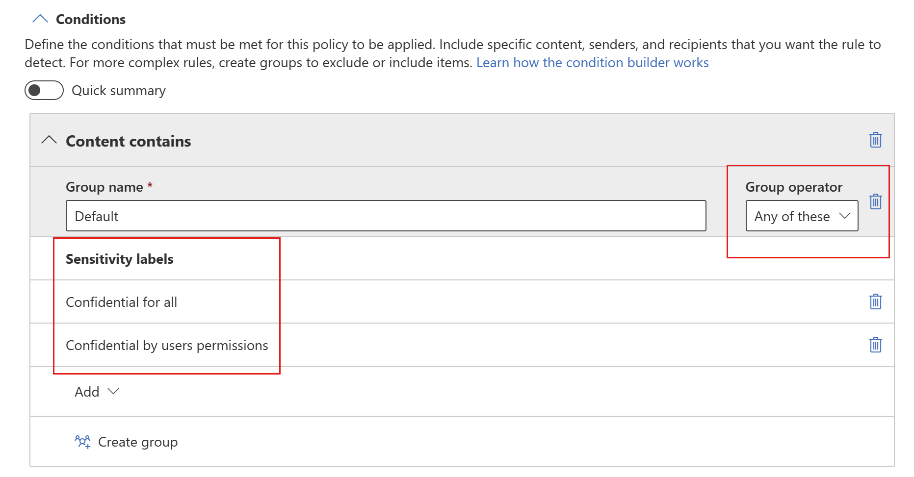
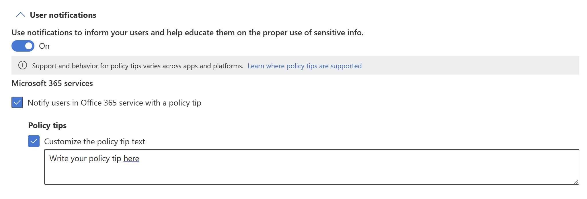
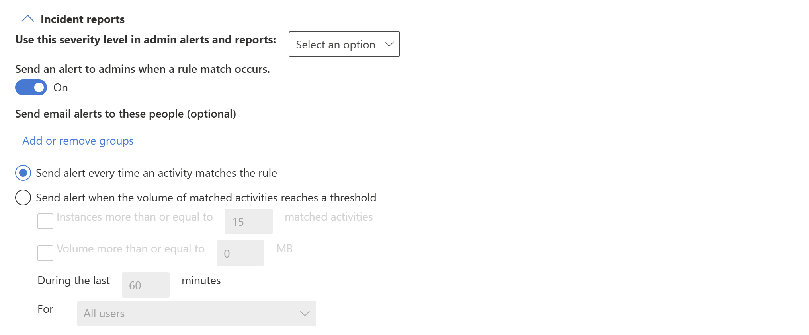
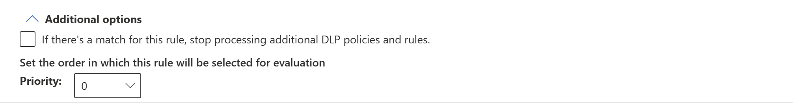

# Configure a DLP policy for Power BI

1. Log into the [Microsoft Purview compliance portal](https://go.microsoft.com/fwlink/p/?linkid=2077149).

1. Expand the **Data loss prevention** solution in the navigation pane, select **Policies**, and choose **Create policy**.

    :::image type="content" source="./media/service-security-dlp-policies-for-power-bi-configure/power-bi-dlp-create.png" alt-text="Screenshot of D L P create policy page.":::

1. Choose the **Custom** category and then the **Custom policy** template.
    
    >[!NOTE]
    >No other categories or templates are currently supported.

    :::image type="content" source="./media/service-security-dlp-policies-for-power-bi-configure/power-bi-dlp-choose-custom.png" alt-text="Screenshot of D L P choose custom policy page.":::
 
    When done, select **Next**.

1. Name the policy and provide a meaningful description.

    :::image type="content" source="./media/service-security-dlp-policies-for-power-bi-configure/power-bi-dlp-name-description.png" alt-text="Screenshot of D L P policy name description section.":::
 
    When done, select **Next**.

1. Select **Next** when you get to the Assign admin units page.

    :::image type="content" source="./media/service-security-dlp-policies-for-power-bi-configure/power-bi-dlp-admin-units.png" alt-text="Screenshot of D L P policy admin units section.":::

1. Enable Power BI as a location for the DLP policy. **Disable all other locations**. Currently, DLP policies for Power BI must specify Power BI as the sole location.

    :::image type="content" source="./media/service-security-dlp-policies-for-power-bi-configure/power-bi-dlp-choose-location.png" alt-text="Screenshot of D L P choose location page.":::

    By default the policy will apply to all workspaces. Alternatively, you can specify particular workspaces to include in the policy as well as workspaces to exclude from the policy.
    >[!NOTE]
    > DLP actions are supported only for workspaces hosted in Premium capacities.

    If you select **Choose workspaces** or **Exclude workspaces**, a dialog will allow you to select workspaces to be included (or excluded).

    You can search for workspaces by workspace name or by user email address. When you search by a user's email address, that user's My Workspace will be listed as *personalWorkspace - \<email address\>*, and you can then select it.

    
 
    After enabling Power BI as a DLP location for the policy and choosing which workspaces the policy will apply to, select **Next**.

1. The **Define policy settings** page appears. Choose **Create or customize advanced DLP rules** to begin defining your policy.

    
 
    When done, select **Next**.

1. On the **Customize advanced DLP rules** page, you can either start creating a new rule or choose an existing rule to edit. Select **Create rule**.

    

1. The **Create rule** page appears. On the create rule page, provide a name and description for the rule, and then configure the other sections, which are described following the image below.

    
 
## Conditions

In the condition section, you define the conditions under which the policy will apply to a dataset. Conditions are created in groups. Groups make it possible to construct complex conditions.

1. Open the conditions section, choose **Add condition** and then **Content contains**.

    
 
    This opens the first group (named Default – you can change this).

1. Choose **Add**, and then chose either **Sensitive info types** or **Sensitivity labels**.
    
    

    >[!NOTE]
    > Currently, DLP policies for Power BI don't support scanning for sensitive info types in data stored in the Southeast Asia region. See [How to find the default region for your organization](../admin/service-admin-where-is-my-tenant-located.md#how-to-find-the-default-region-for-your-organization) to learn how to find your organization's default data region.
 
    When you choose either **Sensitive info types** or **Sensitivity labels**, you'll be able to choose the particular sensitivity labels or sensitive info types you want to detect from a list that will appear in a sidebar.

    

    When you select a sensitive info type as a condition, you then need to specify how many instances of that type must be detected in order for the condition to be considered as met. You can specify from 1 to 500 instances. If you want to detect 500 or more unique instances, enter a range of '500' to 'Any'. You also can select the degree of confidence in the matching algorithm. Select the info button next to the confidence level to see the definition of each level.

     

    You can add additional sensitivity labels or sensitive info types to the group. To the right of the group name, you can specify **Any of these** or **All of these**. This determines whether matches on all or any of the items in the group is required for the condition to hold. If you specified more than one sensitivity label, you'll only be able to choose **Any of these**, since datasets can’t have more than one label applied.

    The image below shows a group (Default) that contains two sensitivity label conditions. The logic Any of these means that a match on any one of the sensitivity labels in the group constitutes “true” for that group.

     
 
    You can create more than one group, and you can control the logic between the groups with **AND** or **OR** logic. 

    The image below shows a rule containing two groups, joined by **OR** logic.

     
 
## Exceptions

If the dataset has a sensitivity label or sensitive info type that matches any of the defined exceptions, the rule won’t be applied to the dataset. 

Exceptions are configured in the same way as conditions, described above.
    

 
## Actions

Protection actions are currently unavailable for Power BI DLP policies.

## User notifications

The user notifications section is where you configure your policy tip. Turn on the toggle, select the **Notify users in Office 365 service with a policy tip** and **Policy tips** checkboxes, and write your policy tip in the text box.

 
## User overrides
 
If you enabled user notifications and selected the **Notify users in Office 365 service with a policy tip** checkbox, dataset owners (users with an Admin or Member role in the workspace where the dataset is located) will be able to respond to violations on the **[Data loss prevention policies side pane](./service-security-dlp-policies-for-power-bi-respond.md)**, which they can display from a button on the policy tip. The options they have depend on your selections in the **User overrides** section.

:::image type="content" source="./media/service-security-dlp-policies-for-power-bi-configure/power-bi-dlp-user-overrides-section.png" alt-text="Screenshot of D L P user overrides section.":::

The options are described below.

* **Allow overrides from M365 services. Allows users in Power BI, Exchange, SharePoint, OneDrive, and Teams to override policy restrictions** (automatically selected when you've enabled user notifications and selected the **Notify users in Office 365 service with a policy tip** checkbox): Users will be able to either report the issue as a false positive or override the policy.

* **Require a business justification to override**: Users will be able to either report the issue as a false positive or override the policy. If they choose to override, they will need to provide a business justification.

* **Override the rule automatically if they report it as a false positive**: Users will be able to report the issue as a false positive and automatically override the policy, or they can just override the policy without reporting it as a false positive.

* If you select both **Override the rule automatically if they report it as a false positive** and **Require a business justification to override**, users will be able to report the issue as a false positive and automatically override the policy, or they can just override the policy without reporting it as a false positive, but they'll have to provide a business justification.

Overriding a policy means that from now on the policy will no longer check the dataset for sensitive data.

Reporting an issue as a false positive means that the data owner believes that the policy has mistakenly identified non-sensitive data as sensitive. You can use false positives to fine tune your rules.

Any action the user takes is logged for reporting.

## Incident reports

Assign a severity level that will be shown in alerts generated from this policy. Enable (default) or disable email notification to admins, specify users or groups for email notification, and configure the details about when notification will occur.

   
## Additional options

## Next steps

* [Learn about data loss prevention](/microsoft-365/compliance/dlp-learn-about-dlp)
* [Get started with Data loss prevention policies for Power BI](/microsoft-365/compliance/dlp-powerbi-get-started)
* [Sensitivity labels in Power BI](service-security-sensitivity-label-overview.md)
* [Audit schema for sensitivity labels in Power BI](service-security-sensitivity-label-audit-schema.md)
* [Power BI implementation planning: Data loss prevention for Power BI](/power-bi/guidance/powerbi-implementation-planning-data-loss-prevention)
