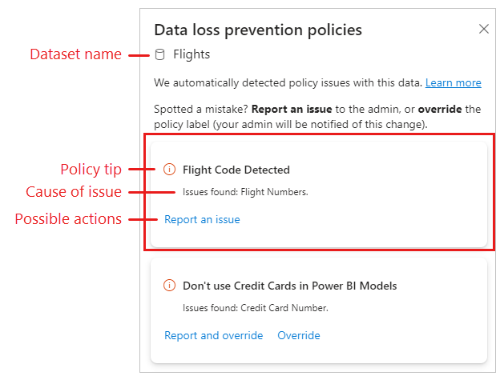

# Overriding data loss prevention policies (preview)

The data loss prevention side pane lists all the DLP policy issues detected by a content scan of the dataset.

Each DLP policy issue is shown on a card. The card shows the policy tip, indicates what kind of sensitive data was detected, and offers actions you can take if you believe that the data detected was falsely identified. The action or combination of actions you see may vary depending on the policy configuration. The possible actions are described below.

* **Report an issue**: Report the issue as a false positive (that is, report that the policy has mistakenly identified non-sensitive data as sensitive).
* **Override**: Override the policy. Overriding a policy means that the policy will no longer check this dataset for sensitive data, and any restrictions already imposed on the dataset by this policy will be rolled back. Depending on the policy's configuration, you may be required to provide a justification for the override.
* **Report and override**: Report the issue as a false positive and override the policy.

any of these actions will be audited or logged by the Security Admin

>[!WARNING]
> Overriding a policy violation on a dataset means that:
> * **Any restrictions imposed by the policy on this dataset, such as blocking user access, will be removed**.
> * This dataset will not be evaluated by this policy in future content scans.

## Next steps

* [Learn about data loss prevention](/microsoft-365/compliance/dlp-learn-about-dlp)
* [Data loss prevention policies for Power BI](./service-security-dlp-policies-for-power-bi.md)
* [Get started with Data loss prevention policies for Power BI](/microsoft-365/compliance/dlp-powerbi-get-started)
* [Sensitivity labels in Power BI](service-security-sensitivity-label-overview.md)
* [Audit schema for sensitivity labels in Power BI](service-security-sensitivity-label-audit-schema.md)
