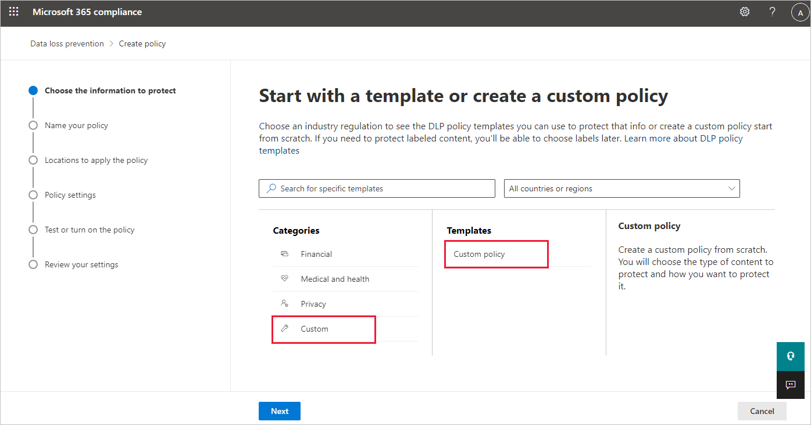
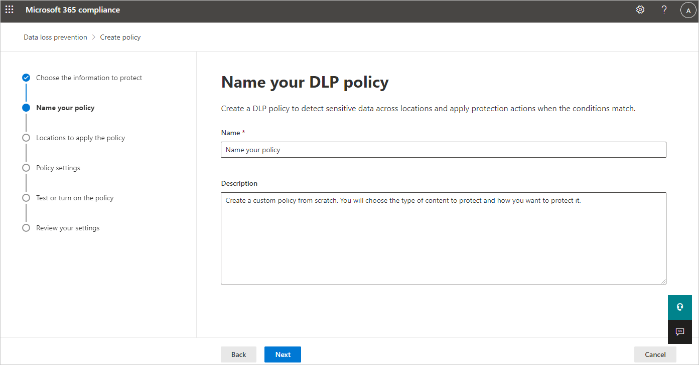
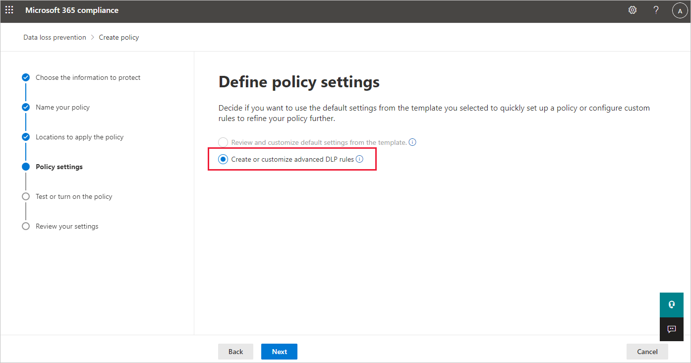
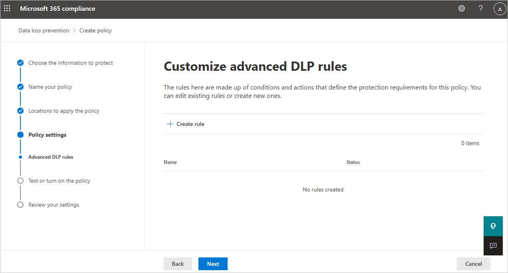
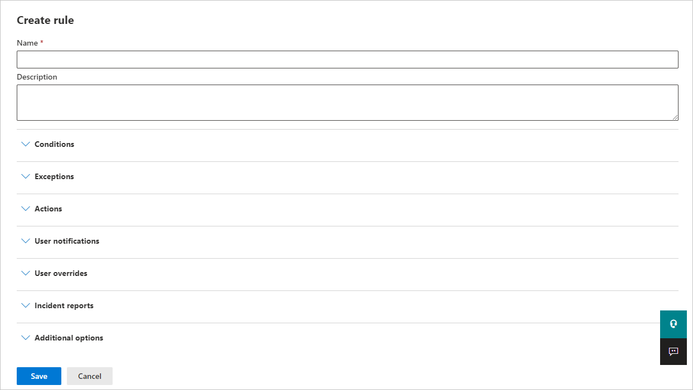
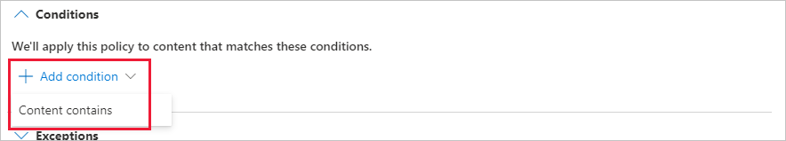
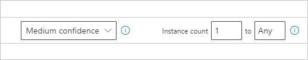
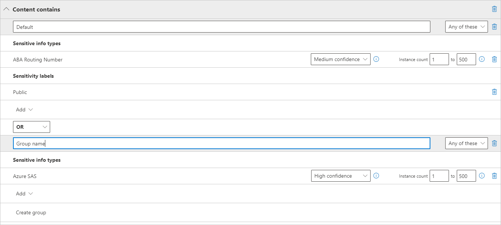
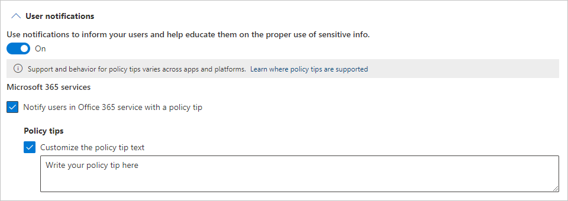
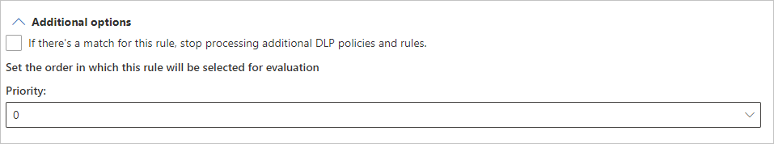

# Data loss prevention policies for Power BI (preview)

To help organizations detect and protect their sensitive data, Power BI supports [Microsoft Purview Data Loss Prevention (DLP) polices](/microsoft-365/compliance/dlp-learn-about-dlp). When a DLP policy for Power BI detects a sensitive dataset, a policy tip can be attached to the dataset in the Power BI service that explains the nature of the sensitive content, and an alert can be registered in the data loss prevention **Alerts** tab in the Microsoft Purview compliance portal for monitoring and management by administrators. In addition, email alerts can be sent to administrators and specified users.

## Considerations and limitations

* DLP policies for Power BI are defined in the [Microsoft Purview compliance portal](https://go.microsoft.com/fwlink/p/?linkid=2077149).
* DLP policies apply to workspaces. Only workspaces hosted in [Premium Gen2 capacities](./service-premium-gen2-what-is.md) are supported.
* DLP dataset evaluation workloads impact capacity. See [CPU metering for DLP policy evaluation](#cpu-metering-for-dlp-policy-evaluation) for more information.
* DLP policy templates aren't yet supported for Power BI DLP policies. When creating a DLP policy for Power BI, choose the "custom policy" option.
* Power BI DLP policy rules currently support sensitivity labels and sensitive info types as conditions.
* DLP policies for Power BI aren't supported for sample datasets, [streaming datasets](../connect-data/service-real-time-streaming.md), or datasets that connect to their data source via [DirectQuery](../connect-data/desktop-use-directquery.md) or [live connection](../connect-data/desktop-directquery-about.md#live-connections).
* DLP policies for Power BI aren't supported in sovereign clouds.
* Custom sensitive info types of the type *Keyword list* and *Keyword dictionary* are currently not supported when using DLP policies for the Power BI location.
* Currently, DLP policies for Power BI don't support scanning for sensitive info types in data stored in the Southeast Asia region. See [How to find the default region for your organization](../admin/service-admin-where-is-my-tenant-located.md#how-to-find-the-default-region-for-your-organization) to learn how to find your organization's default data region.

## Licensing and permissions

### SKU/subscriptions licensing

Before you get started with DLP for Power BI, you should confirm your [Microsoft 365 subscription](https://www.microsoft.com/microsoft-365/compare-microsoft-365-enterprise-plans?rtc=1). The admin account that sets up the DLP rules must be assigned one of the following licenses:

* Microsoft 365 E5
* Microsoft 365 E5 Compliance
* Microsoft 365 E5 Information Protection & Governance

### Permissions

Data from DLP for Power BI can be viewed in [Activity explorer](/microsoft-365/compliance/data-classification-activity-explorer). There are four roles that grant permission to activity explorer; the account you use for accessing the data must be a member of any one of them.

* Global administrator
* Compliance administrator
* Security administrator
* Compliance data administrator

## CPU metering for DLP policy evaluation

DLP policy evaluation uses CPU from the premium capacity associated with the workspace where the dataset being evaluated is located. CPU consumption of the evaluation is calculated as 30% of the CPU consumed by the action that triggered the evaluation. For example, if a refresh action costs 30 milliseconds of CPU, the DLP scan will cost another 9 milliseconds. This fixed 30% additional CPU consumption for DLP evaluation helps you predict the impact of DLP policies on your overall Capacity CPU utilization, and perform capacity planning when rolling out DLP policies in your organization.

Use the Power BI Premium Capacity Metrics App to monitor the CPU usage of your DLP policies. For more information, see [Use the Gen2 metrics app](./service-premium-gen2-metrics-app.md).

>[!NOTE]
>Users with PPU licenses do not incur the DLP policy evaluation costs described above, as these costs are covered for them up front by their PPU license.

## How do DLP policies for Power BI work

You define a DLP policy in the data loss prevention section of the compliance portal. In the policy, you specify the sensitivity labels and/or sensitive info types you want to detect. You also specify the actions that will happen when the policy detects a dataset that contains sensitive data of the kind you specified. DLP policies for Power BI support two actions:

* User notification via policy tips.
* Alerts. Alerts can be sent by email to administrators and users. Additionally, administrators can monitor and manage alerts on the **Alerts** tab in the compliance portal. 

When a dataset is evaluated by DLP policies, if it matches the conditions specified in a DLP policy, the actions specified in the policy occur. A dataset is evaluated against DLP policies whenever one of the following events occurs:

* Publish
* Republish
* On-demand refresh
* Scheduled refresh

>[!NOTE]
> DLP evaluation of the dataset does not occur if either of the following is true:
> * The initiator of the event is a service principal.
> * The dataset owner is either a service principal or a B2B user.

## What happens when a dataset is flagged by a Power BI DLP policy

When a DLP policy detects an issue with a dataset:
* If "user notification" is enabled in the policy, the dataset will be marked in the Power BI service with a shield that indicates that a DLP policy has detected an issue with the dataset.

    

    Open the dataset details page to see a policy tip that explains the policy violation and how the detected type of sensitive information should be handled.

    

    >[!NOTE]
    > If you hide the policy tip, it doesn’t get deleted. It will appear the next time you visit the page.

* If alerts are enabled in the policy, an alert will be recorded on the data loss prevention **Alerts** tab in the compliance portal, and (if configured) an email will be sent to administrators and/or specified users. The following image shows the **Alerts** tab in the data loss prevention section of the compliance portal.

    

## Configure a DLP policy for Power BI

1. Log into the [Microsoft Purview compliance portal](https://go.microsoft.com/fwlink/p/?linkid=2077149).

1. Choose the **Data loss prevention** solution in the navigation pane, select the **Policies** tab, choose **Create policy**.

    

1. Choose the **Custom** category and then the **Custom policy** template.
    
    >[!NOTE]
    >No other categories or templates are currently supported.

    
 
    When done, select **Next**.

1. Name the policy and provide a meaningful description.

    
 
    When done, select **Next**.

1. Enable Power BI as a location for the DLP policy. **Disable all other locations**. Currently, DLP policies for Power BI must specify Power BI as the sole location.

    

    By default the policy will apply to all workspaces. Alternatively, you can specify particular workspaces to include in the policy as well as workspaces to exclude from the policy.
    >[!NOTE]
    > DLP actions are supported only for workspaces hosted in Premium Gen2 capacities.

    If you select **Choose workspaces** or **Exclude workspaces**, a dialog will allow you to select workspaces to be included (or excluded).

    You can search for workspaces by workspace name or by user email address. When you search by a user's email address, that user's My Workspace will be listed as *personalWorkspace - \<email address\>*, and you can then select it.

    
 
    After enabling Power BI as a DLP location for the policy and choosing which workspaces the policy will apply to, select **Next**.

1. The **Define policy settings** page appears. Choose **Create or customize advanced DLP rules** to begin defining your policy.

    
 
    When done, select **Next**.

1. On the **Customize advanced DLP rules** page, you can either start creating a new rule or choose an existing rule to edit. Select **Create rule**.

    

1. The **Create rule** page appears. On the create rule page, provide a name and description for the rule, and then configure the other sections, which are described following the image below.

    
 
### Conditions

In the condition section, you define the conditions under which the policy will apply to a dataset. Conditions are created in groups. Groups make it possible to construct complex conditions.

1. Open the conditions section, choose **Add condition** and then **Content contains**.

    
 
    This opens the first group (named Default – you can change this).

1. Choose **Add**, and then chose either **Sensitive info types** or **Sensitivity labels**.
    
    

    >[!NOTE]
    > Currently, DLP policies for Power BI don't support scanning for sensitive info types in data stored in the Southeast Asia region. See [How to find the default region for your organization](../admin/service-admin-where-is-my-tenant-located.md#how-to-find-the-default-region-for-your-organization) to learn how to find your organization's default data region.
 
    When you choose either **Sensitive info types** or **Sensitivity labels**, you'll be able to choose the particular sensitivity labels or sensitive info types you want to detect from a list that will appear in a sidebar.

    

    When you select a sensitive info type as a condition, you then need to specify how many instances of that type must be detected in order for the condition to be considered as met. You can specify from 1 to 500 instances. If you want to detect 500 or more unique instances, enter a range of '500' to 'Any'. You also can select the degree of confidence in the matching algorithm. Select the info button next to the confidence level to see the definition of each level.

     

    You can add additional sensitivity labels or sensitive info types to the group. To the right of the group name, you can specify **Any of these** or **All of these**. This determines whether matches on all or any of the items in the group is required for the condition to hold. If you specified more than one sensitivity label, you'll only be able to choose **Any of these**, since datasets can’t have more than one label applied.

    The image below shows a group (Default) that contains two sensitivity label conditions. The logic Any of these means that a match on any one of the sensitivity labels in the group constitutes “true” for that group.

     
 
    You can create more than one group, and you can control the logic between the groups with **AND** or **OR** logic. 

    The image below shows a rule containing two groups, joined by **OR** logic.

     
 
### Exceptions

If the dataset has a sensitivity label or sensitive info type that matches any of the defined exceptions, the rule won’t be applied to the dataset. 

Exceptions are configured in the same way as conditions, described above.
    

 
### Actions

Protection actions are currently unavailable for Power BI DLP policies.

### User notifications

The user notifications section is where you configure your policy tip. Turn on the toggle, select the **Notify users in Office 365 service with a policy tip** and **Policy tips** checkboxes, and write your policy tip in the text box.

 
### User overrides
 
User overrides are currently unavailable for Power BI DLP policies.

 
 
### Incident reports

Assign a severity level that will be shown in alerts generated from this policy. Enable (default) or disable email notification to admins, specify users or groups for email notification, and configure the details about when notification will occur.

   
### Additional options

 
## Monitor and manage policy alerts

Log into the [Microsoft Purview compliance portal](https://go.microsoft.com/fwlink/p/?linkid=2077149) and navigate to **Data loss prevention > Alerts**.

Select an alert to start drilling down to its details and to see management options.

## Next steps

* [Learn about data loss prevention](/microsoft-365/compliance/dlp-learn-about-dlp)
* [Get started with Data loss prevention policies for Power BI](/microsoft-365/compliance/dlp-powerbi-get-started)
* [Sensitivity labels in Power BI](service-security-sensitivity-label-overview.md)
* [Audit schema for sensitivity labels in Power BI](service-security-sensitivity-label-audit-schema.md)
* [Power BI implementation planning: Data loss prevention for Power BI](/power-bi/guidance/powerbi-implementation-planning-data-loss-prevention)
