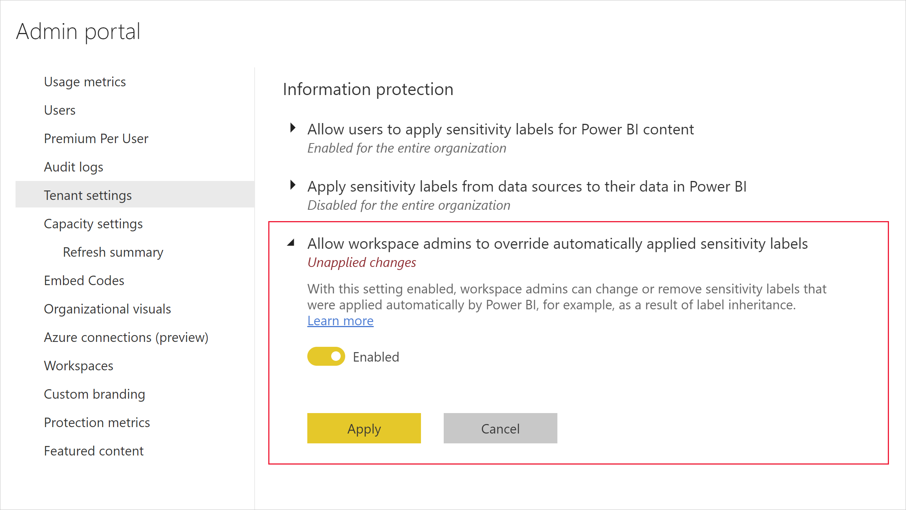

---
title: Sensitivity label change enforcement 
description: Learn how Power BI controls who can change or remove sensitivity labels on Power BI content.
author: paulinbar
ms.author: painbar
manager: kfollis
ms.service: powerbi
ms.subservice: powerbi-eim
ms.topic: conceptual
ms.custom:
ms.date: 08/29/2022
LocalizationGroup: Data from files
---
# Sensitivity label change enforcement

Power BI restricts permission to change or remove sensitivity labels from Microsoft Purview Information Protection that have file encryption settings to authorized users only. 

Authorized users are:
* The user who applied the sensitivity label. 
* Users who have been assigned at least one of the following [usage rights](/microsoft-365/compliance/encryption-sensitivity-labels?view=o365-worldwide&preserve-view=true) to the label in the labeling admin center ([Microsoft Purview compliance portal](https://compliance.microsoft.com/)):
    * OWNER
    * EXPORT
    * EDIT and EDITRIGHTSDATA

Users who try to change a label and can’t should ask the person who applied the label to perform the modification, or they can contact their Microsoft 365/Office security administrator and ask to be granted the necessary usage rights.

## Relaxations to accommodate automatic labeling scenarios

Power BI supports several capabilities, such as [label inheritance from data sources](/fabric/admin/service-security-sensitivity-label-inheritance-from-data-sources) and [downstream inheritance](/fabric/governance/service-security-sensitivity-label-downstream-inheritance), which automatically apply sensitivity labels to content. These automated scenarios can result in situations where no user has been set as the RMS label issuer for a label on an item. This means that there is no user who is guaranteed to be able to change or remove the label.

In such cases, the usage rights requirements for changing or removing the label are relaxed - a user needs just one of the following usage rights to be able to change or remove the label:
* OWNER
* EXPORT
* EDIT 

If no user has even these usage rights, nobody will be able to change or remove the label from the item, and access to the item is potentially endangered.

To avoid this situation, the Power BI admin can enable the **Allow workspace admins to override automatically applied sensitivity labels (preview)** tenant setting. This makes it possible for workspace admins to override automatically applied sensitivity labels without regard to label change enforcement rules.

To enable this setting, go to: **Admin portal > Tenant settings > Information protection**.

## Related content

* [Sensitivity label overview](service-security-sensitivity-label-overview.md)