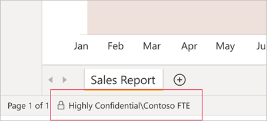
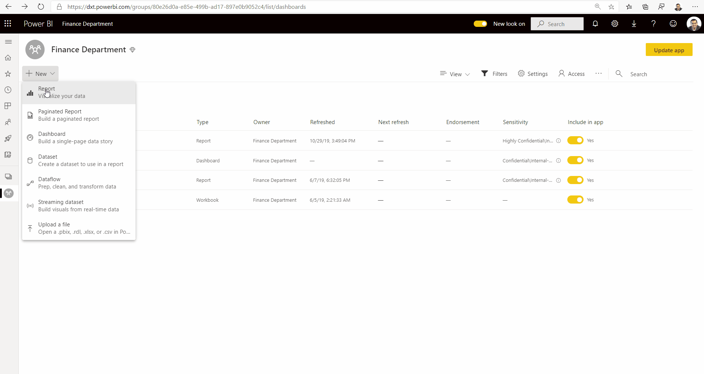
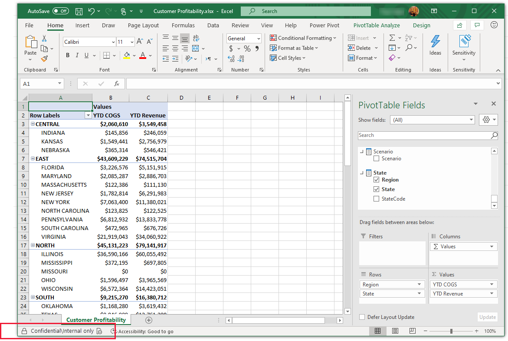
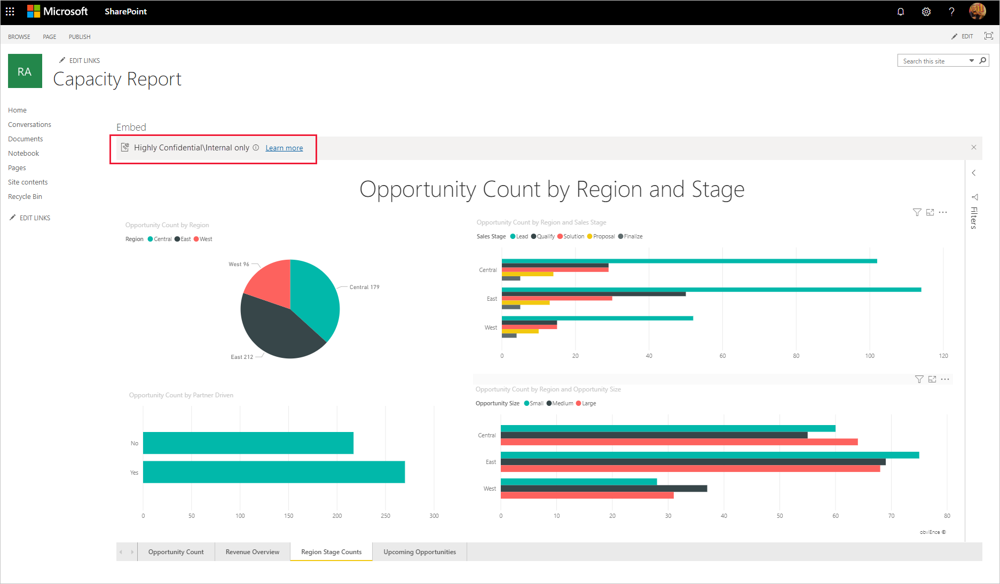

# Sensitivity labels in Power BI

This article describes the functionality of sensitivity labels from Microsoft Purview Information Protection in Power BI.

For information about enabling sensitivity labels on your tenant, including licensing requirements and prerequisites, see [Enable data sensitivity labels in Power BI](service-security-enable-data-sensitivity-labels.md).

For information about how to apply sensitivity labels on your Power BI content and files, see [How to apply sensitivity labels in Power BI](./service-security-apply-data-sensitivity-labels.md).

#### Give us your feedback

The product team would love to get your **[feedback](https://forms.office.com/pages/responsepage.aspx?id=v4j5cvGGr0GRqy180BHbR-PPBJBIRPlBpEYIBVrF5lRUREtUREJJRzJZSzcyM1pZWU9LOUdSVkFKWC4u)** about Power BI's information protection capabilities and its integration with Microsoft Purview Information Protection. Help us meet your information protection needs! Thanks!

## Introduction

Sensitivity labels from Purview Information Protection provide a simple way for your users to classify critical content in Power BI without compromising productivity or the ability to collaborate. They can be applied in both Power BI Desktop and the Power BI service, making it possible to protect your sensitive data from the moment you first start developing your content on through to when it's being accessed from Excel via a live connection. Sensitivity labels are retained when you move your content back and forth between Desktop and the service in the form of .pbix files.

In the Power BI service, sensitivity labels can be applied to semantic models, reports, dashboards, and dataflows. When labeled data leaves Power BI, either via export to Excel, PowerPoint, PDF, or .pbix files, or via other supported export scenarios such as Analyze in Excel or live connection PivotTables in Excel, Power BI automatically applies the label to the exported file and protects it according to the label's file encryption settings. This way your sensitive data can remain protected, even when it leaves Power BI.

In addition, sensitivity labels can be applied to .pbix files in Power BI Desktop, so that your data and content is safe when it's shared outside Power BI (for example, so that only users within your organization can open a confidential .pbix that has been shared or attached in an email), even before it has been published to the Power BI service. See [Restrict access to content by using sensitivity labels to apply encryption](/microsoft-365/compliance/encryption-sensitivity-labels) for more detail.

Sensitivity labels on reports, dashboards, semantic models, and dataflows are visible from many places in the Power BI service. Sensitivity labels on reports and dashboards are also visible in the Power BI iOS and Android mobile apps and in embedded visuals. In Desktop, you can see the sensitivity label in the status bar.

A [protection metrics report](/fabric/governance/use-microsoft-purview-hub) available in the Power BI admin portal gives Power BI admins full visibility over the sensitive data in the Power BI tenant. In addition, the Power BI audit logs include sensitivity label information about activities such as applying, removing, and changing labels, as well as about activities such as viewing reports, dashboards, etc. This gives Power BI and security admins visibility over sensitive data consumption for the purposes of monitoring and investigating security alerts.

## Important considerations

In the Power BI service, sensitivity labeling **does not** affect access to content. Access to content in the service is managed solely by Power BI permissions. While the labels are visible, any associated encryption settings (configured in the [Microsoft Purview compliance portal](https://compliance.microsoft.com/)) aren't applied. They're applied only to data that leaves the service via a supported export path, such as export to Excel, PowerPoint, or PDF, and download to .pbix.

In Power BI Desktop, sensitivity labels with encryption settings **do** affect access to content. If a user doesn't have sufficient [permissions](#power-bi-desktop) according to the encryption settings of the sensitivity label on the .pbix file, they won't be able to open the file. In addition, in Desktop, when you save your work, any sensitivity label you've added and its associated encryption settings will be applied to the saved .pbix file.

Sensitivity labels and file encryption **are not** applied in non-supported export paths. The Power BI admin can block export from non-supported export paths.

> [!NOTE]
> Users who are granted access to a report are granted access to the entire underlying semantic model, unless [row-level security (RLS)](/fabric/security/service-admin-rls) limits their access. Report authors can classify and label reports using sensitivity labels. If the sensitivity label has protection settings, Power BI applies these protection settings when the report data leaves Power BI via a supported export path such as export to Excel, PowerPoint, or PDF, download to .pbix, and **Save** (Desktop). Only authorized users will be able to open protected files.

## Supported export paths

Applying sensitivity labels and their associated protection to data that leaves the Power BI service is currently supported for the following export paths:

* Export to Excel, PDF files, and PowerPoint.
* Analyze in Excel from the Power BI service, which triggers download of an Excel file with a live connection to a Power BI semantic model.
* PivotTable in Excel with a live connection to a Power BI semantic model, for users with Microsoft 365 E3 and above.
* Download to .pbix (Service)

> [!NOTE]
> When using **Download the .pbix** in the Power BI service, if the downloaded report and its semantic model have different labels, the more restrictive label will be applied to the .pbix file.
>
> In Power BI Desktop, sensitivity label support in Export to PDF is a preview feature that is on by default. It is possible to turn it off. See [Desktop considerations and limitations](#power-bi-desktop) for more information. 

## How sensitivity labels work in Power BI

When you apply a sensitivity label to Power BI content and files, it's similar to applying a tag on that resource that has the following benefits:

* **Customizable** - you can create categories for different levels of sensitive content in your organization, such as Personal, Public, General, Confidential, and Highly Confidential.
* **Clear text** - since the label is in clear text, it's easy for users to understand how to treat the content according to sensitivity label guidelines.
* **Persistent** - after a sensitivity label has been applied to content, it accompanies that content when it's exported to  Excel, PowerPoint and PDF files, downloaded to .pbix, or saved (in Desktop) and becomes the basis for applying and enforcing policies.

Here's a quick example of how sensitivity labels in Power BI work. The image below shows how a sensitivity label is applied on a report in the Power BI service, then how the data from the report is exported to an Excel file, and finally how the sensitivity label and its protections persist in the exported file.

The sensitivity labels you apply to content persist and roam with the content as it's used and shared throughout Power BI. You can use the labeling to generate usage reports and to see activity data for your sensitive content.

## Sensitivity labels in Power BI Desktop

Sensitivity labels can also be applied in Power BI Desktop. This makes it possible to protect your data from the moment you first start developing your content. When you save your work in Desktop, the sensitivity label you applied, along with any associated encryption settings, is applied to the resulting .pbix file. If the label has encryption settings, the file is thus protected wherever it goes and however it's transmitted. Only users with the [necessary RMS permissions](#power-bi-desktop) will be able to open it.

> [!NOTE]
> Some limitations may apply. See [Considerations and limitations](#considerations-and-limitations).

If you apply a sensitivity label in Desktop, when you publish your work to the service, or when you upload a .pbix file of that work to the service, the label travels with the data into the service. In the service, the label will be applied to both the semantic model and the report that you get with the file. If the semantic model and report already have sensitivity labels, you can choose to keep those labels or to overwrite them with the label coming from Desktop.

If you upload a .pbix file that has never been published to the service before, and that has the same name as a report or semantic model that already exists on the service, the upload will succeed only if the uploader has the RMS permissions necessary to change the label.

The same is also true in the opposite direction - when you download to .pbix in the service and then load the .pbix into Desktop, the label that was in the service will be applied to the downloaded .pbix file and from there be loaded into Desktop. If the report and semantic model in the service have different labels, the more restrictive of the two will be applied to the downloaded .pbix file.

When you apply a label in Desktop, it shows up in the status bar.

[Learn how to apply sensitivity labels to Power BI content and files](./service-security-apply-data-sensitivity-labels.md).

## Sensitivity label inheritance upon creation of new content

When new reports and dashboards are created in the Power BI service, they automatically inherit the sensitivity label previously applied on parent semantic model or report. For example, a new report created on top of a semantic model that has a "Highly Confidential" sensitivity label will automatically receive the "Highly Confidential" label as well.

The following image shows how a semantic model's sensitivity label is automatically applied on a new report that is built on top of the semantic model.

> [!NOTE]
> If for any reason the sensitivity label can't be applied on the new report or dashboard, Power BI **will not** block creation of the new item.

## Sensitivity label inheritance from data sources

Power BI semantic models that connect to sensitivity-labeled data in supported data sources can inherit those labels so that the data remains classified and secure when brought into Power BI. Currently, Azure Synapse Analytics (formerly SQL Data Warehouse) and Azure SQL Database are supported. See [Sensitivity label inheritance from data sources](service-security-sensitivity-label-inheritance-from-data-sources.md) to learn how inheritance from data sources works and how to enable it for your organization.

## Sensitivity label downstream inheritance

When a sensitivity label is applied to a semantic model or report in the Power BI service, it's possible to have the label trickle down and be automatically applied to content that is built from that semantic model or report as well. This capability is called downstream inheritance.

Downstream inheritance is a critical link in Power BI's end-to-end information protection solution. Together with inheritance from data sources, inheritance upon creation of new content, inheritance upon export to file, and other capabilities for applying sensitivity labels, downstream inheritance helps ensure that sensitive data remains protected throughout its journey through Power BI, from data source to point of consumption.

[Read more about downstream inheritance](service-security-sensitivity-label-downstream-inheritance.md)

## Data loss prevention (DLP) policies

Power BI leverages Microsoft 365 data loss prevention to enable central security teams to use data loss prevention policies to enforce their organization's DLP policies in Power BI. See [Data loss prevention policies for Power BI](service-security-dlp-policies-for-power-bi-overview.md) for detail.

## Default label policy

To help ensure comprehensive protection and governance of sensitive data, organizations can create default label policies for Power BI that automatically apply default sensitivity labels to unlabeled content. Currently, default label policies are supported in Power BI Desktop only. For more information, see [Default label policy](service-security-sensitivity-label-default-label-policy.md).

## Mandatory label policy

To help ensure comprehensive protection and governance of sensitive data, organizations can require users to apply labels to their sensitive Power BI content. Such a policy is called a mandatory label policy. For more information, see [Mandatory label policy](service-security-sensitivity-label-mandatory-label-policy.md).

## Admin APIs for setting and removing labels programmatically

To meet compliance requirements, organizations are often required to classify and label all sensitive data in Power BI. This task can be challenging for tenants that have large volumes of data in Power BI. To make the task easier and more effective, Power BI has admin REST APIs that admins can use to set and remove sensitivity labels on large numbers of Power BI artifacts programatically. See the following:

* [Admin - InformationProtection SetLabelsAsAdmin](/rest/api/power-bi/admin/informationprotection_setlabelsasadmin)
* [Admin - InformationProtection RemoveLabelsAsAdmin](/rest/api/power-bi/admin/informationprotection_removelabelsasadmin)

## Auditing for activity on sensitivity labels

Whenever a sensitivity label on a semantic model, report, dashboard, or dataflow is applied, changed, or removed, that activity is recorded in the audit log for Power BI. You can track these activities in the unified audit log or in the Power BI activity log. See [Audit schema for sensitivity labels in Power BI](service-security-sensitivity-label-audit-schema.md) for detail.

## Sensitivity labels and protection on exported data

When data is exported from Power BI to Excel, PDF files (service only) or PowerPoint files, Power BI automatically applies a sensitivity label on the exported file and protects it according to the label's file encryption settings. This way your sensitive data remains protected no matter where it is.

A user who exports a file from Power BI has permissions to access and edit that file according to the sensitivity label settings; they don't get owner permissions to the file.

> [!NOTE]
> When using **Download the .pbix** in the Power BI service, if the downloaded report and its semantic model have different labels, the more restrictive label will be applied to the .pbix file.

Sensitivity labels and protection aren't applied when data is exported to .csv, files or any other unsupported export path.

Applying a sensitivity label and protection to an exported file doesn't add content marking to the file. However, if the label is configured to apply content markings, the markings are automatically applied by the Azure Information Protection unified labeling client when the file is opened in Office desktop apps. The content markings aren't automatically applied when you use built-in labeling for desktop, mobile, or web apps. See [When Office apps apply content marking and encryption](/microsoft-365/compliance/sensitivity-labels-office-apps#when-office-apps-apply-content-marking-and-encryption) for more detail.

Export fails if a label can't be applied when data is exported to a file. To check if export failed because the label couldn't be applied, select the report or dashboard name at the center of the title bar and see whether it says "Sensitivity label can't be loaded" in the info dropdown that opens. This can happen as the result of a temporary system issue, or if the applied label has been unpublished or deleted by the security admin.

## Sensitivity label inheritance in Analyze in Excel

When you create a PivotTable in Excel with a live connection to a Power BI semantic model (you can do this either from Power BI through [Analyze In Excel](../collaborate-share/service-analyze-in-excel.md) or from [Excel](https://support.microsoft.com/office/create-a-pivottable-from-power-bi-datasets-31444a04-9c38-4dd7-9a45-22848c666884?ui=en-US&rs=en-US&ad=US)), the semantic model's sensitivity label is inherited and applied to your Excel file, along with any associated protection. If the label on the semantic model later changes to a more restrictive one, the label applied on the linked Excel file will automatically update upon data refresh.

Sensitivity labels in Excel that were manually set aren't automatically overwritten by the semantic model's sensitivity label. Rather, a banner notifies you that the semantic model has a sensitivity label and recommends that you apply it.

> [!NOTE]
> If the semantic model's sensitivity label is less restrictive than the Excel file's sensitivity label, no label inheritance or update takes place. An Excel file never inherits a less restrictive sensitivity label.

## Sensitivity label persistence in embedded reports and dashboards

You can embed Power BI reports, dashboards, and visuals in business applications such as Microsoft Teams and SharePoint, or in an organization's website. When you embed a visual, report or dashboard that has a sensitivity label applied to it, the sensitivity label will be visible in the embedded view, and the label and its protection will persist when data is exported to Excel.

The following embedding scenarios are supported:

* [Embed for your organization](../developer/embedded/embed-sample-for-your-organization.md)
* Microsoft 365 apps (for example, [Teams](../collaborate-share/service-embed-report-microsoft-teams.md) and [SharePoint](../collaborate-share/service-embed-report-spo.md))
* [Secure URL embedding](../collaborate-share/service-embed-secure.md) (embedding from the Power BI service)

## Sensitivity labels in paginated reports

Sensitivity labels can be applied to paginated reports hosted in the Power BI service. After uploading a paginated report to the service, you apply the label to the report just as you would to a regular Power BI report. See [Sensitivity label support for paginated reports](service-security-sensitivity-label-paginated-reports.md) for detail.

## Sensitivity labels in deployment pipelines

Sensitivity labels are supported in deployment pipelines. See the [deployment pipeline documentation](/fabric/cicd/deployment-pipelines/understand-the-deployment-process#item-properties-copied-during-deployment) for details about how sensitivity labels are handled as content is deployed from stage to stage.

## Sensitivity labels in the Power BI mobile apps

Sensitivity labels can be viewed on reports and dashboards in the Power BI mobile apps. An icon near the name of the report or dashboard indicates that it has a sensitivity label, and the type of label and its description can be found in the report or dashboard's info box.

## Label change enforcement

Power BI restricts permission to change or remove sensitivity labels from Purview Information Protection that have file encryption settings to authorized users only. See [Sensitivity label change enforcement](service-security-sensitivity-label-change-enforcement.md) for detail.

## Supported clouds

Sensitivity labels are supported for tenants in global (public) clouds, and the following national/regional clouds:

* [US Government](service-govus-overview.md#power-bi-feature-availability): GCC, GCC High, DoD
* China

Sensitivity labels aren't currently supported in other national/regional clouds.

## Licensing and requirements

See [Licensing and requirements](service-security-enable-data-sensitivity-labels.md#licensing-and-requirements).

## Sensitivity label creation and management

Sensitivity labels are created and managed in the [Purview compliance portal](https://compliance.microsoft.com/).

To access sensitivity labels in either of these centers, navigate to **Classification > Sensitivity labels**. These sensitivity labels can be used by multiple Microsoft services such Azure Information Protection, Office apps, and Office 365 services.

> [!IMPORTANT]
> If your organization uses Azure Information Protection sensitivity labels, you need to [migrate](/azure/information-protection/configure-policy-migrate-labels) them to one of the previously listed services in order for the labels to be used in Power BI.

## Custom help link

To help your users understand what your sensitivity labels mean or how they should be used, you can provide a *Learn more* URL that appears at the bottom of the sensitivity label menu that you see when you're applying a sensitivity label.

See [Custom help link for sensitivity labels](service-security-sensitivity-label-custom-help-link.md) for detail.

## Considerations and limitations

### General

* Don't use parent labels. A parent label is a label that has sublabels. You can't apply parent labels, but a label that is already applied may become a parent label if it acquires sublabels. If you come across an item that has a parent label, apply the appropriate sublabel. To change a parent label, you must have [sufficient usage rights on the label](./service-security-sensitivity-label-change-enforcement.md).

    If an item has a parent label, note the following behavior:
    * Parent labels won't be inherited.
    * Mandatory label policies won't be applied to items that have a parent label. This means users won't be required to apply a meaningful label in order to save the item, and the item will escape mandatory label policies designed to promote total coverage.
    * If you try to export data from an item that has a parent label, export will fail.
    * It's possible to publish a *.pbix* file that has a parent label, but if the parent label is protected, publish will fail. The solution is to apply a suitable sublabel.

* Data sensitivity labels aren't supported for template apps. Sensitivity labels set by the template app creator are removed when the app is extracted and installed, and sensitivity labels added to artifacts in an installed template app by the app consumer are lost (reset to nothing) when the app is updated.

* In the Power BI service, if a semantic model has a label that has been deleted from the label admin center, you will not be able to export or download the data. In Analyze in Excel, a warning will be issued and the data will be exported to an .odc file with no sensitivity label.

* Power BI doesn't support sensitivity labels of the [Do Not Forward](/microsoft-365/compliance/encryption-sensitivity-labels#let-users-assign-permissions), [user-defined](/microsoft-365/compliance/encryption-sensitivity-labels#let-users-assign-permissions), and [HYOK](/azure/information-protection/configure-adrms-restrictions) protection types. The Do Not Forward and user-defined protection types refer to labels defined in the [Purview compliance portal](https://compliance.microsoft.com/).

* Get data and refresh scenarios from encrypted Excel (*.xlsx*) files are supported, unless the file is stored behind a gateway, in which case the Get data/refresh action will fail. Get data and refresh actions from an Excel file that is stored behind a gateway and that has an *unprotected* sensitivity label will succeed, but the sensitivity label won't be inherited. See [Sensitivity label inheritance from data sources](./service-security-sensitivity-label-inheritance-from-data-sources.md) for detail.

* Information protection in Power BI doesn't support **B2B** and **multi-tenant scenarios**.

### Power BI service

* Sensitivity labels can be applied only on dashboards, reports, semantic models, dataflows, and [paginated reports](service-security-sensitivity-label-paginated-reports.md). They aren't currently available for workbooks.

* Sensitivity labels on Power BI assets are visible in the workspace list, lineage, favorites, recents, and apps views; labels aren't currently visible in the "shared with me" view. Note, however, that a label applied to a Power BI asset, even if not visible, will always persist on data exported to Excel, PowerPoint, PDF, and PBIX files.

* Import of sensitivity-labeled *.pbix* files (both protected and unprotected) stored on OneDrive or SharePoint Online, as well as on-demand and automatic semantic model refresh from such files, is supported, except for the following scenarios:

    * Protected live-connected *.pbix* files and protected Azure Analysis Services *.pbix* files. Refresh will fail. Neither report content nor label will be updated.
    * Labeled unprotected Live Connect *.pbix* files: Report content will be updated but label won't be updated.
    * When the *.pbix* file has had a new sensitivity label applied that the semantic model owner doesn't have usage rights to. In this case, refresh will fail. Neither report content nor label will be updated.
    * If the semantic model owner's access token for OneDrive/SharePoint has expired. In this case, refresh will fail. Neither report content nor label will be updated.

### Power BI Desktop

* Power BI Desktop for Power BI Report Server doesn't support information protection. If you try to open a protected .pbix file, the file won't open and you'll receive an error message. Sensitivity-labeled .pbix files that aren't encrypted can be opened as normal.

* Users with a free license can't open protected .pbix files.

* To open a protected .pbix file, a user with an appropriate license must also have [**Full control** and/or **Export** usage rights](/microsoft-365/compliance/encryption-sensitivity-labels) for the relevant label. [See more detail](/azure/information-protection/configure-usage-rights#rights-management-issuer-and-rights-management-owner).

    The user who sets the label gets Full control and can never be locked out unless connectivity fails and authentication can't take place.

    In rare cases, it may happen that no one has the necessary usage rights for the relevant label except the person that set the label. Then, if that one person leaves the organization or changes aliases within the organization, all access to the .pbix file will be lost. The solution for regaining access to the file in such cases is to either change or remove the sensitivity label on the file using the [set](/rest/api/power-bi/admin/information-protection-set-labels-as-admin)/[remove](/rest/api/power-bi/admin/information-protection-remove-labels-as-admin) sensitivity label Admin APIs. Contact your Power BI admin for assistance (only admins can run the Admin APIs).

* "Publish" or "Get data" of a protected .pbix file requires that the label on the .pbix file be in the user's [label policy](/microsoft-365/compliance/create-sensitivity-labels). If the label isn't in the user's label policy, the Publish or Get data action will fail.

* Power BI supports publishing or importing a .pbix file that has an **unprotected** sensitivity label to the service via APIs running under a service principal. Publishing or importing a .pbix file that has a **protected** sensitivity label to the service via APIs running under a service principal **is not** supported and will fail. To mitigate, users can remove the label and then publish using service principals.

* Power BI Desktop users may experience problems saving their work when internet connectivity is lost, such as after going offline. With no internet connection, some actions related to sensitivity labels and rights management might not complete properly. In such cases it's recommended to go back online and try saving again.

* In general, when you protect a file with a sensitivity label that applies encryption, it's good practice to use another encryption method as well, such as pagefile encryption, NTFS encryption, BitLocker instances, antimalware, etc.

* Temp files aren't encrypted.

* **Export to PDF in Desktop** supports sensitivity labels as a preview feature that is on by default. To turn off the preview feature, go to **File > Options and settings > Options > Preview features**, and uncheck **Enable setting sensitivity label on exported PDF**. If you turn off the preview feature, when you export a file that has a sensitivity label to PDF, the PDF won't receive the label and no protection will be applied.

* If you overwrite a labeled semantic model or report in the service with an unlabeled .pbix file, the labels in the service will be retained.

## Related content

This article provided an overview of data protection in Power BI. The following articles provide more details about data protection in Power BI.

* [Enable sensitivity labels in Power BI](service-security-enable-data-sensitivity-labels.md)
* [How to apply sensitivity labels in Power BI](service-security-apply-data-sensitivity-labels.md)
* [Using Microsoft Defender for Cloud Apps controls in Power BI](service-security-using-defender-for-cloud-apps-controls.md)
* [Protection metrics report](/fabric/governance/use-microsoft-purview-hub)
* [Power BI implementation planning: Information protection for Power BI](/power-bi/guidance/powerbi-implementation-planning-info-protection)
