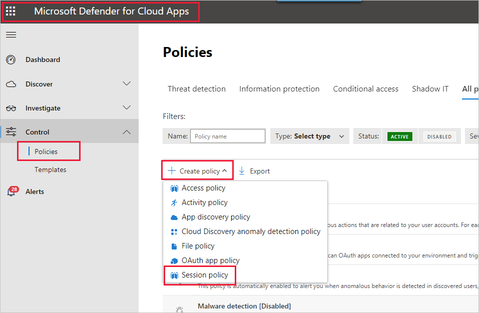
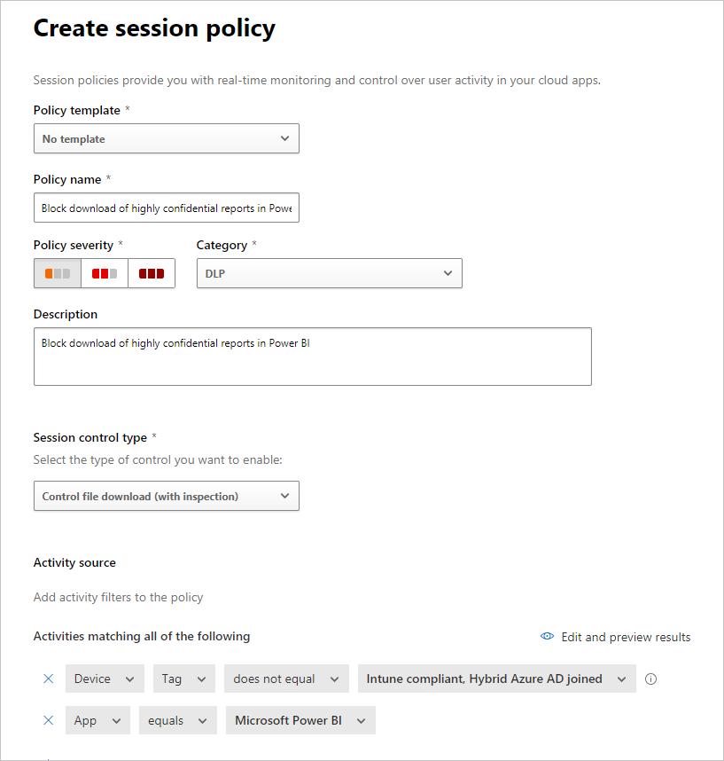
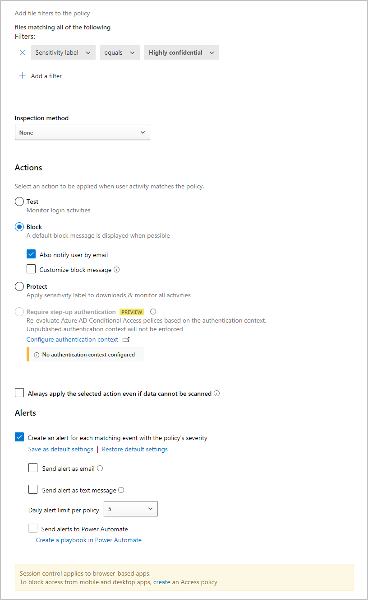
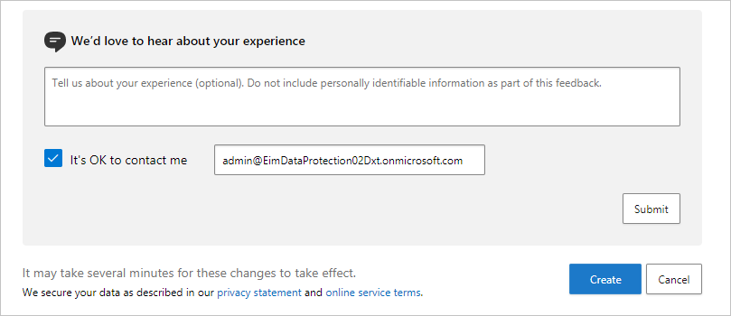

# Using Microsoft Defender for Cloud Apps controls in Power BI

By using Defender for Cloud Apps with Power BI, you can help protect your Power BI reports, data, and services from unintended leaks or breaches. With Defender for Cloud Apps, you can create conditional access policies for your organization's data, by using real-time session controls in Microsoft Entra ID, that help to ensure your Power BI analytics are secure. Once these policies are set, administrators can monitor user access and activity, perform real-time risk analysis, and set label-specific controls.

> [!NOTE]
> Microsoft Defender for Cloud Apps is now part of [**Microsoft Defender XDR**](https://security.microsoft.com). For more information, see [**Microsoft Defender for Cloud Apps in Microsoft Defender XDR**](/microsoft-365/security/defender/microsoft-365-security-center-defender-cloud-apps).

:::image type="content" source="media/service-security-using-defender-for-cloud-apps-controls/defender-for-cloud-apps-controls-cloud-apps-catalog.png" alt-text="Screenshot of the Defender for Cloud Apps window showing the Cloud app catalog page with Power BI highlighted.":::

You can configure Defender for Cloud Apps for all sorts of apps and services, not only Power BI. You'll need to configure Defender for Cloud Apps to work with Power BI to benefit from Defender for Cloud Apps protections for your Power BI data and analytics. For more information about Defender for Cloud Apps, including an overview of how it works, the dashboard, and app risk scores, see the [Defender for Cloud Apps](/cloud-app-security/) documentation.

## Defender for Cloud Apps licensing

To use Defender for Cloud Apps with Power BI, you must use and configure relevant Microsoft security services, some of which are set outside Power BI. In order to have Defender for Cloud Apps in your tenant, you must have one of the following [licenses](https://query.prod.cms.rt.microsoft.com/cms/api/am/binary/RE2NXYO):

* Microsoft Defender for Cloud Apps: Provides Defender for Cloud Apps capabilities for all supported apps, part of the EMS E5 and Microsoft 365 E5 suites.
* Office 365 Cloud App Security: Provides Defender for Cloud Apps capabilities only for Office 365, part of the Office 365 E5 suite.

## Configure real-time controls for Power BI with Defender for Cloud Apps

> [!NOTE]
> A Microsoft Entra ID P1 license is required in order to benefit from Defender for Cloud Apps real-time controls.

The following sections describe the steps for configuring real-time controls for Power BI with Defender for Cloud Apps.

### Set session policies in Microsoft Entra ID (required)

The steps necessary to set session controls are completed in the Microsoft Entra ID and Defender for Cloud Apps portals. In the Microsoft Entra admin center, you create a conditional access policy for Power BI, and route sessions used in Power BI through the Defender for Cloud Apps service.

Defender for Cloud Apps operates in a reverse-proxy architecture, and is integrated with Microsoft Entra Conditional Access to monitor Power BI user activity in real-time. The following steps are provided to help you understand the process, and detailed step-by-step instructions are provided in the linked content in each of the following steps. For a description of the whole process, see [Defender for Cloud Apps](/cloud-app-security/proxy-deployment-aad).

1. [Create a Microsoft Entra Conditional Access test policy](/defender-cloud-apps/proxy-deployment-aad#conf-idp)
1. [Sign into each app using a user scoped to the policy](/defender-cloud-apps/proxy-deployment-aad#sign-in-scoped)
1. [Verify the apps are configured to use access and session controls](/defender-cloud-apps/proxy-deployment-aad#portal)
1. [Enable the app for use in your organization](/defender-cloud-apps/proxy-deployment-aad#enable-app)
1. [Test the deployment](/defender-cloud-apps/proxy-deployment-aad#test)

The process for setting session policies is described in detail in [Session policies](/defender-cloud-apps/session-policy-aad).

### Set anomaly detection policies to monitor Power BI activities (recommended)

You can define anomaly Power BI detection policies that can be independently scoped, so that they apply to only the users and groups you want to include and exclude in the policy. For more information, see [Anomaly detection policies](/defender-cloud-apps/anomaly-detection-policy#anomaly-detection-policies).

Defender for Cloud Apps has two dedicated, built-in detections for Power BI. See [Built-in Defender for Cloud Apps detections for Power BI](#built-in-defender-for-cloud-apps-detections-for-power-bi).

### Use sensitivity labels from Microsoft Purview Information Protection (recommended)

Sensitivity labels enable you to classify and help protect sensitive content, so that people in your organization can collaborate with partners outside your organization, yet still be careful and aware of sensitive content and data.

For information about the process of using sensitivity labels for Power BI, see [Sensitivity labels in Power BI](service-security-sensitivity-label-overview.md). [See the example later in this article of a Power BI policy based on sensitivity labels](#example).

## Custom policies to alert on suspicious user activity in Power BI

Defender for Cloud Apps activity policies enable administrators to define their own custom rules to help detect user behavior that deviates from the norm, and even possibly act upon it automatically, if it seems too dangerous. For example:

* **Massive sensitivity label removal.** For example, alert me when sensitivity labels are removed by a single user from 20 different reports in a time window shorter than 5 minutes.

* **Encrypting sensitivity label downgrade.** For example, alert me when a report that had a **Highly confidential** sensitivity label is now classified as **Public**.

> [!NOTE]
> The unique identifiers (IDs) of Power BI artifacts and sensitivity labels can be found using [Power BI REST APIs](/rest/api/power-bi/). See [Get semantic models](/rest/api/power-bi/datasets/getdatasets) or [Get reports](/rest/api/power-bi/reports/getreports).

Custom activity policies are configured in the Defender for Cloud Apps portal. For more information, see [Activity policies](/defender-cloud-apps/user-activity-policies).

## Built-in Defender for Cloud Apps detections for Power BI

Defender for Cloud Apps detections enable administrators to monitor specific activities of a monitored app. For Power BI, there are currently two dedicated, built-in Defender for Cloud Apps detections:

* **Suspicious share** – detects when a user shares a sensitive report with an unfamiliar (external to the organization) email. A sensitive report is a report whose sensitivity label is set to **INTERNAL-ONLY** or higher.

* **Mass share of reports** – detects when a user shares a massive number of reports in a single session.

Settings for these detections are configured in the Defender for Cloud Apps portal. For more information, see [Unusual activities (by user)](/defender-cloud-apps/anomaly-detection-policy#unusual-activities-by-user).

## Power BI admin role in Defender for Cloud Apps

A new role is created for Power BI admins when using Defender for Cloud Apps with Power BI. When you sign in as a Power BI admin to the [Defender for Cloud Apps portal](https://portal.cloudappsecurity.com/), you have limited access to data, alerts, users at risk, activity logs, and other information relevant to Power BI.

## Considerations and limitations

Using Defender for Cloud Apps with Power BI is designed to help secure your organization's content and data, with detections that monitor user sessions and their activities. When you use Defender for Cloud Apps with Power BI, there are a few considerations and limitations you should keep in mind:

* Defender for Cloud Apps can only operate on Excel, PowerPoint, and PDF files.
* If you want to use sensitivity label capabilities in your session policies for Power BI, you need an Azure Information Protection Premium P1 or Premium P2 license. Microsoft Azure Information Protection can be purchased either standalone or through one of the Microsoft licensing suites. For more information, see [Azure Information Protection pricing](https://azure.microsoft.com/services/information-protection/). In addition, sensitivity labels must have been applied on your Power BI assets.
* Session control is available for any browser on any major platform on any operating system. We recommend using the latest version of Microsoft Edge, Google Chrome, Mozilla Firefox, or Apple Safari. Power BI public API calls and other non-browser-based sessions aren't supported as part of Defender for Cloud Apps session control. For more information, see [Supported apps and clients](/defender-cloud-apps/proxy-intro-aad#supported-apps-and-clients).
* If you experience sign in difficulties, such as having to sign in more than once, it could be related to the way some apps handle authentication. For more information, see the troubleshooting article [Slow login](/defender-cloud-apps/troubleshooting-proxy#slow-login).

> [!CAUTION]
> In the session policy, in the "Action" part, the "protect" capability works only if no label exists on the item. If a label already exists, the "protect" action won't apply; you can't override an existing label that has already been applied to an item in Power BI.

## Example

The following example shows you how to create a new session policy using Defender for Cloud Apps with Power BI.

First, create a new session policy. In the **Defender for Cloud Apps** portal, select **Policies** on the navigation pane. Then on the policies page, select **Create policy** and choose **Session policy**.

In the window that appears, create the session policy. The numbered steps describe settings for the following image.

1. In the **Policy template** dropdown, choose *No template*.
2. For **Policy name**, provide a relevant name for your session policy.
3. For **Session control type**, select *Control file download (with inspection)* (for DLP).

    For the **Activity source** section, choose relevant blocking policies. We recommend blocking un-managed and non-compliant devices. Choose to block downloads when the session is in Power BI.

    

    More options appear when you scroll down. The following image shows those options, with other examples.

4. Create a filter on **Sensitivity label** and choose *Highly confidential* or whatever best fits your organization.
5. Change the **Inspection method** to *none*.
6. Choose the **Block** option that fits your needs.
7. Create an alert for such an action.

    

8. Select **Create** to complete the session policy.

    

## Related content

This article described how Defender for Cloud Apps can provide data and content protections for Power BI. For more information about Data Protection for Power BI and supporting content for the Azure services that enable it, see:

* [Sensitivity labels in Power BI](service-security-sensitivity-label-overview.md)
* [Enable sensitivity labels in Power BI](service-security-enable-data-sensitivity-labels.md)
* [How to apply sensitivity labels in Power BI](service-security-apply-data-sensitivity-labels.md)

For information about Azure and security articles, see:

* [Protect apps with Microsoft Defender for Cloud Apps Conditional Access App Control](/defender-cloud-apps/proxy-intro-aad)
* [Deploy Conditional Access App Control for catalog apps with Microsoft Entra ID](/defender-cloud-apps/proxy-deployment-aad)
* [Session policies](/defender-cloud-apps/session-policy-aad)
* [Learn about sensitivity labels](/microsoft-365/compliance/sensitivity-labels)
* [Data protection metrics report](service-security-data-protection-metrics-report.md)
* [Power BI implementation planning: Defender for Cloud Apps for Power BI](/power-bi/enterprise/service-security-using-defender-for-cloud-apps-controls)
