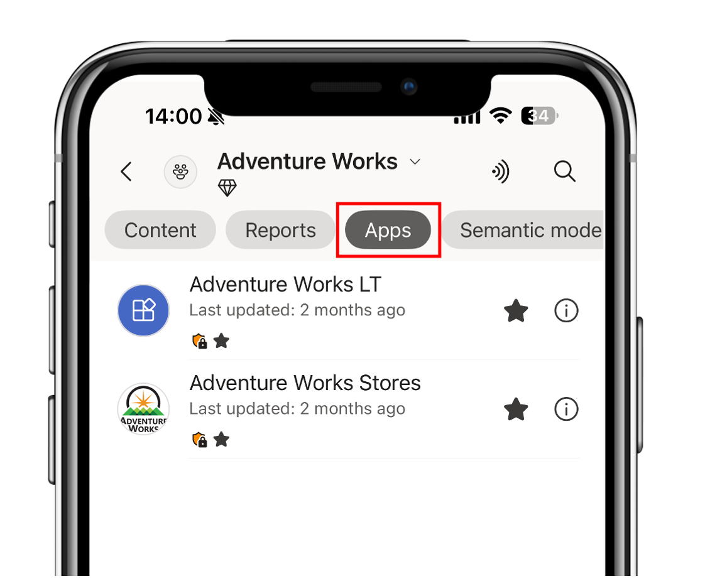
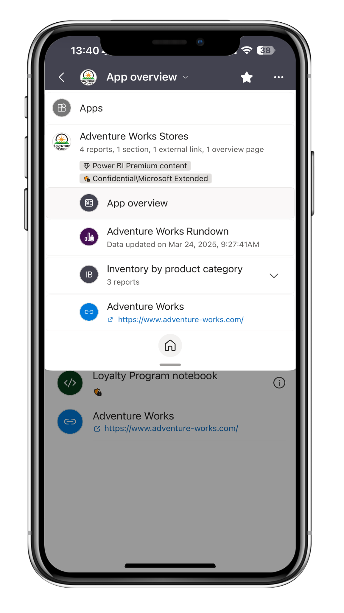
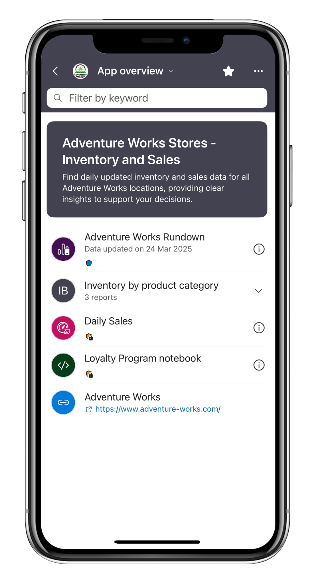

# View and navigate org apps in the Power BI mobile apps

**Applies to:** [!INCLUDE [applies-to-mobile](../../includes/applies-to-version/mobile.md)]

Org apps are the next generation of Power BI apps, designed to simplify access to Power BI and Fabric items. In the Power BI mobile apps, users can view org apps and interact with supported content. 

To learn more about org apps, see [Get started with org apps](../org-app-items.md).

## Discover and access org apps

Org apps appear in the apps section alongside workspace apps, and in workspace content lists. You can filter a workspace by apps to view all available ones.  

  
Since org apps are considered items, you can favorite them to make them easier to find. Additionally, they also appear on the Power BI mobile apps homepage under the recents and frequents sections, based on the items you have viewed.

## Navigation and layout

* Like any other item you view in the Power BI mobile apps, when you open an org app, you can access its navigation tree via the header. The navigation tree includes only supported items (excluding Fabric items), and tapping any of them will load the item in the main view page. 

* When you open the app, you'll land on the first supported item based on the defined order during app authoring. This means the landing item will be either a Power BI report or, if an overview page has been included and is listed first, the overview page. 

## Audiences

A single org app can serve different groups of people through *audiences*. When creating an app, the app creator defines multiple audiences, controls which items each audience sees, and tailors the navigation for each group. This way, executives, managers, frontline workers, and department teams can each land in an experience curated for their needs, all from a single governed app.

The Power BI mobile apps respect the audiences defined for an org app. When you open an org app on your phone or tablet, you see and navigate only the content assigned to your audience, so you can quickly find the reports, dashboards, and other Power BI content most relevant to your role while on the go. On smaller screens, this focused view gives you a cleaner, less cluttered experience.

:::image type="content" source="media/mobile-apps-org-apps/audiences.png" alt-text="Screenshot of an org app in the Power BI mobile app, showing the audience switcher with the Finance audience selected and its content in the navigation.":::

Here's how audiences behave in the Power BI mobile apps:

* **Content and navigation are audience-specific.** The navigation tree and content list show only the items included in the audience you're viewing. Items hidden from your audience don't appear.
* **You can switch between audiences you belong to.** If you're assigned to more than one audience, use the audience switcher in the app to move between them and view the content curated for each group.
* **The landing item follows the audience order.** When you open the app, you land on the first supported item defined for your audience, based on the order set during app authoring.

App creators configure audiences in the Power BI service. You can't create or change audiences from the mobile apps. To learn how audiences are defined and managed, see [Get started with org apps](../org-app-items.md).

## Supported item types in Power BI mobile  

Supported items are item types you can view directly in the Power BI mobile apps. They appear in the app's content and navigation tree and include: 

* Power BI reports
* Paginated reports 
* Overview page 
* Sections
* Links

## Theme and customization 

* Creators can configure themes for their org apps. That configuration is respected by the Power BI mobile apps, including light/dark mode compatibility. 
* If an overview page was configured, then a mobile version of this page suitable for mobile devices will be available as well.

## Limitations

* Org apps can contain Fabric items such as real-time dashboards, notebooks, and maps, but Power BI mobile apps support only Power BI items. Therefore, the app's overview page and content list include other Fabric items, but those items open in the browser.
