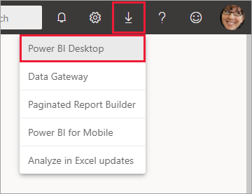
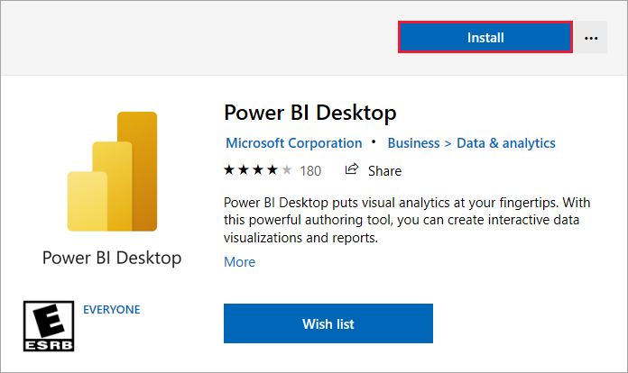
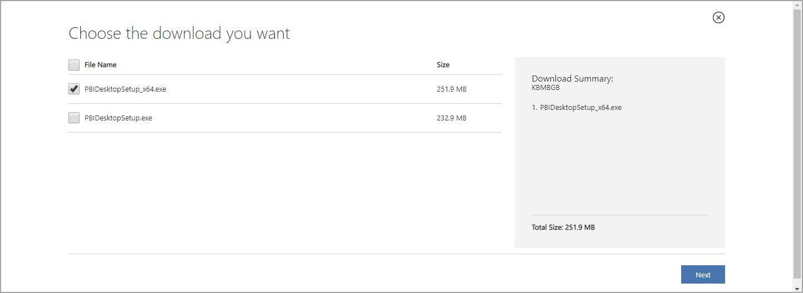
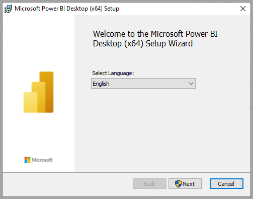
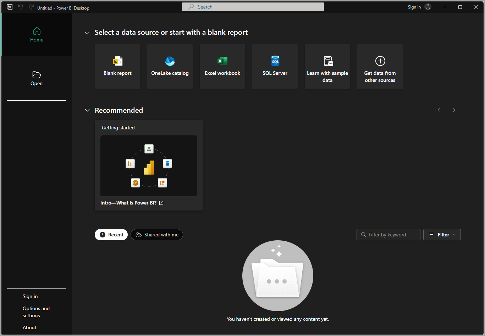

# Get Power BI Desktop
With Power BI Desktop, you can build advanced queries, models, and reports that visualize data. You can also build data models, create reports, and share your work by publishing to the Power BI service. Power BI Desktop is a free download.

To get Power BI Desktop, you can use one of the two approaches.

* [Install as an app from the Microsoft Store](#install-as-an-app-from-the-microsoft-store).
* [Download directly, as an executable you download and install on your computer](#download-power-bi-desktop-directly).

Either of the two approaches gets the latest version of Power BI Desktop onto your computer. However, there are some differences worth noting, as described in the following sections.


> [!IMPORTANT]
> Power BI Desktop is updated and released on a monthly basis, incorporating customer feedback and new features. Only the latest version of Power BI Desktop is supported. You will be asked to upgrade the application to the latest version when contacting Support for Power BI Desktop. 
> You can get the latest version of Power BI Desktop from the [Windows Store](https://aka.ms/pbidesktopstore), or as a single executable containing all supported languages that you [download](https://www.microsoft.com/download/details.aspx?id=58494) and install on your computer.


## Install as an app from the Microsoft Store
There are a few ways to access the most recent version of Power BI Desktop from the Microsoft Store. 

1. Use one of the following options to open the **Power BI Desktop** page of the Microsoft Store:

   - Open a browser and go directly to the [Power BI Desktop page](https://aka.ms/pbidesktopstore) of the Microsoft Store.

    - From the [Power BI service](./service-get-started.md), in the upper right corner, select the **Download** icon and then choose **Power BI Desktop**.

      

   - Go to the [Power BI Desktop product page](https://powerbi.microsoft.com/desktop/), and then select **Download Free**.
  
2. After you've landed on the **Power BI Desktop** page of the Microsoft Store, select **Install**.

     

There are a few advantages to getting Power BI Desktop from the Microsoft Store:

* **Automatic updates**: Windows downloads the latest version automatically in the background as soon as it's available, so your version will always be up to date.
* **Smaller downloads**: Microsoft Store ensures only components that have changed in each update are downloaded to your machine, resulting in smaller downloads for each update.
* **Admin privilege isn't required**: When you download the package directly and install it, you must be an administrator for the installation to complete successfully. If you get Power BI Desktop from the Microsoft Store, admin privilege is *not* required.
* **IT roll-out enabled**: Through the Microsoft Store for Business, you can more easily deploy, or *roll out*, Power BI Desktop to everyone in your organization

* **Language detection**: The Microsoft Store version includes all supported languages, and checks the language used on your computer each time it's launched. This language support also affects the localization of models created in Power BI Desktop. For example, built-in date hierarchies match the language that Power BI Desktop is using when the .pbix file is created.

The following consideration and limitations apply when you install Power BI Desktop from the Microsoft Store:

* If you use the SAP connector, you may need to move your SAP driver files to the *Windows\System32* folder.
* Installing Power BI Desktop from the Microsoft Store doesn't copy user settings from the .exe version. You might have to reconnect to your recent datasources and reenter your data source credentials. 

> [!NOTE]
> The Power BI Report Server version of Power BI Desktop is a separate and different installation from the versions discussed in this article. For information about the Report Server version of Power BI Desktop, see [Create a Power BI report for Power BI Report Server](../report-server/quickstart-create-powerbi-report.md).
> 
> 

## Download Power BI Desktop directly
  
  To download the Power BI Desktop executable from the Download Center, select **Download** from the [Download Center page](https://www.microsoft.com/download/details.aspx?id=58494). Then, specify a 32-bit or 64-bit installation file to download.

  

### Install Power BI Desktop after downloading it
You're prompted to run the installation file after you've finished downloading it.

Power BI Desktop ships as a single .exe installation package that contains all supported languages, with a separate .exe file for the 32-bit and 64-bit versions. The .msi packages are discontinued, requiring the .exe executable for installation. This approach makes distribution, updates, and installation (especially for administrators) much easier and more convenient. You can also use command-line parameters to customize the installation process, as described in [Using command-line options during installation](#using-command-line-options-during-installation).

After you launch the installation package, Power BI Desktop installs as an application and runs on your desktop.



> [!NOTE]
> Installing the downloaded (MSI) version (deprecated), and the Microsoft Store version of Power BI Desktop on the same computer (sometimes referred to as a *side-by-side* installation) is not supported. Manually uninstall Power BI Desktop before you download it from the Microsoft Store.
> 

## Using Power BI Desktop
When you launch Power BI Desktop, a welcome screen is displayed.



If you're using Power BI Desktop for the first time (that is, the installation isn't an upgrade), you're prompted to fill out a form or sign in to the Power BI service before you can continue.

From there, you can begin creating data models or reports, then share them with others on the Power BI service. Check out the [Next steps](#next-steps) section for links to guides to help you get started using Power BI Desktop.

## Minimum requirements
The following list provides the minimum requirements to run Power BI Desktop:

> [!IMPORTANT]
> Power BI Desktop is no longer supported on Windows 7. 

* Windows 8.1 / Windows Server 2012 R2, or later
* .NET 4.6.2 or later
* Internet Explorer 11 or later
* Memory (RAM): At least 2 GB available, 4 GB or more recommended.
* Display: At least 1440x900 or 1600x900 (16:9) required. Lower resolutions such as 1024x768 or 1280x800 aren't supported, as certain controls (such as closing the startup screen) display beyond those resolutions.
* Windows display settings: If you set your display settings to change the size of text, apps, and other items to more than 100%, you may not be able to see certain dialogs that you must interact with to continue using Power BI Desktop. If you encounter this issue, check your display settings in Windows by going to **Settings** > **System** > **Display**, and use the slider to return display settings to 100%.
* CPU: 1 gigahertz (GHz) 64-bit (x64) processor or better recommended.

> [!NOTE]
> We recommend using a client version of Windows such as Windows 10, rather than Windows Server. For example, Power BI Desktop does not support using Internet Explorer Enhanced Security Configuration as it will stop Power BI Desktop from signing in to the Power BI service.

## Considerations and limitations

We want your experience with Power BI Desktop to be great. Because there may be occasions when you run into an issue with Power BI Desktop, this section contains solutions or suggestions to address these issues. 

### Using command-line options during installation 

When you install Power BI Desktop, you can set properties and options with command-line switches. These settings are especially useful for administrators who manage or facilitate the installation of Power BI Desktop across organizations. These options apply to .msi and .exe installations. 


|Command-line option  |Behavior  |
|---------|---------|
|-q, -quiet, -s, -silent     |Silent install         |
|-passive     |Show the progress bar only during installation         |
|-norestart     |Suppress the computer restart requirement         |
|-forcerestart     |Restart the computer after installation without a prompt         |
|-promptrestart     |Prompt the user if computer restart is required (default)         |
|-l<>, -log<>     |Log the installation to a specific file, with the file specified in <>         |
|-uninstall     |Uninstall Power BI Desktop         |
|-repair     |Repair the installation (or install if it's not currently installed)         |
|-package, -update     |Install Power BI Desktop (default, as long as -uninstall or -repair aren't specified)         |

You can also use the following syntax parameters, which you specified with a *property = value* syntax:

|Parameter  |Meaning  |
|---------|---------|
|ACCEPT_EULA     |Requires a value of 1 to automatically accept the EULA         |
|ENABLECXP     |A value of 1 enrolls in the customer experience program that captures telemetry on usage of the product         |
|INSTALLDESKTOPSHORTCUT     |A value of 1 adds a shortcut to the Desktop         |
|INSTALLLOCATION     |File path to where you want it installed         |
|LANGUAGE     |The locale code (for example, en-US, de-DE, pr-BR) to force the default language of the application. If you don't specify the language, Power BI Desktop displays the Windows OS language. You can change this setting in the **Options** dialog.         |
|REG_SHOWLEADGENDIALOG     |A value of 0 disables showing the dialog that appears before you've signed in to Power BI Desktop.         |
|DISABLE_UPDATE_NOTIFICATION     |A value of 1 disables update notifications.         |


For example, you can run Power BI Desktop with the following options and parameters to install without any user interface, using the German language: 

```-quiet LANG=de-DE ACCEPT_EULA=1```

### Installing Power BI Desktop on remote machines

If you're deploying Power BI Desktop to your users with a tool that requires a Windows installer file (.msi file), you can extract the .msi file from the Power BI Desktop installer .exe file. Use a third-party tool, such as WiX Toolset.

> [!NOTE]
> As a third-party product, WiX Toolset options might change without notice. Check their documentation for the most up-to-date information, and contact their user mailing list for help.

1. On the computer where you downloaded the Power BI Desktop installer, install the latest version of the [WiX Toolset](https://wixtoolset.org/).
2. Open a command-line window as an administrator and navigate to the folder where you installed WiX Toolset.
3. Run the following command: 
    
    ```Dark.exe <path to Power BI Desktop installer> -x <output folder>```

    For example:

    ``` Dark.exe C:\PBIDesktop_x64.exe -x C:\output```

    The output folder contains a folder named *AttachedContainer*, which includes the .msi files.

Upgrading an install from an .exe to a .msi that you've extracted from an .exe is not supported.   In order to make this upgrade, first you'll need to uninstall the older version of Power BI Desktop that you have.

### Issues when using previous releases of Power BI Desktop

Some users may encounter an error message similar to the following message when they use an outdated version of Power BI Desktop: 

*We weren't able to restore the saved database to the model* 

Updating to the current version of Power BI Desktop usually solves this issue.

### Disabling notifications
We recommend updating to the most recent version of Power BI Desktop to take advantage of advances in features, performance, stability, and other improvements. Some organizations may not want users to update to each new version. You can disable notifications by modifying the registry with the following steps:

1. In the Registry Editor, navigate to the **HKEY_LOCAL_MACHINE\SOFTWARE\Microsoft\Microsoft Power BI Desktop** key.
2. Create a new **REG_DWORD** entry in the key with the following name: **DisableUpdateNotification**.
3. Set the value of that new entry to **1**.
4. Restart your computer for the change to take effect.

### Power BI Desktop loads with a partial screen

In certain circumstances, including certain screen resolution configurations, some users may see Power BI Desktop render content with large black areas. This issue is generally a result of recent operating system updates that affect how items are rendered, rather than a direct result of how Power BI Desktop presents content. Follow these steps to address this issue:

1. Press the **Start** key and enter *blurry* into the search bar that appears.
2. In the dialog that appears, select the option: **Let Windows fix apps that are blurry.**
3. Restart Power BI Desktop.

This issue may resolve after later Windows updates are released. 
 

## Next steps
After you've installed Power BI Desktop, see the following content to help you get up and running quickly:

* [What is Power BI Desktop?](desktop-what-is-desktop.md)
* [Query overview in Power BI Desktop](../transform-model/desktop-query-overview.md)
* [Data sources in Power BI Desktop](../connect-data/desktop-data-sources.md)
* [Connect to data in Power BI Desktop](../connect-data/desktop-connect-to-data.md)
* [Shape and combine data in Power BI Desktop](../connect-data/desktop-shape-and-combine-data.md)
* [Common query tasks in Power BI Desktop](../transform-model/desktop-common-query-tasks.md)
